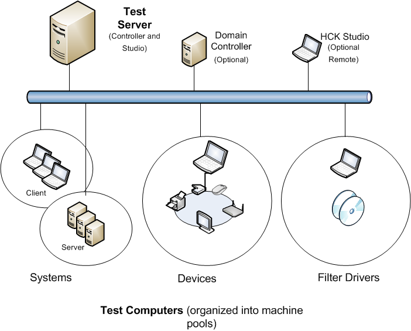

# Windows HCK Prerequisites

Before you begin testing, make sure that the test environment meets the necessary requirements. Windows HCK is comprised of two components: an HCK test server and one or more test computers.

-   **HCK Test server.** Often referred to as the *controller*, a test server has two parts: Windows HCK Controller and Windows HCK Studio. The Controller software is the engine that manages tests that are run on test computers. The Studio software is the management tool that lets you select and schedule tests against any test computer connected to the test server. Controller and Studio are installed from the Windows HCK installation source. Once established, the test server contains separate installers to inllstall a remote Windows HCK Studio and Windows HCK Client.

    One controller governs a collection of client computers. Controllers can manage and access only the client computers that they govern.

-   **Test computer.** Also referred to as a client computer, each one can have a different configuration that's appropriate for various testing scenarios, including different hardware, operating systems, service packs, and drivers. Each test computer can only be associated with one test server. You configure each test computer by running the Windows HCK Client software installer directly from a shared network location on the test server.

## Deployment scenarios

There are two deployment scenarios for Windows HCK:

-   **Domain-joined environment.** In a domain-joined environment, a domain controller is present and all computers designated for Windows HCK features are joined to the same domain controller. If you plan to deploy Windows HCK in a domain-joined environment, you need a minimum of three computers: a Windows domain controller, a Windows HCK test server, and one Windows HCK test computer. Make sure that Microsoft Active Directory® is configured and running on the domain controller. Your domain controller and HCK test server cannot be on the same box.

-   **Workgroup environment.** A workgroup environment has no domain controller. If you plan to deploy Windows HCK in a workgroup, you need at least two computers: a test server and a test computer joined to the same workgroup. **Don't** use the Default Administrator account. In this configuration, you must enable the Guest account.

In addition, consider how you want to organize lab resources to best use the Windows HCK. You need to determine the number of test servers and the number of test computers connecting to them. These decisions are partly influenced by the type of devices or systems that you want to certify.

To test systems and filter drivers, you need at least 1 test server and 1 test computer.

To test external devices, you need at least 1 test server, 1 test computer, and the external device(s) to be tested.

You can choose to allocate fewer controllers, each with multiple clients connected to them, if you want less overhead administering the controllers and clients. A maximum of 150 clients can be connected to a single controller. Alternately, you can allocate more controllers and connect fewer clients to them. This allows any given controller to be more responsive because it has fewer clients communicating with it. For more information, see [HCK Controller and Client Organization](hck-controller-and-client-organization.md).

The following image shows an example test environment.

## System Requirements

### Test server

<table>
<colgroup>
<col width="33%" />
<col width="33%" />
<col width="33%" />
</colgroup>
<thead>
<tr class="header">
<th>Component</th>
<th>Minimum</th>
<th>Optimum</th>
</tr>
</thead>
<tbody>
<tr class="odd">
<td>
Processor
</td>
<td>
Single Intel or AMD-based x64 platform with a speed of 2.0 GHz
</td>
<td>
Multicore or multiple x64-based processors running in x64 mode with a speed of 2.0 GHz or faster
</td>
</tr>
<tr class="even">
<td>
System memory
</td>
<td>
2 GB main memory
</td>
<td>
4 GB main memory
</td>
</tr>
<tr class="odd">
<td>
Hard disk capacity
</td>
<td>
300 GB minimum to accommodate the volume of logs that can be generated.
</td>
<td>
RAID configuration
</td>
</tr>
<tr class="even">
<td>
Network connection
</td>
<td>
100 megabits per second (Mbps)
</td>
<td>
1 gigabit per second (Gbps)
</td>
</tr>
<tr class="odd">
<td>
Operating system
</td>
<td>
English language and English local version of Windows Server 2008 R2 64-bit with service pack (SP1) or Windows Server® 2012. For information, see the [Windows Server](http://go.microsoft.com/fwlink/?LinkId=236055) website.

<strong>Note</strong>  

Controller isn't supported on Windows Server 2003, Windows Server 2008, Windows Vista, Windows XP, or Windows 2000.

Controller isn't supported on an installation that has already been set up as a domain controller.

Controller isn't supported in a virtual PC or any third-party Hypervisor environment.

 

</td>
<td>

</td>
</tr>
</tbody>
</table>

 

### Test computer

<table>
<colgroup>
<col width="50%" />
<col width="50%" />
</colgroup>
<thead>
<tr class="header">
<th>Component</th>
<th>Minimum</th>
</tr>
</thead>
<tbody>
<tr class="odd">
<td>
Processor
</td>
<td>
The recommended processor for the operating system that you install.
</td>
</tr>
<tr class="even">
<td>
System memory
</td>
<td>
Refer to the recommended processor for the operating system that you install.
</td>
</tr>
<tr class="odd">
<td>
Hard disk capacity
</td>
<td>
300 GB minimum to accommodate the test files and logs that can be generated.

The client must be unique; you can't swap drives.
</td>
</tr>
<tr class="even">
<td>
Network connection
</td>
<td>
100 Mbps
</td>
</tr>
<tr class="odd">
<td>
Operating system
</td>
<td>
Install the Windows operating system that you are testing against.

Test computers are not supported in a virtual PC or any third-party Hypervisor environment.

If you are testing against a Windows “N” edition, you must also manually install Media Feature Pack.
</td>
</tr>
<tr class="even">
<td>
Additional requirements
</td>
<td>
Many of the tests require a test system to restart—often more than once—to complete a test run. So, we recommend that you:

<ul>
<li>
Configure test computers to boot from the regular boot sector of a hard drive and not from external devices, CDs, or DVD boot discs.
</li>
</ul>

For Workgroup environments, you must enable the guest account.

<ol>
<li>
On each computer, create a new user account and add it to the Administrator group.
</li>
<li>
On each computer, log on with the administrator account you just created and enable the Guest account.
</li>
</ol>

Testing may also require:

<ul>
<li>
HCK Filters.
</li>
<li>
Test-sign drivers.
</li>
<li>
Additional source code/Readme files that are requested at the end of package creation.
</li>
</ul></td>
</tr>
</tbody>
</table>

 

### Optional remote/standalone Windows HCK Studio

<table>
<colgroup>
<col width="50%" />
<col width="50%" />
</colgroup>
<thead>
<tr class="header">
<th>Component</th>
<th>Minimum</th>
</tr>
</thead>
<tbody>
<tr class="odd">
<td>
Processor
</td>
<td>
The recommended processor for the operating system that you install.
</td>
</tr>
<tr class="even">
<td>
System memory
</td>
<td>
Refer to the recommended processor for the operating system that you install.
</td>
</tr>
<tr class="odd">
<td>
Hard disk capacity
</td>
<td>
300 GB minimum to accommodate the volume of logs that can be generated.

The client must be unique; you can't swap drives.
</td>
</tr>
<tr class="even">
<td>
Network connection
</td>
<td>
100 Mbps
</td>
</tr>
<tr class="odd">
<td>
Operating system
</td>
<td><ul>
<li>
Windows 8.1
</li>
<li>
Windows 8
</li>
<li>
Windows 7
</li>
</ul>

HCK Studio isn’t supported in a virtual PC or any third-party Hypervisor environment.
</td>
</tr>
</tbody>
</table>

 

## Additional requirements

You might need to configure additional hardware for the device or system that you're testing. For more info, see the Prerequisites section for each feature that you're testing:

**Systems**

-   [System.Client Testing](systemclient-testing.md)

-   [System.Fundamentals Tests](systemfundamentals-tests.md)

-   [System.Server Testing](systemserver-testing.md)

**Devices**

-   [Device.Audio Testing](deviceaudio-testing.md)

-   [Device.BusController Testing](devicebuscontroller-testing.md)

-   [Device.Connectivity Tests](deviceconnectivity-tests.md)

-   [Device.Fundamentals Testing](devicefundamentals-testing.md)

-   [Device.Graphics Testing](devicegraphics-testing.md)

-   [Device.Imaging Testing](deviceimaging-testing.md)

-   [Device.Input Testing](deviceinput-testing.md)

-   [Device.Network Testing](devicenetwork-testing.md)

-   [Device.Media Testing](devicemedia-testing.md)

-   [Device.Portable Testing](deviceportable-testing.md)

-   [Device.Storage Testing](devicestorage-testing.md)

-   [Device.Streaming Testing](devicestreaming-testing.md)

**Filter Drivers**

-   [Filter.Driver Testing](filterdriver-testing.md)

 

 

