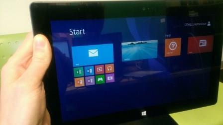
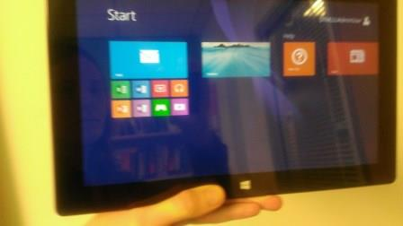
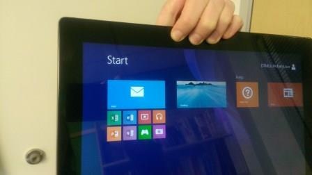

# Windows Touch Test

This test verifies that a Windows® Touch device meets requirements.

## Test details

<table>
<colgroup>
<col width="50%" />
<col width="50%" />
</colgroup>
<tbody>
<tr class="odd">
<td>
<strong>Associated requirements</strong>
</td>
<td>
Device.Digitizer.Touch.Bezel Device.Digitizer.Touch.DigitizerConnectsOverUSBOrI2C Device.Digitizer.Touch.FieldFirmwareUpdatable Device.Digitizer.Touch.PhysicalDimension Device.Digitizer.Touch.PowerStates

[See the device hardware requirements.](http://go.microsoft.com/fwlink/p/?linkid=254483)
</td>
</tr>
<tr class="even">
<td>
<strong>Platforms</strong>
</td>
<td>
Windows RT (ARM-based) Windows 8 (x64) Windows 8 (x86) Windows RT 8.1 Windows 8.1 x64 Windows 8.1 x86
</td>
</tr>
<tr class="odd">
<td>
<strong>Expected run time</strong>
</td>
<td>
~2 minutes
</td>
</tr>
<tr class="even">
<td>
<strong>Categories</strong>
</td>
<td>
Certification Functional Reliability
</td>
</tr>
<tr class="odd">
<td>
<strong>Type</strong>
</td>
<td>
Manual
</td>
</tr>
</tbody>
</table>

 

## Running the test

Before you run the test, complete the test setup as described in the test requirements: [Windows Touch Testing Prerequisites](windows-touch-testing-prerequisites.md).

The Windows Touch Test combines a set of simple manual tests. Measured requirements include: having a bezel that is flush with the display, specifying physical dimensions that match the device's true physical dimensions, and passing the HID Validator tool's static test. (The HID Validator tool installed together with the Windows HCK).

### Flush Bezel

The bezel requirement (System.Client.Digitizer.Touch.Bezel) helps ensure easy access to the edge of the screen, which is used to display the **Charms Bar** and to switch applications. It also provides an optimal set of conditions to use the thumb keyboard. USB and I2C buses are required because they support the HID standard upon which the Windows touch infrastructure is based. FFU is required.

For a Tablet device, ensure that the bezel is flush with the display (the bezel must not be taller than the display).

### Physical Dimensions

The physical dimensions of the device must support system gestures and general touch interactions (Device.Digitizer.Touch.PhysicalDimension). For example, the momentum of a touch gesture depends on the physical distance moved and the length of that movement.

This test verifies that the physical dimensions that are reported by the HID descriptor match the true physical dimensions of the visible screen area. Discrepancies affect system gestures and UI elements, which rely on physical size information. We strongly recommend that you use the dimensions that are specified by the display manufacturer. The test itself relies on this information to size elements appropriately. The test will be affected by errors; for example, targets that are intended to be 20mm apart might resolve to being 22mm apart. The WTTL does not make allowances for devices that report physical size values that differ from the true measurement by more than 2mm.

### High Quality Touch Digitizer Input

To run this test, the HID descriptor must be stored in the device firmware. The Windows Hardware Certification Kit (Windows HCK) includes the HID Validator tool. Before you run this test, we recommend that you review the Windows Hardware Certification Requirements and the HID Validator documentation that is installed together with the HID Validator tool.

To run the test, double-click **HidValidator.exe** on the touch device. The tool ensures that the descriptor conforms to the HID specification.

### Power States

For a discussion of power-state requirements (Device.Digitizer.Touch.PowerStates), see [Power Handling for Windows 8 Touch Controllers](http://go.microsoft.com/fwlink/p/?linkid=287026).

You can use the WTTL to check the ability of a device to traverse power states by using the following procedure:

**To run the power states test**

1.  If applicable, put the device into the **Connected Standby** state. Otherwise, power the device off.

2.  Place any type of contact on any number on the screen and hold for 10 to 15 seconds.

3.  If the device is in the **Connected Standby** state, wake the device while maintaining contact. If the device is powered off, power on the device while maintaining contact.

4.  After the machine has booted, ensure that no ghost touches exist. Attempt to use touch input.

5.  If applicable to the device, repeat these steps for **Sleep (S3)** state.

If no ghost touches exist, and if touch input can be used as expected to control the machine, then the device passes this test. Otherwise, it fails the test.

## Accidental Touch Input

Requirements Tested: System.Client.Tablet.BezelWidth

Users are expected to hold devices in a variety of positions, and the software/hardware configuration of the device should support users holding their devices in a natural fashion without accidental touch input.

Along the sides of the device (held in a landscape orientation), place a thumb along the edge of the device so that the outer edge of thumb is aligned with the device edge. Hold for two seconds and lift. Repeat three times on each side.

Along the bottom of the device, hold the thumb for two seconds and lift. Repeat three times.

Along the top edge of the device, grip with one hand for two seconds and lift. Repeat three times.

## Troubleshooting

For troubleshooting information, see [How to run the Windows HCK Tests for Touch and Pen Devices](how-to-run-the-windows-hck-tests-for-touch-and-pen-devices.md#hiderrors).

## More information

### Command syntax

<table>
<colgroup>
<col width="50%" />
<col width="50%" />
</colgroup>
<thead>
<tr class="header">
<th>Command option</th>
<th>Description</th>
</tr>
</thead>
<tbody>
<tr class="odd">
<td>
<strong>Logo3.exe -config Other.json</strong>
</td>
<td>
Runs the test.
</td>
</tr>
</tbody>
</table>

 

### File list

<table>
<colgroup>
<col width="50%" />
<col width="50%" />
</colgroup>
<thead>
<tr class="header">
<th>File</th>
<th>Location</th>
</tr>
</thead>
<tbody>
<tr class="odd">
<td>
Logo3.exe
</td>
<td>
<em>&lt;testbinroot&gt;</em>\digitizer\Win8Touch
</td>
</tr>
<tr class="even">
<td>
Other.json
</td>
<td>
<em>&lt;testbinroot&gt;</em>\digitizer\Win8Touch
</td>
</tr>
</tbody>
</table>

 

## Related topics

[How to run the Windows HCK Tests for Touch and Pen Devices](how-to-run-the-windows-hck-tests-for-touch-and-pen-devices.md)

 

 

[Send comments about this topic to Microsoft](mailto:wsddocfb@microsoft.com?subject=Documentation%20feedback%20%5Bp_hck\p_hck%5D:%20Windows%20Touch%20Test%20%20RELEASE:%20%284/27/2016%29&body=%0A%0APRIVACY%20STATEMENT%0A%0AWe%20use%20your%20feedback%20to%20improve%20the%20documentation.%20We%20don't%20use%20your%20email%20address%20for%20any%20other%20purpose,%20and%20we'll%20remove%20your%20email%20address%20from%20our%20system%20after%20the%20issue%20that%20you're%20reporting%20is%20fixed.%20While%20we're%20working%20to%20fix%20this%20issue,%20we%20might%20send%20you%20an%20email%20message%20to%20ask%20for%20more%20info.%20Later,%20we%20might%20also%20send%20you%20an%20email%20message%20to%20let%20you%20know%20that%20we've%20addressed%20your%20feedback.%0A%0AFor%20more%20info%20about%20Microsoft's%20privacy%20policy,%20see%20http://privacy.microsoft.com/default.aspx. "Send comments about this topic to Microsoft")

