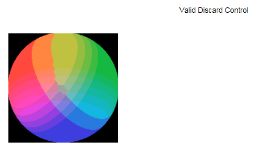

# XPS Content Library - Discard Control Processing (MANUAL)

This manual test loads both valid and invalid XPS documents that contain discard control features, and then prints the documents to the specified printer. This test only has to be run if the consumer supports discard control processing. This test uses the XPS Content Library tool.

By using this test tool, you can generate jobs to send to a printer or to XPS serialization. This tool includes options for validating the XPS that the tool produces, or for selecting particular XML files. The tool exits after the tool prints each file one time.

## Test details

<table>
<colgroup>
<col width="50%" />
<col width="50%" />
</colgroup>
<tbody>
<tr class="odd">
<td>
<strong>Associated requirements</strong>
</td>
<td>
Device.Imaging.Printer.XPS.XPS

[See the device hardware requirements.](http://go.microsoft.com/fwlink/p/?linkid=254483)
</td>
</tr>
<tr class="even">
<td>
<strong>Platforms</strong>
</td>
<td>
Windows 7 (x64) Windows 7 (x86) Windows 8 (x64) Windows 8 (x86) Windows Server 2012 (x64) Windows Server 2008 R2 (x64) Windows 8.1 x64 Windows 8.1 x86 Windows Server 2012 R2
</td>
</tr>
<tr class="odd">
<td>
<strong>Expected run time</strong>
</td>
<td>
~2 minutes
</td>
</tr>
<tr class="even">
<td>
<strong>Categories</strong>
</td>
<td>
Certification Functional
</td>
</tr>
<tr class="odd">
<td>
<strong>Type</strong>
</td>
<td>
Manual
</td>
</tr>
</tbody>
</table>

 

## Running the test

Before you run the test, complete the test setup as described in the test requirements: [Printer Testing Prerequisites](printer-testing-prerequisites.md).

In addition, this test requires the following:

-   Printer paper

## Troubleshooting

For troubleshooting information, see [Troubleshooting Device.Imaging Testing](troubleshooting-deviceimaging-testing.md).

## More information

The XPS Content Library tool prints a set of XPS file content that is a representative subset of the XPS specification. The tool uses a static set of XPS files.

An XPS print filter or device must consume all the valid XPS test files successfully and fail gracefully (that is, no crashes, "hangs," or resource leaks may occur) on the invalid XPS files.

This job is similar to the standard XPS Content Library job. However, this job focuses only on functionality that relates to Discard Control processing. The job only appears in the submission if the user has specified that the test printer supports Discard Control processing.

This job must only print one page. The page must be titled "Valid Discard Control" and contain a multi-colored circle inside a black square box, as seen in the following image:

The following documents relate to Discard Control processing:

<table>
<colgroup>
<col width="50%" />
<col width="50%" />
</colgroup>
<thead>
<tr class="header">
<th>Document name</th>
<th>Description</th>
</tr>
</thead>
<tbody>
<tr class="odd">
<td>
M10.6a
</td>
<td>
DiscardControl references itself (TargetUri)
</td>
</tr>
<tr class="even">
<td>
M10.6b
</td>
<td>
DiscardControl references itself (SentinelUri)
</td>
</tr>
<tr class="odd">
<td>
M10.23a
</td>
<td>
Multiple DiscardControl package relationships
</td>
</tr>
<tr class="even">
<td>
DiscardControl.xps
</td>
<td>
Valid XPS file that contains a discard control
</td>
</tr>
</tbody>
</table>

 

 

 

[Send comments about this topic to Microsoft](mailto:wsddocfb@microsoft.com?subject=Documentation%20feedback%20%5Bp_hck\p_hck%5D:%20XPS%20Content%20Library%20-%20Discard%20Control%20Processing%20%28MANUAL%29%20%20RELEASE:%20%284/27/2016%29&body=%0A%0APRIVACY%20STATEMENT%0A%0AWe%20use%20your%20feedback%20to%20improve%20the%20documentation.%20We%20don't%20use%20your%20email%20address%20for%20any%20other%20purpose,%20and%20we'll%20remove%20your%20email%20address%20from%20our%20system%20after%20the%20issue%20that%20you're%20reporting%20is%20fixed.%20While%20we're%20working%20to%20fix%20this%20issue,%20we%20might%20send%20you%20an%20email%20message%20to%20ask%20for%20more%20info.%20Later,%20we%20might%20also%20send%20you%20an%20email%20message%20to%20let%20you%20know%20that%20we've%20addressed%20your%20feedback.%0A%0AFor%20more%20info%20about%20Microsoft's%20privacy%20policy,%20see%20http://privacy.microsoft.com/default.aspx. "Send comments about this topic to Microsoft")

