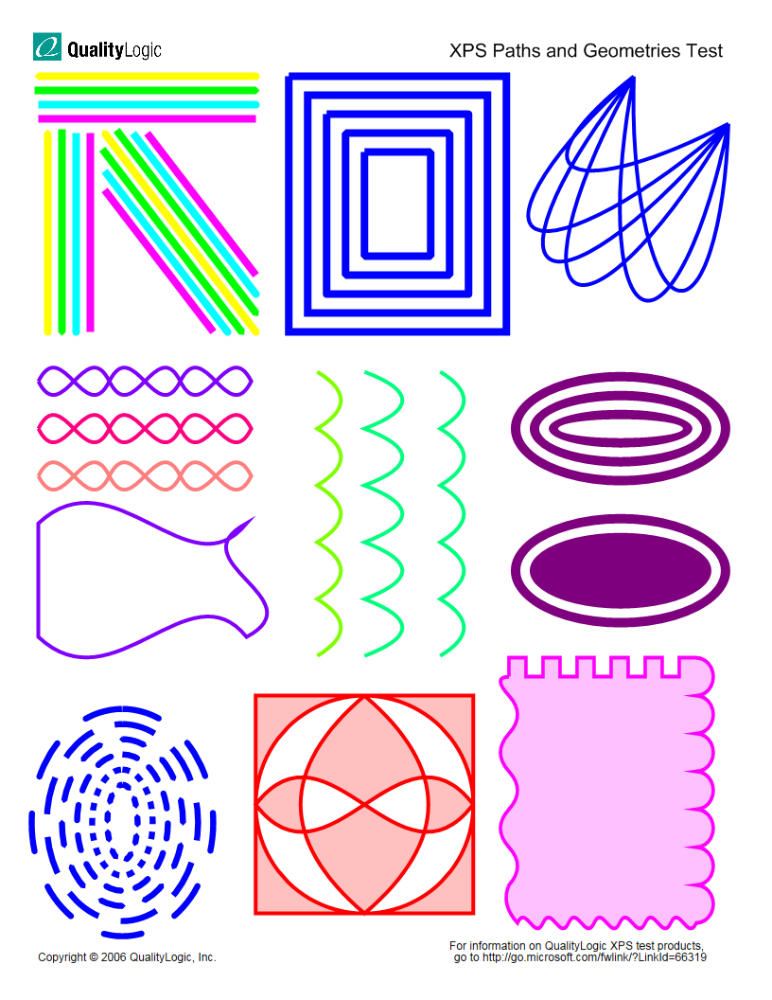
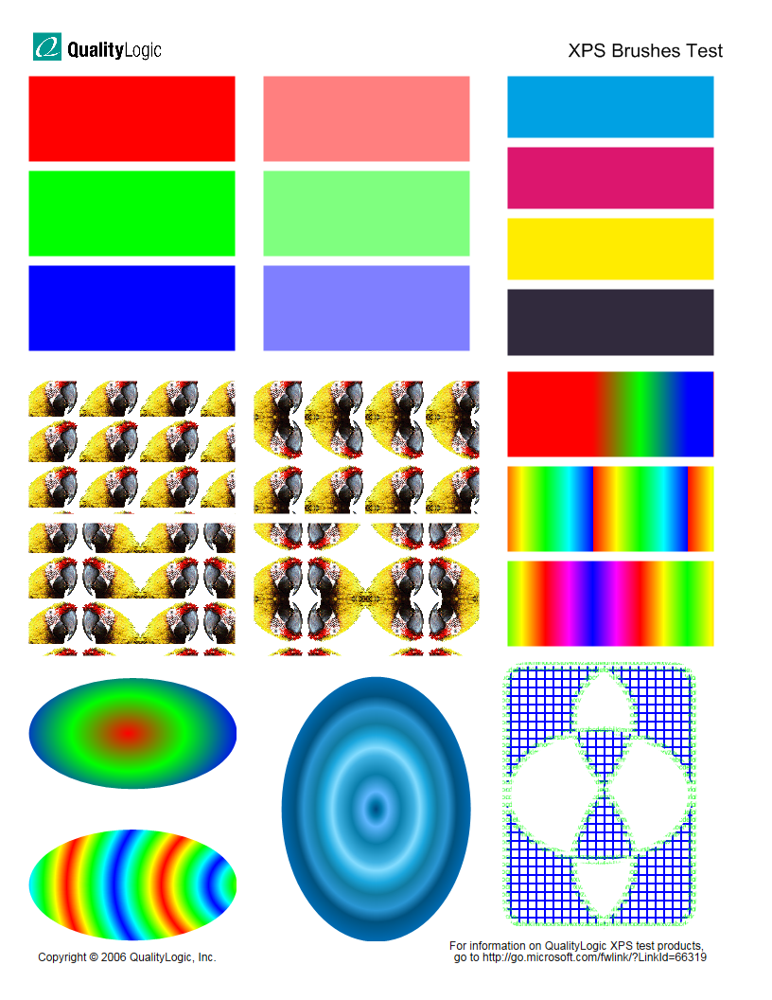
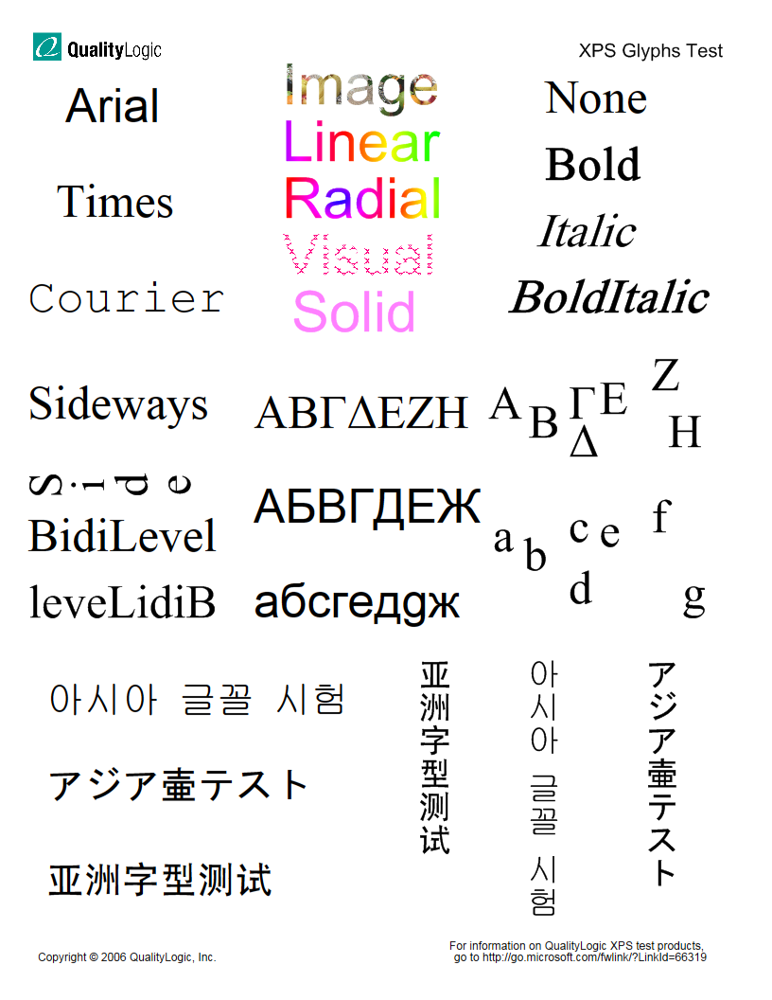
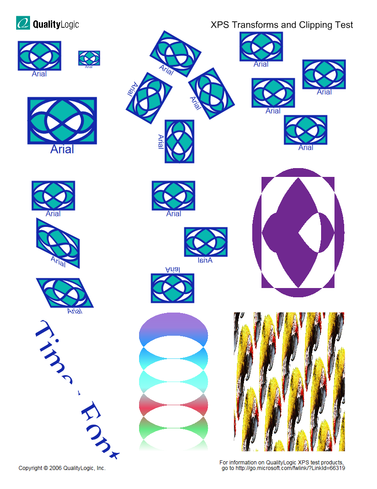
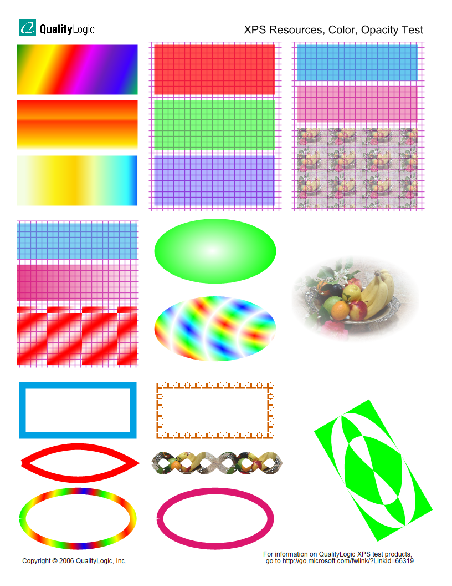
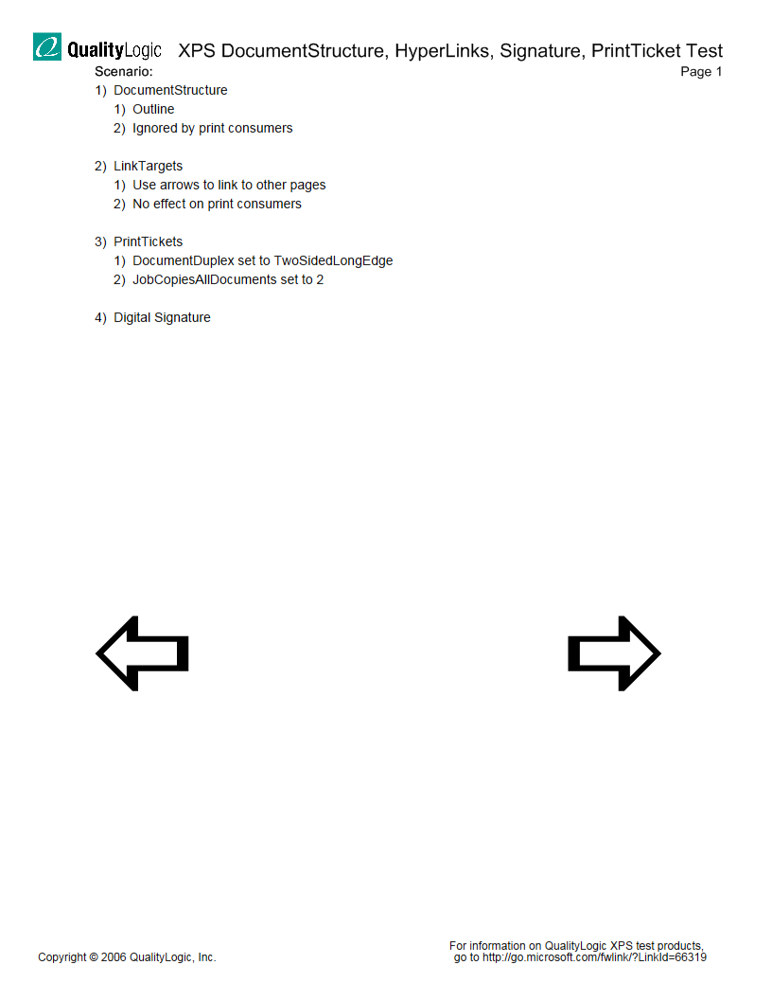
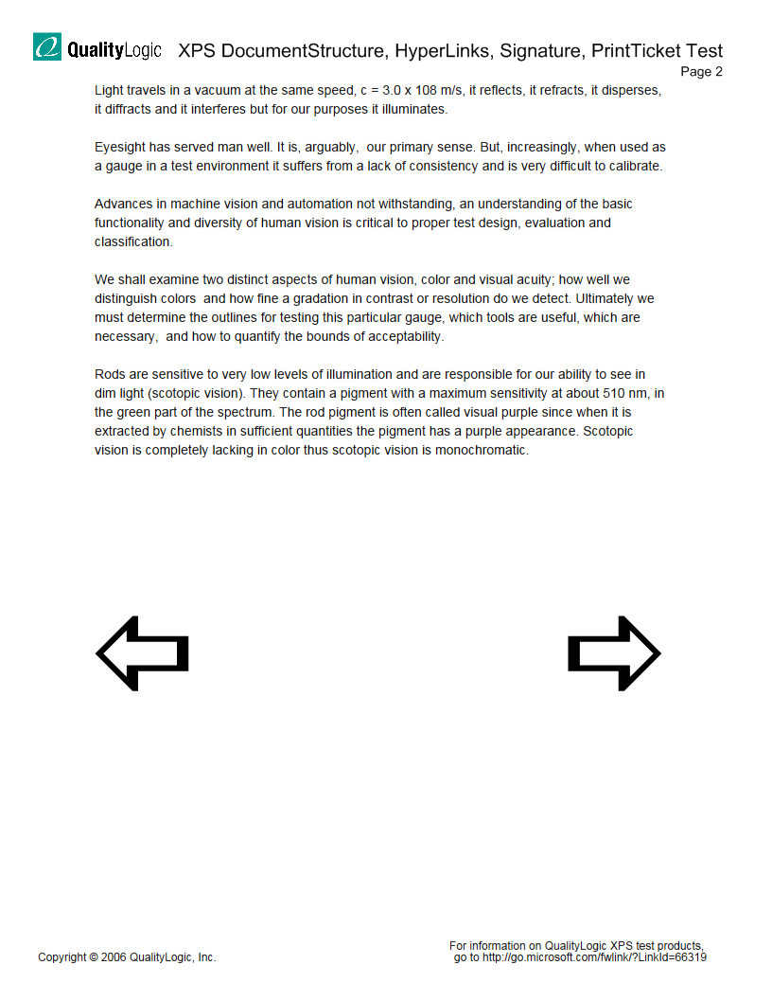
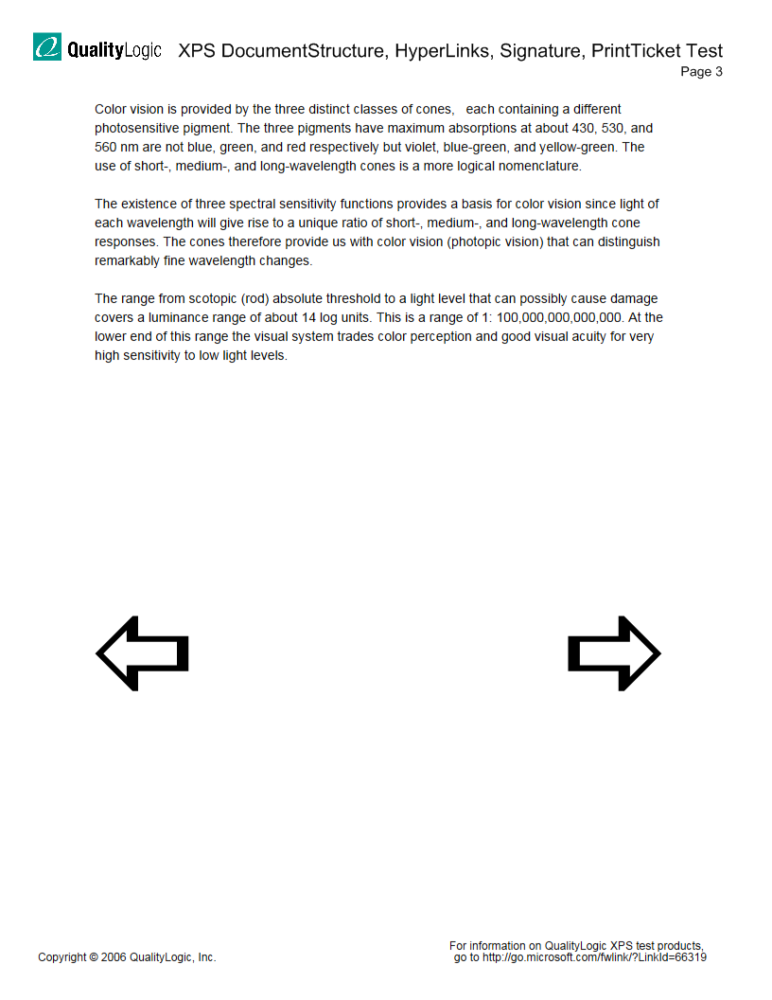

# XPS Content Library (Manual)

This manual test uses the XPS Content Library tool to print a set of XPS file content that is a representative subset of the XPS specification. The test uses a static set of XPS files.

**Note**  
This test cannot run on Windows Server 2008 unless you first install Microsoft .NET Framework version 3.0.

 

## Test details

<table>
<colgroup>
<col width="50%" />
<col width="50%" />
</colgroup>
<tbody>
<tr class="odd">
<td>
<strong>Associated requirements</strong>
</td>
<td>
Device.Imaging.Printer.XPS.XPS

[See the device hardware requirements.](http://go.microsoft.com/fwlink/p/?linkid=254483)
</td>
</tr>
<tr class="even">
<td>
<strong>Platforms</strong>
</td>
<td>
Windows 7 (x64) Windows 7 (x86) Windows 8 (x64) Windows 8 (x86) Windows Server 2012 (x64) Windows Server 2008 R2 (x64) Windows 8.1 x64 Windows 8.1 x86 Windows Server 2012 R2
</td>
</tr>
<tr class="odd">
<td>
<strong>Expected run time</strong>
</td>
<td>
~10 minutes
</td>
</tr>
<tr class="even">
<td>
<strong>Categories</strong>
</td>
<td>
Certification Functional
</td>
</tr>
<tr class="odd">
<td>
<strong>Type</strong>
</td>
<td>
Manual
</td>
</tr>
</tbody>
</table>

 

## Running the test

Before you run the test, complete the test setup as described in the test requirements: [Printer Testing Prerequisites](printer-testing-prerequisites.md).

## Troubleshooting

For troubleshooting information, see [Troubleshooting Device.Imaging Testing](troubleshooting-deviceimaging-testing.md).

## More information

An XPS print filter or device must consume all the valid XPS test files successfully and fail gracefully (that is, no crashes, "hangs," or resource leaks may occur) on the invalid XPS files.

This test includes the following test cases:

-   Test case 1 - Valid Content Test

-   Test case 2 - Invalid Content Test

### Test case 1 - valid content test

This test first prints a set of valid XPS documents. The XPS print filter or device must consume these valid XPS files successfully.

**Titles of the required valid quality logic documents**

<table>
<colgroup>
<col width="50%" />
<col width="50%" />
</colgroup>
<thead>
<tr class="header">
<th>Document title</th>
<th>Description</th>
</tr>
</thead>
<tbody>
<tr class="odd">
<td>
mb01.xps
</td>
<td>
XPS Paths and Geometries Test
</td>
</tr>
<tr class="even">
<td>
mb02.xps
</td>
<td>
XPS Brushes Test
</td>
</tr>
<tr class="odd">
<td>
mb03.xps
</td>
<td>
XPS Glyphs Test
</td>
</tr>
<tr class="even">
<td>
mb04.xps
</td>
<td>
XPS Transforms and Clipping Test
</td>
</tr>
<tr class="odd">
<td>
mb05.xps
</td>
<td>
XPS Resources, Color, Opacity Test
</td>
</tr>
<tr class="even">
<td>
mb06.xps
</td>
<td>
XPS Document Structure, HyperLinks, Signature, PrintTicket Test
</td>
</tr>
<tr class="odd">
<td>
mb07.xps
</td>
<td>
Saved as XPS from Microsoft Office 2007 Word
</td>
</tr>
<tr class="even">
<td>
mb08.xps
</td>
<td>
Breakfast Menu
</td>
</tr>
<tr class="odd">
<td>
mb09.xps
</td>
<td>
The Suzuki Guitar (printed to XPS from Microsoft Office 2007 PowerPoint)
</td>
</tr>
</tbody>
</table>

 

**Expected result**

For these files, compare the output of the printed material with the images below. The printed material must match these images:

The following image represents mb01.xps

The following image represents is an illustration of mb02.xps

The following image represents is an illustration of mb03.xps

The following image represents is an illustration of mb04.xps

The following image represents is an illustration of mb05.xps

The following image represents is an illustration of mb06.xps

The following image represents is an illustration of mb07.xps

The following image represents is an illustration of mb08.xps

The following image represents is an illustration of mb09.xps

### Test case 2 - invalid content test

This test case attempts to print a set of XPS documents whose contents violate certain rules in the XPS and OPC specifications and rules of markup compatibility. The description of each file and the corresponding rule that it violates is below. The XPS print filter must fail gracefully (that is, no crashes, "hangs," or resource leaks may occur) for each of these invalid XPS files. The XPS print filter must not produce output. It is acceptable for a printer to partially print the document, as long as the printer never prints the picture of the gumballs.

**Note**  
A driver or device that consumes XPS in stream format cannot detect the failure in the M3.14a.xps file until after the device has received the entire document. As a result, the device may complete printing the picture of the gumballs, but the device must detect the error and notify the user as soon as the error occurs.

 

**Documents that violate rules in the OPC specification**

<table>
<colgroup>
<col width="50%" />
<col width="50%" />
</colgroup>
<thead>
<tr class="header">
<th>Document title</th>
<th>Description</th>
</tr>
</thead>
<tbody>
<tr class="odd">
<td>
M1.1a.xps
</td>
<td>
The 1.fpage part is missing a part name.
</td>
</tr>
<tr class="even">
<td>
M1.2a.xps
</td>
<td>
The <strong>Default</strong> element in [Content_Types].xml is missing for the jpg type.
</td>
</tr>
<tr class="odd">
<td>
M1.2b.xps
</td>
<td>
The <strong>ContentType</strong> attribute in [Content_Types].xml is missing for the jpg type.
</td>
</tr>
<tr class="even">
<td>
M1.2c.xps
</td>
<td>
The <strong>ContentType</strong> attribute in [Content_Types].xml is empty for the jpg type.
</td>
</tr>
<tr class="odd">
<td>
M1.3a.xps
</td>
<td>
The /Documents/1/Pages/1.fpage part has the name /Documents//Pages/1.fpage.
</td>
</tr>
<tr class="even">
<td>
M1.5a.xps
</td>
<td>
The /Documents/1/Pages/1.fpage part has the name /Documents/1/Pages/1.fpage/.
</td>
</tr>
<tr class="odd">
<td>
M1.6a.xps
</td>
<td>
The /Documents/1/Pages/1.fpage part has the name /Documents/1/Pages#/1.fpage/. ('#' is a gen-deliminator character by RFC 3986)
</td>
</tr>
<tr class="even">
<td>
M1.6b.xps
</td>
<td>
The /Documents/1/Pages/1.fpage part has the name /Documents/1/Pages?/1.fpage/. ('?' is a gen- deliminator character by RFC 3986)
</td>
</tr>
<tr class="odd">
<td>
M1.6c.xps
</td>
<td>
The /Documents/1/Pages/1.fpage part has the name /Documents/1/Pages[/1.fpage/. ('[' is a gen- deliminator character by RFC 3986)
</td>
</tr>
<tr class="even">
<td>
M1.6d.xps
</td>
<td>
The /Documents/1/Pages/1.fpage part has the name /Documents/1/Pages]/1.fpage/. (']' is a gen- deliminator character by RFC 3986)
</td>
</tr>
<tr class="odd">
<td>
M1.7a.xps
</td>
<td>
The /Documents/1/Pages/1.fpage part has the name /Documents/1/Pages%2F/1.fpage/. (%2F is the percent-encoding for a forward slash.)
</td>
</tr>
<tr class="even">
<td>
M1.7b.xps
</td>
<td>
The /Documents/1/Pages/1.fpage part has the name /Documents/1/Pages%5C/1.fpage/. (%5C is the percent-encoding for a backward slash.)
</td>
</tr>
<tr class="odd">
<td>
M1.8a.xps
</td>
<td>
The /Documents/1/Pages/1.fpage part has the name /Documents/1/Pages%48/1.fpage/. (%48 is the percent-encoding for a zero (0).)
</td>
</tr>
<tr class="even">
<td>
M1.8b.xps
</td>
<td>
The /Documents/1/Pages/1.fpage part has the name /Documents/1/Pages%51/1.fpage/. (%51 is the percent-encoding for a 'q'.)
</td>
</tr>
<tr class="odd">
<td>
M1.8c.xps
</td>
<td>
The /Documents/1/Pages/1.fpage part has the name /Documents/1/Pages%7E/1.fpage/. (%7E is the percent-encoding for a tilde (~).)
</td>
</tr>
<tr class="even">
<td>
M1.10a.xps
</td>
<td>
The /Documents/1/Pages/1.fpage part has the name /Documents/1/Pages/./1.fpage/.
</td>
</tr>
<tr class="odd">
<td>
M1.10b.xps
</td>
<td>
The /Documents/1/Pages/1.fpage part has the name /Documents/1/Pages/../1.fpage/.
</td>
</tr>
<tr class="even">
<td>
M1.11a.xps
</td>
<td>
The /Resources/Images/image_0.jpg/image_1.jpg part has a name derived from adding a segment to the part name of the /Resources/Images/image_0.jpg part.
</td>
</tr>
<tr class="odd">
<td>
M1.12a.xps
</td>
<td>
/Resources/Images/image_0.jpg and /Resources/Images/IMAGE_0.JPG exist in the package.
</td>
</tr>
<tr class="even">
<td>
M1.13a.xps
</td>
<td>
The <strong>ContentType</strong> attribute in [Content_Types].xml for the jpg type is &quot;image&quot;. This breaks the RFC 2616 rule because it has a type but no subtype.
</td>
</tr>
<tr class="odd">
<td>
M1.13b.xps
</td>
<td>
The <strong>ContentType</strong> attribute in [Content_Types].xml for the jpg type is &quot;image/jpeg?&quot;. This breaks the RFC 2616 rule because it has a separator.
</td>
</tr>
<tr class="even">
<td>
M1.14a.xps
</td>
<td>
The <strong>ContentType</strong> attribute in [Content_Types].xml for the jpg type is &quot;image / jpeg&quot;, which contains linear white space (LWS) between the type and subtype.
</td>
</tr>
<tr class="odd">
<td>
M1.14b.xps
</td>
<td>
The ContentType attribute in [Content_Types].xml for the jpg type is &quot; image/jpeg&quot;, which contains a leading LWS.
</td>
</tr>
<tr class="even">
<td>
M1.14c.xps
</td>
<td>
The ContentType attribute in [Content_Types].xml for the jpg type is &quot;image/jpeg &quot;, which contains a trailing LWS.
</td>
</tr>
<tr class="odd">
<td>
M1.15a.xps
</td>
<td>
The <strong>Default</strong> element in [Content_Types].xml for the jpg type is &quot;image/jpeg &lt;!-- comment --&gt;&quot;, which contains an XML comment.
</td>
</tr>
<tr class="even">
<td>
M1.17a.xps
</td>
<td>
[Content_Types].xml is encoded in ISO-8859-1.
</td>
</tr>
<tr class="odd">
<td>
M1.17b.xps
</td>
<td>
_rels\.rels is encoded in ISO-8859-1.
</td>
</tr>
<tr class="even">
<td>
M1.18a.xps
</td>
<td>
[Content_Types].xml contains a DTD declaration at the top of the XML markup.
</td>
</tr>
<tr class="odd">
<td>
M1.18b.xps
</td>
<td>
_rels/.rels contains a DTD declaration at the top of the XML markup.
</td>
</tr>
<tr class="even">
<td>
M1.20a.xps
</td>
<td>
[Content_Types].xml contains an illegal namespace at the top of the XML markup, and an attribute drawn from that namespace in the <strong>Default</strong> element for the jpg type.
</td>
</tr>
<tr class="odd">
<td>
M1.21a.xps
</td>
<td>
[Content_Types].xml contains an attribute drawn from the &quot;xml&quot; namespace in the <strong>Default</strong> element for the jpg type.
</td>
</tr>
<tr class="even">
<td>
M1.21b.xps
</td>
<td>
_rels/.rels contains an attribute drawn from the &quot;xsi&quot; namespace in the <strong>Relationship</strong> element for the fixed document sequence.
</td>
</tr>
<tr class="odd">
<td>
M1.22a.xps
</td>
<td>
The content type for the Relationships part has a parameter / value pair.
</td>
</tr>
<tr class="even">
<td>
M1.26a.xps
</td>
<td>
The _rels/.rels part contains two relationships with identical <strong>Id</strong> attribute values.
</td>
</tr>
<tr class="odd">
<td>
M1.26b.xps
</td>
<td>
The _rels/.rels part contains a relationship that has an illegal Id value according to the W3C Recommendation. The Id value includes an exclamation point.
</td>
</tr>
<tr class="even">
<td>
M1.27a.xps
</td>
<td>
The <strong>Type</strong> attribute of the fixed document sequence relationship is missing.
</td>
</tr>
<tr class="odd">
<td>
M1.27b.xps
</td>
<td>
The <strong>Type</strong> attribute of the fixed document sequence relationship is incorrect. It is set to the core properties type.
</td>
</tr>
<tr class="even">
<td>
M1.28a.xps
</td>
<td>
The <strong>Target</strong> attribute of the fixed document sequence relationship is missing.
</td>
</tr>
<tr class="odd">
<td>
M1.28b.xps
</td>
<td>
The <strong>Target</strong> attribute of the fixed document sequence relationship is not a URI.
</td>
</tr>
<tr class="even">
<td>
M1.30a.xps
</td>
<td>
The fixed page relationship part is named incorrectly for a relationship part.
</td>
</tr>
<tr class="odd">
<td>
M1.30b.xps
</td>
<td>
The fixed page relationship part is has an invalid content type in [Content_Types].xml.
</td>
</tr>
<tr class="even">
<td>
M2.4a.xps
</td>
<td>
The fixed document sequence type has no matching <strong>Default</strong> or <strong>Override</strong> elements.
</td>
</tr>
<tr class="odd">
<td>
M2.5a.xps
</td>
<td>
The fixed document sequence type has two matching <strong>Default</strong> elements.
</td>
</tr>
<tr class="even">
<td>
M2.5b.xps
</td>
<td>
The fixed document sequence type has two matching <strong>Override</strong> elements.
</td>
</tr>
<tr class="odd">
<td>
M2.6a.xps
</td>
<td>
The <strong>Extension</strong> attribute is missing for the fixed document sequence type.
</td>
</tr>
<tr class="even">
<td>
M2.6b.xps
</td>
<td>
The <strong>Extension</strong> attribute is missing a value for the fixed document sequence type.
</td>
</tr>
<tr class="odd">
<td>
M2.7a.xps
</td>
<td>
The <strong>PartName</strong> attribute is missing for the fixed document sequence type.
</td>
</tr>
<tr class="even">
<td>
M2.7b.xps
</td>
<td>
The <strong>PartName</strong> attribute has an empty value for the fixed document sequence type.
</td>
</tr>
<tr class="odd">
<td>
M2.10a.xps
</td>
<td>
The rels type has Markup Compatibility markup.
</td>
</tr>
<tr class="even">
<td>
M2.11a.xps
</td>
<td>
The fixed document sequence has both a non-interleaved part and an interleaved part.
</td>
</tr>
<tr class="odd">
<td>
M2.18a.xps
</td>
<td>
The _rels/.rels part is missing one piece.
</td>
</tr>
<tr class="even">
<td>
M3.9a.xps
</td>
<td>
The entire ZIP archive is encrypted. The password is “password”.
</td>
</tr>
<tr class="odd">
<td>
M3.10a.xps
</td>
<td>
The file item &quot;/[Content_Types].xml&quot; has been renamed to &quot;/Content_Types.xml&quot;.
</td>
</tr>
<tr class="even">
<td>
M3.14a.xps
</td>
<td>
The local file header does not match the file header in the Central Directory for the _rels/.rels part.
</td>
</tr>
</tbody>
</table>

 

**Documents that violate rules in the XPS specification**

<table>
<colgroup>
<col width="50%" />
<col width="50%" />
</colgroup>
<thead>
<tr class="header">
<th>Document title</th>
<th>Description</th>
</tr>
</thead>
<tbody>
<tr class="odd">
<td>
M1.2a
</td>
<td>
The package is plain text instead of a zip archive.
</td>
</tr>
<tr class="even">
<td>
M2.2a
</td>
<td>
The ContentType attribute is missing.
</td>
</tr>
<tr class="odd">
<td>
M2.3a
</td>
<td>
The fixedrepresentation relationship is missing.
</td>
</tr>
<tr class="even">
<td>
M2.3b
</td>
<td>
There are two fixedrepresentation relationships.
</td>
</tr>
<tr class="odd">
<td>
M2.3c
</td>
<td>
The FixedDocumentSequence part is missing.
</td>
</tr>
<tr class="even">
<td>
M2.4a
</td>
<td>
The FixedDocument part is missing.
</td>
</tr>
<tr class="odd">
<td>
M2.5a
</td>
<td>
The FixedPage part is missing.
</td>
</tr>
<tr class="even">
<td>
M2.6a
</td>
<td>
The Font Part is missing.
</td>
</tr>
<tr class="odd">
<td>
M2.6b
</td>
<td>
The FontURI attribute is missing.
</td>
</tr>
<tr class="even">
<td>
M2.7c
</td>
<td>
The FontURI attribute is invalid.
</td>
</tr>
<tr class="odd">
<td>
M2.7a
</td>
<td>
The Image Part is missing.
</td>
</tr>
<tr class="even">
<td>
M2.7b
</td>
<td>
The ImageSource attribute is missing.
</td>
</tr>
<tr class="odd">
<td>
M2.7c
</td>
<td>
The ImageSource attribute is invalid.
</td>
</tr>
<tr class="even">
<td>
M2.8a
</td>
<td>
The Remote Resource Dictionary Part is missing.
</td>
</tr>
<tr class="odd">
<td>
M2.8b
</td>
<td>
The FixedPage Resource attribute for Remote Resource Dictionary Part is missing.
</td>
</tr>
<tr class="even">
<td>
M2.8c
</td>
<td>
The FixedPage Resource attribute is invalid.
</td>
</tr>
<tr class="odd">
<td>
M2.10a
</td>
<td>
The Required Resource relationships are missing.
</td>
</tr>
<tr class="even">
<td>
M2.10b
</td>
<td>
The Required Resource relationships are invalid.
</td>
</tr>
<tr class="odd">
<td>
M2.13a
</td>
<td>
The fixedrepresentation relationships are missing.
</td>
</tr>
<tr class="even">
<td>
M2.13b
</td>
<td>
There are two fixedrepresentation relationships.
</td>
</tr>
<tr class="odd">
<td>
M2.14b
</td>
<td>
The fixedrepresentation relationship points to the Nonexistence part.
</td>
</tr>
<tr class="even">
<td>
M2.17a
</td>
<td>
The JPG image is corrupt.
</td>
</tr>
<tr class="odd">
<td>
M2.18a
</td>
<td>
The PNG image is corrupt.
</td>
</tr>
<tr class="even">
<td>
M2.25a
</td>
<td>
The TIF image is corrupt.
</td>
</tr>
<tr class="odd">
<td>
M2.35a
</td>
<td>
The WDP image is corrupt.
</td>
</tr>
<tr class="even">
<td>
M2.39a
</td>
<td>
The ODTTF font is corrupt.
</td>
</tr>
<tr class="odd">
<td>
M2.39b
</td>
<td>
The TTF font is corrupt.
</td>
</tr>
<tr class="even">
<td>
M2.39c
</td>
<td>
The TTF font is treated as an obfuscated font.
</td>
</tr>
<tr class="odd">
<td>
M2.54a
</td>
<td>
The Obfuscated font file name is invalid.
</td>
</tr>
<tr class="even">
<td>
M2.59a
</td>
<td>
Two PrintTickets are related to FixedDocumentSequence.
</td>
</tr>
<tr class="odd">
<td>
M2.59b
</td>
<td>
Two PrintTickets are related to FixedDocument.
</td>
</tr>
<tr class="even">
<td>
M2.59c
</td>
<td>
Two PrintTickets are related to FixedPage.
</td>
</tr>
<tr class="odd">
<td>
M2.70a
</td>
<td>
XML is encoded using big5 type.
</td>
</tr>
<tr class="even">
<td>
M2.71a
</td>
<td>
There is a DTD in Relationship markup.
</td>
</tr>
<tr class="odd">
<td>
M2.71b
</td>
<td>
There is a DTD in Content_Types markup.
</td>
</tr>
<tr class="even">
<td>
M2.71c
</td>
<td>
There is a DTD in FixedPage markup.
</td>
</tr>
<tr class="odd">
<td>
M2.72a
</td>
<td>
The XML file is invalid.
</td>
</tr>
<tr class="even">
<td>
M2.72b
</td>
<td>
There are elements that do not conform with XPS XSD schema.
</td>
</tr>
<tr class="odd">
<td>
M2.72c
</td>
<td>
There are attributes that do not conform with XPS XSD schema.
</td>
</tr>
<tr class="even">
<td>
M2.73a
</td>
<td>
There is an Xml:id attribute in FixedPage markup.
</td>
</tr>
<tr class="odd">
<td>
M2.73b
</td>
<td>
There is an Xsi:SchemaLocation attribute on the &lt;FixedPage&gt; element.
</td>
</tr>
<tr class="even">
<td>
M2.74a
</td>
<td>
Duplicate attribute (FixedPage::Width)
</td>
</tr>
<tr class="odd">
<td>
M2.74b
</td>
<td>
Duplicate element (Path::Fill)
</td>
</tr>
<tr class="even">
<td>
M2.74c
</td>
<td>
Duplicate attribute/element (&lt;Path&gt; has Fill attrib and &lt;Path.Fill&gt; child element)
</td>
</tr>
<tr class="odd">
<td>
M2.75a
</td>
<td>
Xml:space attribute on &lt;FixedDocument&gt; element
</td>
</tr>
<tr class="even">
<td>
M2.75b
</td>
<td>
Xml:space attribute on &lt;PageContent&gt; element
</td>
</tr>
<tr class="odd">
<td>
M2.75c
</td>
<td>
Xml:space attribute on &lt;FixedPage&gt; element
</td>
</tr>
<tr class="even">
<td>
M2.75d
</td>
<td>
Xml:space attribute on &lt;Path&gt; element
</td>
</tr>
<tr class="odd">
<td>
M2.77a
</td>
<td>
The Source attribute is missing.
</td>
</tr>
<tr class="even">
<td>
M2.77b
</td>
<td>
The Source attribute is invalid.
</td>
</tr>
<tr class="odd">
<td>
M3.2a
</td>
<td>
The DocumentReference::Source attribute is missing.
</td>
</tr>
<tr class="even">
<td>
M3.2b
</td>
<td>
The DocumentReference::Source attribute is invalid.
</td>
</tr>
<tr class="odd">
<td>
M3.3a
</td>
<td>
Multiple &lt;DocumentReference&gt; elements point to the same FixedDocument.
</td>
</tr>
<tr class="even">
<td>
M3.5a
</td>
<td>
The PageContent::Source attribute is missing.
</td>
</tr>
<tr class="odd">
<td>
M3.5b
</td>
<td>
The PageContent::Source attribute is invalid.
</td>
</tr>
<tr class="even">
<td>
M3.6a
</td>
<td>
Multiple &lt;PageContent&gt; elements point to the same FixedPage.
</td>
</tr>
<tr class="odd">
<td>
M3.6b
</td>
<td>
Multiple &lt;PageContent&gt; elements point to the same FixedPage from different FixedDocuments.
</td>
</tr>
<tr class="even">
<td>
M3.20a
</td>
<td>
The x:Key attribute for Canvas is missing.
</td>
</tr>
<tr class="odd">
<td>
M3.20b
</td>
<td>
The x:Key attribute for Canvas is invalid.
</td>
</tr>
<tr class="even">
<td>
M4.1a
</td>
<td>
The x:Key attribute for Path is missing.
</td>
</tr>
<tr class="odd">
<td>
M4.1b
</td>
<td>
The x:Key attribute for Path is invalid.
</td>
</tr>
<tr class="even">
<td>
M4.2a
</td>
<td>
The x:Key attribute for PathGeometry is missing.
</td>
</tr>
<tr class="odd">
<td>
M4.2b
</td>
<td>
The x:Key attribute for PathGeometry is invalid.
</td>
</tr>
<tr class="even">
<td>
M4.3a
</td>
<td>
There is a duplicate PathFigure.
</td>
</tr>
<tr class="odd">
<td>
M5.2a
</td>
<td>
The UnicodeString / Indices are missing.
</td>
</tr>
<tr class="even">
<td>
M5.2b
</td>
<td>
The Indices and Invalid UnicodeString (&quot;&quot;) are missing.
</td>
</tr>
<tr class="odd">
<td>
M5.2c
</td>
<td>
The Indices and Invalid UnicodeString (&quot;{}&quot;) are missing.
</td>
</tr>
<tr class="even">
<td>
M5.3a
</td>
<td>
The x:Key attribute for Glyphs is missing.
</td>
</tr>
<tr class="odd">
<td>
M5.3b
</td>
<td>
The x:Key attribute for Glyphs is invalid.
</td>
</tr>
<tr class="even">
<td>
M5.4a
</td>
<td>
A &lt;Glyphs&gt; element has an Indices attribute that contains an invalid Glyph Index for the specified font.
</td>
</tr>
<tr class="odd">
<td>
M5.4b
</td>
<td>
A &lt;Glyphs&gt; element has more entries in the indices attribute than the UnicodeString attribute.
</td>
</tr>
<tr class="even">
<td>
M5.7a
</td>
<td>
A &lt;Glyphs&gt; element has a UnicodeString attribute that starts with {.
</td>
</tr>
<tr class="odd">
<td>
M5.15a
</td>
<td>
A &lt;Glyphs&gt; element has both BidiLevel and isSideways attributes.
</td>
</tr>
<tr class="even">
<td>
M6.1a
</td>
<td>
The x:Key attribute for SolidColorBrush is missing.
</td>
</tr>
<tr class="odd">
<td>
M6.1b
</td>
<td>
The x:Key attribute for SolidColorBrush is invalid.
</td>
</tr>
<tr class="even">
<td>
M6.2a
</td>
<td>
The x:Key attribute for ImageBrush is missing.
</td>
</tr>
<tr class="odd">
<td>
M6.2b
</td>
<td>
The x:Key attribute for ImageBrush is invalid.
</td>
</tr>
<tr class="even">
<td>
M6.3a
</td>
<td>
The ImageSource attribute is missing.
</td>
</tr>
<tr class="odd">
<td>
M6.3b
</td>
<td>
The ImageSource attribute (&lt;ImageBrush&gt; element that references a font part) is invalid.
</td>
</tr>
<tr class="even">
<td>
M6.4a
</td>
<td>
The x:Key attribute for VisualBrush is missing.
</td>
</tr>
<tr class="odd">
<td>
M6.4b
</td>
<td>
The x:Key attribute for VisualBrush is invalid.
</td>
</tr>
<tr class="even">
<td>
M6.5a
</td>
<td>
The x:Key attribute for LinearGradientBrush is missing.
</td>
</tr>
<tr class="odd">
<td>
M6.5b
</td>
<td>
The x:Key attribute for LinearGradientBrush is invalid.
</td>
</tr>
<tr class="even">
<td>
M6.6a
</td>
<td>
The x:Key attribute for RadialGradientBrush is missing.
</td>
</tr>
<tr class="odd">
<td>
M6.6b
</td>
<td>
The x:Key attribute for RadialGradientBrush is invalid.
</td>
</tr>
<tr class="even">
<td>
M7.2a
</td>
<td>
The namespace declaration in ResourceDictionary is missing.
</td>
</tr>
<tr class="odd">
<td>
M7.2b
</td>
<td>
The namespace declaration in ResourceDictionary is invalid.
</td>
</tr>
<tr class="even">
<td>
M7.5a
</td>
<td>
A remote resource dictionary references another remote resource dictionary.
</td>
</tr>
<tr class="odd">
<td>
M7.6a
</td>
<td>
A ResourceDictionary has both Source and ResourceDefinitions set.
</td>
</tr>
<tr class="even">
<td>
M7.11a
</td>
<td>
The x:Key attribute for MatrixTransform is missing.
</td>
</tr>
<tr class="odd">
<td>
M7.11b
</td>
<td>
The x:Key attribute for MatrixTransform is invalid.
</td>
</tr>
<tr class="even">
<td>
M8.14a
</td>
<td>
The ContextColor value contains exponent form numbers.
</td>
</tr>
<tr class="odd">
<td>
M9.10a
</td>
<td>
There is a Name attribute in RemoteResourceDictionary.
</td>
</tr>
<tr class="even">
<td>
M9.10b
</td>
<td>
There is a Name attribute in ResourceDictionary.
</td>
</tr>
<tr class="odd">
<td>
M12.2a
</td>
<td>
A FixedDocument is referenced twice in DocumentSequence.
</td>
</tr>
<tr class="even">
<td>
M12.3a
</td>
<td>
A FixedPage is referenced twice in a single FixedDocument.
</td>
</tr>
<tr class="odd">
<td>
M12.3b
</td>
<td>
A FixedPage is referenced twice in different FixedDocuments.
</td>
</tr>
<tr class="even">
<td>
M12.5a
</td>
<td>
A FixedDocumentSequence has two PrintTickets.
</td>
</tr>
<tr class="odd">
<td>
M12.5b
</td>
<td>
A FixedDocument with two PrintTickets.
</td>
</tr>
<tr class="even">
<td>
M12.5c
</td>
<td>
A FixedPage has two PrintTickets.
</td>
</tr>
<tr class="odd">
<td>
M12.7a
</td>
<td>
A ContentType attribute contains a Parameter (ContentType=&quot;image/jpeg;q=0&quot;).
</td>
</tr>
</tbody>
</table>

 

**Documents that violate markup compatibility rules**

<table>
<colgroup>
<col width="50%" />
<col width="50%" />
</colgroup>
<thead>
<tr class="header">
<th>Document title</th>
<th>Description</th>
</tr>
</thead>
<tbody>
<tr class="odd">
<td>
M1.1a
</td>
<td>
The Canvas element in the FixedPage markup contains a BadMustUnderstand attribute in the Markup Compatibility namespace.
</td>
</tr>
<tr class="even">
<td>

</td>
<td>
The XML in the \Documents\1\Pages\1.fpage part is invalid: &lt;Canvas mc:BadMustUnderstand=&quot;v1&quot;&gt;
</td>
</tr>
<tr class="odd">
<td>
<em>M1.2a</em>
</td>
<td>
The Canvas element in the FixedPage markup contains a BadMustUnderstand attribute in the Markup Compatibility namespace.
</td>
</tr>
<tr class="even">
<td>
<em></em>
</td>
<td>
The XML in the \Documents\1\Pages\1.fpage part is invalid: &lt;Canvas mc:BadMustUnderstand=&quot;v1&quot;&gt;
</td>
</tr>
<tr class="odd">
<td>
<em>M2.14a</em>
</td>
<td>
The Canvas element in the FixedPage markup contains a ProcessContent attribute that doesn't belong to a namespace that is identified by the Ignoreable attribute on the Canvas element.
</td>
</tr>
<tr class="even">
<td>
<em></em>
</td>
<td>
The XML in the \Documents\1\Pages\1.fpage part is invalid: &lt;Canvas mc:Ignorable=&quot;v3&quot; mc:ProcessContent=&quot;v2:Blink&quot;&gt;
</td>
</tr>
<tr class="odd">
<td>
<em>M2.17a</em>
</td>
<td>
The Canvas element in the FixedPage markup contains a ProcessContent attribute that doesn't belong to a namespace that is identified by the Ignoreable attribute on the Canvas element.
</td>
</tr>
<tr class="even">
<td>
<em></em>
</td>
<td>
The XML in the \Documents\1\Pages\1.fpage part is invalid: &lt;Canvas mc:Ignorable=&quot;v2&quot; mc:ProcessContent=&quot;v2:Blink&quot;&gt; &lt;v2:Blink xml:lang=&quot;en-US&quot;&gt;
</td>
</tr>
<tr class="odd">
<td>
<em>M2.27a</em>
</td>
<td>
The Canvas element in the FixedPage markup contains a MustUnderstand attribute that isn't understood.
</td>
</tr>
<tr class="even">
<td>
<em></em>
</td>
<td>
The XML in the \Documents\1\Pages\1.fpage part is invalid: &lt;Canvas mc:MustUnderstand=&quot;v2&quot;&gt;
</td>
</tr>
<tr class="odd">
<td>
<em>M2.27b</em>
</td>
<td>
The Canvas element in the FixedPage markup contains a MustUnderstand attribute that isn't understood. This problem occurs even though the attribute is specified as Ignorable.
</td>
</tr>
<tr class="even">
<td>
<em></em>
</td>
<td>
The XML in the \Documents\1\Pages\1.fpage part is invalid: &lt;Canvas mc:Ignorable=&quot;v2&quot;&gt; &lt;Canvas mc:MustUnderstand=&quot;v2&quot;&gt;
</td>
</tr>
<tr class="odd">
<td>
<em>M2.30a</em>
</td>
<td>
The AlternateContent element in the FixedPage markup does not contain a Choice child element.
</td>
</tr>
<tr class="even">
<td>
<em></em>
</td>
<td>
The XML in the\Documents\1\Pages\1.fpage part is invalid: &lt;mc:AlternateContent&gt; &lt;mc:Fallback&gt;
</td>
</tr>
<tr class="odd">
<td>
<em>M2.31a</em>
</td>
<td>
The AlternateContent element in the FixedPage markup contains two Fallback child elements.
</td>
</tr>
<tr class="even">
<td>
<em></em>
</td>
<td>
The XML in the \Documents\1\Pages\1.fpage part is invalid:
</td>
</tr>
<tr class="odd">
<td>
<em>M2.32a</em>
</td>
<td>
The AlternateContent element in the FixedPage markup contains a Fallback child element that precedes a Choice element.
</td>
</tr>
<tr class="even">
<td>
<em></em>
</td>
<td>
The XML in the \Documents\1\Pages\1.fpage part is invalid:
</td>
</tr>
<tr class="odd">
<td>
<em>M2.33a</em>
</td>
<td>
The AlternateContent element in the FixedPage markup is a child of another AlternateContent element.
</td>
</tr>
<tr class="even">
<td>
<em></em>
</td>
<td>
The XML in the \Documents\1\Pages\1.fpage part is invalid:
</td>
</tr>
<tr class="odd">
<td>
<em>M2.35a</em>
</td>
<td>
The AlternateContent element has an attribute that is unprefixed.
</td>
</tr>
<tr class="even">
<td>
<em></em>
</td>
<td>
The XML in the \Documents\1\Pages\1.fpage part is invalid: &lt;mc:AlternateContent Ignorable=&quot;v2&quot;&gt;
</td>
</tr>
<tr class="odd">
<td>
<em>M2.36a</em>
</td>
<td>
The AlternateContent element has a child that is neither understood nor ignorable.
</td>
</tr>
<tr class="even">
<td>
<em></em>
</td>
<td>
The XML in the \Documents\1\Pages\1.fpage part is invalid (as a child of AlternateContent): &lt;v2:Circle Center=&quot;13,20&quot; Radius=&quot;20&quot; Color=&quot;Yellow&quot; Opacity=&quot;0.5&quot; Luminance=&quot;13&quot; /&gt;
</td>
</tr>
<tr class="odd">
<td>
<em>M2.36b</em>
</td>
<td>
AlternateContent has an attribute that belongs to a namespace that is neither understood nor ignorable.
</td>
</tr>
<tr class="even">
<td>
<em></em>
</td>
<td>
The XML in the \Documents\1\Pages\1.fpage part is invalid: &lt;mc:AlternateContent v2:Blink=&quot;Blink&quot; /&gt;
</td>
</tr>
<tr class="odd">
<td>
<em>M2.41a</em>
</td>
<td>
The Choice element contains an attribute from a namespace that is neither understood nor ignorable.
</td>
</tr>
<tr class="even">
<td>
<em></em>
</td>
<td>
The XML in the \Documents\1\Pages\1.fpage part is invalid: &lt;mc:Choice Requires=&quot;v2&quot; v2:bad=&quot;bad&quot;&gt;
</td>
</tr>
<tr class="odd">
<td>
<em>M2.41b</em>
</td>
<td>
The Fallback element contains an attribute from a namespace that is neither understood nor ignorable.
</td>
</tr>
<tr class="even">
<td>
<em></em>
</td>
<td>
The XML in the \Documents\1\Pages\1.fpage part is invalid: &lt;mc:Fallback v2:bad=&quot;bad&quot;&gt;
</td>
</tr>
<tr class="odd">
<td>
<em>M2.42a</em>
</td>
<td>
The Choice element has a MustUnderstand attribute that identifies a namespace that the test does not understand, which is v2.
</td>
</tr>
<tr class="even">
<td>
<em></em>
</td>
<td>
The XML in the \Documents\1\Pages\1.fpage part is invalid: &lt;mc:Choice Requires=&quot;v2&quot; mc:MustUnderstand=&quot;v2&quot;&gt;
</td>
</tr>
<tr class="odd">
<td>
<em>M2.42b</em>
</td>
<td>
The Fallback element has a MustUnderstand attribute that identifies a namespace that the test does not understand, which is v2
</td>
</tr>
<tr class="even">
<td>
<em></em>
</td>
<td>
The XML in the \Documents\1\Pages\1.fpage part is invalid: &lt;mc:Fallback mc:MustUnderstand=&quot;v2&quot;&gt;
</td>
</tr>
<tr class="odd">
<td>
<em>M2.43a</em>
</td>
<td>
The AlternateContent element has the xml:lang attribute.
</td>
</tr>
<tr class="even">
<td>
<em></em>
</td>
<td>
The XML in the \Documents\1\Pages\1.fpage part is invalid: &lt;mc:AlternateContent xml:lang=&quot;en-US&quot;&gt;
</td>
</tr>
<tr class="odd">
<td>
<em>M2.43b</em>
</td>
<td>
The AlternateContent element has the xml:space attribute.
</td>
</tr>
<tr class="even">
<td>
<em></em>
</td>
<td>
The XML in the \Documents\1\Pages\1.fpage part is invalid: &lt;mc:AlternateContent xml:space=&quot;default&quot;&gt;
</td>
</tr>
<tr class="odd">
<td>
<em>M2.48a</em>
</td>
<td>
The Choice element has an unprefixed attribute.
</td>
</tr>
<tr class="even">
<td>
<em></em>
</td>
<td>
The XML in the \Documents\1\Pages\1.fpage part is invalid: &lt;mc:Choice Ignorable=&quot;v3&quot; Requires=&quot;v2&quot;&gt;
</td>
</tr>
<tr class="odd">
<td>
<em>M2.49a</em>
</td>
<td>
The Choice element has the xml:lang attribute.
</td>
</tr>
<tr class="even">
<td>
<em></em>
</td>
<td>
The XML in the \Documents\1\Pages\1.fpage part is invalid: &lt;mc:Choice xml:lang=&quot;en-US&quot; Requires=&quot;v2&quot;&gt;
</td>
</tr>
<tr class="odd">
<td>
<em>M2.49b</em>
</td>
<td>
The Choice element has the xml:space attribute.
</td>
</tr>
<tr class="even">
<td>
<em></em>
</td>
<td>
The XML in the \Documents\1\Pages\1.fpage part is invalid: &lt;mc:Choice xml:space=&quot;default&quot; Requires=&quot;v2&quot;&gt;
</td>
</tr>
<tr class="odd">
<td>
<em>M2.50a</em>
</td>
<td>
The Choice element has a Requires attribute that specifies a non-visible namespace.
</td>
</tr>
<tr class="even">
<td>
<em></em>
</td>
<td>
The XML in the \Documents\1\Pages\1.fpage part is invalid: &lt;mc:Choice Requires=&quot;v5&quot;&gt;
</td>
</tr>
<tr class="odd">
<td>
<em>M2.52a</em>
</td>
<td>
The Choice element has a Requires attribute that has the Markup Compatibility prefix.
</td>
</tr>
<tr class="even">
<td>
<em></em>
</td>
<td>
The XML in the \Documents\1\Pages\1.fpage part is invalid: &lt;mc:Choice mc:Requires=&quot;v2&quot;&gt;
</td>
</tr>
<tr class="odd">
<td>
<em>M2.55a</em>
</td>
<td>
The Fallback element has an attribute that has no prefix.
</td>
</tr>
<tr class="even">
<td>
<em></em>
</td>
<td>
The XML in the \Documents\1\Pages\1.fpage part is invalid: &lt;mc:Fallback Ignorable=&quot;v2&quot;&gt;
</td>
</tr>
<tr class="odd">
<td>
<em>M2.56a</em>
</td>
<td>
The Fallback element has an xml:lang attribute.
</td>
</tr>
<tr class="even">
<td>
<em></em>
</td>
<td>
The XML in the \Documents\1\Pages\1.fpage part is invalid: &lt;mc:Fallback xml:lang=&quot;en&quot;&gt;
</td>
</tr>
</tbody>
</table>

 

**Documents that deal with thumbnails -- Optional:**

**Note**  
This print job prints one page that is titled "Valid Thumbnail" and contains a red square box.

 

<table>
<colgroup>
<col width="50%" />
<col width="50%" />
</colgroup>
<thead>
<tr class="header">
<th>Document title</th>
<th>Description</th>
</tr>
</thead>
<tbody>
<tr class="odd">
<td>
M2.36a
</td>
<td>
FixedPage with 2 thumbnails
</td>
</tr>
<tr class="even">
<td>
M2.37a
</td>
<td>
FixedPage with TIF thumbnail
</td>
</tr>
<tr class="odd">
<td>
Thumbnail.xps
</td>
<td>
Valid XPS file containing a thumbnail
</td>
</tr>
</tbody>
</table>

 

**Documents that deal with discard control -- Optional:**

**Note**  
This print job prints one page that is titled "Valid Discard Control" and contains a multi-color circle inside a black square box.

 

<table>
<colgroup>
<col width="50%" />
<col width="50%" />
</colgroup>
<thead>
<tr class="header">
<th>Document title</th>
<th>Description</th>
</tr>
</thead>
<tbody>
<tr class="odd">
<td>
M10.6a
</td>
<td>
DiscardControl references itself (TargetUri)
</td>
</tr>
<tr class="even">
<td>
M10.6b
</td>
<td>
DiscardControl references itself (SentinelUri)
</td>
</tr>
<tr class="odd">
<td>
M10.23a
</td>
<td>
Multiple DiscardControl package relationships
</td>
</tr>
<tr class="even">
<td>
DiscardControl.xps
</td>
<td>
Valid XPS file containing a discard control
</td>
</tr>
</tbody>
</table>

 

 

 

[Send comments about this topic to Microsoft](mailto:wsddocfb@microsoft.com?subject=Documentation%20feedback%20%5Bp_hck\p_hck%5D:%20XPS%20Content%20Library%20%28Manual%29%20%20RELEASE:%20%284/27/2016%29&body=%0A%0APRIVACY%20STATEMENT%0A%0AWe%20use%20your%20feedback%20to%20improve%20the%20documentation.%20We%20don't%20use%20your%20email%20address%20for%20any%20other%20purpose,%20and%20we'll%20remove%20your%20email%20address%20from%20our%20system%20after%20the%20issue%20that%20you're%20reporting%20is%20fixed.%20While%20we're%20working%20to%20fix%20this%20issue,%20we%20might%20send%20you%20an%20email%20message%20to%20ask%20for%20more%20info.%20Later,%20we%20might%20also%20send%20you%20an%20email%20message%20to%20let%20you%20know%20that%20we've%20addressed%20your%20feedback.%0A%0AFor%20more%20info%20about%20Microsoft's%20privacy%20policy,%20see%20http://privacy.microsoft.com/default.aspx. "Send comments about this topic to Microsoft")

