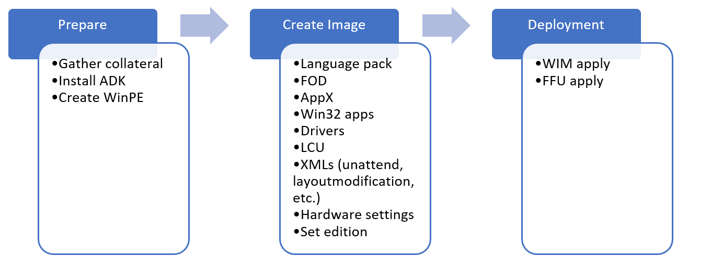

# OEM Deployment of Windows 10 for desktop editions

Getting ready to build and test Windows 10 desktop PCs? This lab shows you the steps to take to make and deploy Windows images. We'll show you how to use the tools to use and commands to setup an end-to-end deployment. The commands can be scripted, helping you quickly customize new images for specific markets to meet your customers' needs.

We'll walk you through the process of building a customized Windows deployment. Here's what we'll cover:



We'll start by preparing your environment, then we'll cover the steps for:
    
- Preparing and mounting a WinPE image
- Adding packages
- Adding drivers
- Creating WinPE media

Next we'll move onto customizing your Windows image. We'll start with [offline customizations](#customize-your-windows-image) to a mounted Windows image, where we'll cover:

- Adding Drivers
- Adding Languages
- Adding Updates
- Reinstalling inbox apps
- Preinstalling Microsoft Office
- Adding tiles to the Start Layout
- Setup OOBE to display a custom EULA
- Configuring and using answer files to customize Windows Setup

We'll finish customizing the Windows image by [deploying your image to a PC and then booting into Audit mode](#use-a-deployment-script-to-apply-your-image) and finish making changes, including:
- Making changes in Audit mode
- Preparing Push Button Reset

Finally, we'll [Finalize and Capture your image, verify everything works, and prepare your image for deployment](#finalize-and-capture-your-image).
- Finalizing the image

Let's get started!

## Prepare your lab environment

> [!Note]
> If you haven't gathered the files you need to go through this lab, see [Get the tools you need for OEM deployment of Windows 10 for desktop editions](oem-deployment-of-windows-10-for-desktop-editions-get-tools.md).

At this point, you should have your tools ready to go. At this point, you should have:

A USB drive, formatted with two partitions, with the following on the NTFS, partition (_O:_):
- The extracted folder structure and files from USB-B

A technician PC that has:
- A folder called `C:\temp\lab` with the following media downloaded:
    - Windows installation media
    - The most recent version of the Microsoft Office OPK
    - Windows Features on Demand ISOs
    - Windows Language pack ISO
    - OPK App Update or Inbox Apps ISO
    - Windows ADK installer
    - Drivers for your image (if needed)


Let's setup your lab.


### Install the Windows ADK for Windows 10

The Windows ADK is a collection of tools that enables you to manage and deploy custom Windows installations to new computers. 

> [!important]
> Use the matching version of ADK for the images being customized. For example, if you're working with Windows 10, version 1803, use the ADK for Windows 10, version 1803.

On your technician PC:
1.  If you have a previous version of the Windows Assessment and Deployment Kit (ADK), uninstall it.

2.  Download the version of the [Windows ADK](https://developer.microsoft.com/windows/hardware/windows-assessment-deployment-kit#winADK) that matches the version of Windows that you’re installing. **Run** the installer.

3.  Install with the following options:

    -   **Deployment Tools**

    -   **Windows Preinstallation Environment (Windows PE)**

    -   **User State Migration Tool (USMT)**


5.  When installation finishes, close the installer window.


## Create a bootable Windows PE (WinPE) partition

WinPE is a small, command-line based operating system that you can use to capture, update, and optimize Windows images. In this section, we'll show you how to prepare a basic WinPE image on a bootable USB flash drive and try it out.

### Prepare WinPE files

1.  On your technician PC, start the **Deployment and Imaging Tools Environment**  as an administrator:
    -  Click **Start**, type **Deployment and Imaging Tools Environment**. Right-click **Deployment and Imaging Tools Environment** and select **Run as administrator**.

2.  Use `copype` to create a working directory that has the base WinPE files:

    ```
    copype amd64 C:\winpe_amd64
    ```

   > [!Tip]
   > If this doesn't work, make sure you're in the Deployment and Imaging Tools Environment, and not the standard command prompt. 
	
### Customize WinPE

You can customize a WinPE image (boot.wim) in several ways by adding files and components to a mounted WinPE image.

Here are some examples of how you can modify your WinPE image:

- **Add an optional component**. [WinPE Optional components](winpe-add-packages--optional-components-reference.md) ship in the ADK. These are packages that you can add to your WinPE image to add functionality to WinPE.

- **Add a graphics or network driver**. (WinPE includes generic video and network drivers, but in some cases, additional drivers are needed to show the screen or connect to the network.). To learn more, see [WinPE: Add drivers](winpe-add-drivers.md).

- **Set the power scheme to high-performance**. Speeds deployment. Note, our sample deployment scripts already set this scheme automatically. See  [WinPE: Mount and Customize: High Performance](winpe-mount-and-customize.md#highperformance).

- **Optimize WinPE**: Recommended for devices with limited RAM and storage (for example, 1GB RAM/16GB storage). After you add drivers or other customizations to Windows PE, see [WinPE: Optimize and shrink the image](winpe-optimize.md) to help reduce the boot time.

When you add packages to WinPE, performance will be reduced and boot time will increase. Only add packages that you need to complete a successful deployment.

#### Mount your WinPE image

To customize a Windows image, you have to mount it before you can work with it. This is true for WinPE images as well. Mounting an image extracts the contents of an image file to a location where it can be viewed and modified. Throughout this lab we'll use DISM to mount and modify images. DISM comes with Windows, but we'll be using the version that is installed by the ADK, which we'll access through the Deployment and imaging tools environment.

Boot.wim is the WinPE image file. You can find it in the files that you copies with copype.cmd.

Mount the image:

- From the **Deployment and imaging tools environment**, mount the image:

```
Dism /mount-image /imagefile:c:\WinPE_amd64\media\sources\boot.wim /index:1 /mountdir:c:\winpe_amd64\mount
```


#### Add packages, optional components, dependencies, and language packs to WinPE (optional)

Use `Dism /Add-Package` to add packages to your mounted WinPE image. The ADK has [WinPE Optional Components](winpe-add-packages--optional-components-reference.md) you can add for additional WinPE functionality. Some packages have dependencies and require other packages to be installed. For these packages, you'll have to install the dependencies before you add the a package. For example, if you want to use Powershell in WinPE, you have to install the NetFx as well as the language-specific OCs. You can find OC CABs in `C:\Program Files (x86)\Windows Kits\10\Assessment and Deployment Kit\Windows Preinstallation Environment\<arch>\WinPE_OCs\`. Here's how to add Powershell support for en-us:

```
Dism /Add-Package /Image:"C:\WinPE_amd64\mount" /PackagePath:"C:\Program Files (x86)\Windows Kits\10\Assessment and Deployment Kit\Windows Preinstallation Environment\amd64\WinPE_OCs\WinPE-WMI.cab"  /PackagePath:"C:\Program Files (x86)\Windows Kits\10\Assessment and Deployment Kit\Windows Preinstallation Environment\amd64\WinPE_OCs\en-us\WinPE-WMI_en-us.cab" /PackagePath:"C:\Program Files (x86)\Windows Kits\10\Assessment and Deployment Kit\Windows Preinstallation Environment\amd64\WinPE_OCs\WinPE-NetFX.cab" /PackagePath:"C:\Program Files (x86)\Windows Kits\10\Assessment and Deployment Kit\Windows Preinstallation Environment\amd64\WinPE_OCs\en-us\WinPE-NetFX_en-us.cab" /PackagePath:"C:\Program Files (x86)\Windows Kits\10\Assessment and Deployment Kit\Windows Preinstallation Environment\amd64\WinPE_OCs\WinPE-Scripting.cab" /PackagePath:"C:\Program Files (x86)\Windows Kits\10\Assessment and Deployment Kit\Windows Preinstallation Environment\amd64\WinPE_OCs\en-us\WinPE-Scripting_en-us.cab" /PackagePath:"C:\Program Files (x86)\Windows Kits\10\Assessment and Deployment Kit\Windows Preinstallation Environment\amd64\WinPE_OCs\WinPE-PowerShell.cab" /PackagePath:"C:\Program Files (x86)\Windows Kits\10\Assessment and Deployment Kit\Windows Preinstallation Environment\amd64\WinPE_OCs\en-us\WinPE-PowerShell_en-us.cab" /PackagePath:"C:\Program Files (x86)\Windows Kits\10\Assessment and Deployment Kit\Windows Preinstallation Environment\amd64\WinPE_OCs\WinPE-StorageWMI.cab" /PackagePath:"C:\Program Files (x86)\Windows Kits\10\Assessment and Deployment Kit\Windows Preinstallation Environment\amd64\WinPE_OCs\en-us\WinPE-StorageWMI_en-us.cab" /PackagePath:"C:\Program Files (x86)\Windows Kits\10\Assessment and Deployment Kit\Windows Preinstallation Environment\amd64\WinPE_OCs\WinPE-DismCmdlets.cab" /PackagePath:"C:\Program Files (x86)\Windows Kits\10\Assessment and Deployment Kit\Windows Preinstallation Environment\amd64\WinPE_OCs\en-us\WinPE-DismCmdlets_en-us.cab"
```


> [!note] 
> Only add additional packages when necessary. The more packages you add, the greater the impact to boot time and performance.

#### Add drivers to WinPE (If needed)

If you need to add drivers to WinPE, you'll use `Dism /Add-Driver`. You'll only need to do this if WinPE doesn't already include the drivers for your hardware. 

Here's how to add drivers to WinPE:

> [!note]
> This method requires .inf-based drivers. We recommend getting .inf based drivers from your hardware Vendor.


```
dism /image:C:\winpe_amd64\mount /Add-Driver /driver:"C:\Out-of-Box Drivers\mydriver.inf"
```
Where `C:\Out-of-Box Drivers\mydriver.inf` is the path of the driver you're adding.

To install all of the drivers in a folder and all its subfolders use the /recurse option. For example:

```
Dism /Image:C:\Winpe_amd64\mount /Add-Driver /Driver:c:\drivers /Recurse
```
Where `C:\drivers` is the drivers folder that you're adding.

### Set the power scheme to high-performance

Setting WinPE to use high-performance mode will speed deployment. The sample scripts set WinPE to high-performance mode when they run, but if you want to make sure that WinPE always runs in high-performance mode, you can [modify `startnet.cmd` in the WinPE image](wpeinit-and-startnetcmd-using-winpe-startup-scripts.md).

1. Use notepad to open C:\Winpe_amd64\mount\windows\system32\startnet.cmd

    ```
    notepad C:\Winpe_amd64\mount\windows\system32\startnet.cmd
    ```

2. Add the following line to startnet.cmd:
    
    ```
    powercfg /s 8c5e7fda-e8bf-4a96-9a85-a6e23a8c635c
    ```

3. Save the file and close Notepad.

### Cleanup your WinPE image

Run `dism /cleanup-image` to reduce the disk and memory footprint of WinPE and increase compatibility with a wide range of devices:


```
DISM /image:c:\winpe_amd64\mount /Cleanup-image /StartComponentCleanup /ResetBase
```
See [WinPE: Optimize and shrink the image](winpe-optimize.md) for more details.

### Commit your changes and unmount your image

If you've added extra files in your WinPE image, you can delete them to reduce your image size and improve performance. When you're done working with your image, you can commit your changes and unmount your image. Then export your customized WinPE image into your WinPE folder:

```
dism /unmount-image /mountdir:c:\winpe_amd64\mount /commit
dism /export-image /sourceimagefile:c:\winpe_amd64\media\sources\boot.wim /sourceindex:1 /DestinationImageFile:c:\winpe_amd64\mount\boot2.wim
Del c:\winpe_amd64\media\sources\boot.wim
Copy c:\winpe_amd64\mount\boot2.wim c:\winpe_amd64\media\sources\boot.wim
```

### Create a bootable WinPE drive

Now that you've updated your WinPE image to have everything it needs to work with the PCs in your environment, you can make a bootable WinPE drive. From the Deployment and Imaging Tools Environment:

1.  Connect your USB key to your technician PC.

2.  Copy WinPE to the *WinPE* partition:

    ```
    MakeWinPEMedia /UFD C:\winpe_amd64 P:
    ```
    Where P: is the letter of the _WinPE_ drive.

    When prompted, press **Y** to format the drive and install WinPE.


### Boot your reference PC to WinPE

1.  Connect the USB drive to your reference device.

2.  Turn off the reference device, and then boot to the USB drive. You usually do this by powering on the device and quickly pressing a key (for example, the **Esc** key or the **Volume up** key).

    > [!note]
    > On some devices, you might need to go into the boot menus to choose the USB drive. If you're given a choice between booting in UEFI mode or BIOS mode, choose UEFI mode. To learn more, see [Boot to UEFI Mode or Legacy BIOS mode](http://go.microsoft.com/fwlink/?LinkId=526943).
    If the device does not boot from the USB drive, see the troubleshooting tips in [WinPE: Create USB Bootable drive](http://go.microsoft.com/fwlink/?LinkId=526944).

    WinPE starts at a command line, and runs `wpeinit` to set up the system. This can take a few minutes.

Leave this PC booted to Windows PE for now. You can remove the bootable USB drive.

## Customize your Windows image

Now that you have your WinPE image customized for your deployment, we'll get into how to get your Windows image ready for deployment. The process is similar to how we changed our WinPE image, but Windows has many additional customization options.

You can make either offline or online or online customizations to a Windows image. Offline customizations are done to the windows image (install.wim) from either the Technician PC or from the destination PC while booted into WinPE. In most scenarios, offline customizations are customizations you perform from the Technician PC. Online customizations are done on the Reference PC after it’s been booted into audit mode. 

The table below shows which customizations can be made online and offline. In a manufacturing environment, it’s recommended to do as many customizations as possible offline.

| Scenario |	Offline |	Online |
| --- | --- | --- |
| Adding device drivers	| X |	X |
| Adding Microsoft Store apps	| X |	X |
| Adding Desktop (win32) apps	| - |	X |
| Adding language packs	| X |	X |
| Remove default language pack	| X |	- |
| Adding features-on-demand	| X |	X |
| Adding the latest cumulative update	| X	| X |
| Image optimization	| X	| X |
| Microsoft Store apps duplicate files cleanup	| X |	- |
| Microsoft Office	| X |	X |

### Prepare and mount a Windows image 


In this section we'll cover how to mount Windows images on your technician PC. Mounting a Windows image is the same process that we used to mount the WinPE image earlier. When we mount our Windows image (install.wim), we'll be able to access a second image, WinRe.wim, which is the image that supports recovery scenarios. Updating install.wim and WinRE.wim at the same time helps you keep the two images in sync, which ensures that recovery goes as expected.

Before we continue, make sure that you've created your _USB-B_ drive. We showed you how to set it up in the [Get the tools you need](#get-the-tools-needed-to-customize-windows) section.

Start working with your images:

#### Backup your Windows image file

Before working on your Windows image, you want to make sure you have a backup copy in case something goes wrong. Make a copy of the original image:

First copy the install.wim from your Windows installation media to _USB-B_. Install.wim includes both Home and Professional images. We'll export the Home image from install.wim, and then work with that image during this lab.

1.	Insert _USB-B_ into your technician computer.
2.	Mount the Windows 10 Home .img from the Win Home 10 32-BIT/X64 English OPK.
3.	From the mounted image, copy D:\sources\install.wim to C:\temp\lab\images. (Where D: is the drive letter of the mounted image.)
4.	From the Start menu, open Windows Kits, open the **Deployment and Imaging Tools Environment** as administrator.
5.  Make a copy of your image in case something goes wrong.
    ```
    copy "C:\temp\lab\Images\install.wim" C:\temp\lab\Images\install-backup.wim
    ```
6.  Export the Home edition (index 2) from install.wim as basicimage.wim and delete the original C:\temp\lab\images\install.wim:

    ```
    Dism /export-image /sourceimagefile:C:\temp\lab\images\install.wim /sourceindex:2 /destinationimagefile:C:\temp\lab\images\basicimage.wim
    Del C:\temp\lab\images\install.wim
    ```
Now that you have your image exported, you can mount it.

#### Mount your Windows image

Create a mount directory and mount basicimage.wim:

```
Md C:\mount\windows
Dism /Mount-Wim /WimFile:C:\temp\lab\images\basicimage.wim /index:1 /MountDir:C:\mount\windows
```

(where E:\ is the drive letter of _USB-B_)

#### Mount your WinRE image

If a system can't successfully boot into Windows, it will fail over to the Windows Recovery Environment (WinRE). WinRE can repair common causes of unbootable operating systems. WinRE is based on WinPE, and to make it work for your customers, you can add drivers, languages, Windows PE Optional Components, and other troubleshooting and diagnostic tools.

The WinRE image is included inside the Windows 10 image, and is eventually copied to the Windows RE tools partition on the destination PC or device. To modify the WinRE image, you'll mount the Windows image, then mount the WinRE image inside it. Make your changes, unmount the WinRE image, then unmount the Windows image.


You should update your recovery image to ensure a consistent recovery experience whenever you:
-   Add boot-critical .inf-style drivers, such as the graphics and storage drivers.
-   Add major updates to Windows, like LCUs.
-   Add new languages, though this isn’t always possible, as not all languages have Windows RE equivalents.)

> [!Note] 
> This lab assumes you’d rather keep winre.wim inside of install.wim to keep your languages and drivers in sync. If you’d like to save a bit of time on the factory floor, and if you’re okay managing these images separately, you may prefer to remove winre.wim from the image and apply it separately.

-   Mount the Windows RE Image file from your mounted image.

    ```
    Md c:\mount\winre 
    Dism /Mount-Wim /WimFile:C:\mount\windows\Windows\System32\Recovery\winre.wim /index:1 /MountDir:C:\mount\winre
    ```

    > [!Tip]
    > If winre.wim cannot be seen under the specified directory, use the following command to set the file visible:
    >
    > ```
    > attrib -h -a -s C:\mount\windows\Windows\System32\Recovery\winre.wim
    > ```

    **Troubleshoot**: If the mounting operation fails, make sure you're using DISM from the Deployment and Imaging Tools Environment. Do not mount images to protected folders, such as the User\Documents folder.  If DISM processes are interrupted, consider temporarily disconnecting from the network and disabling virus protection.


### Offline customizations

With your images mounted, you can start customizing. We'll show you how to make offline customizations to your Windows image. Offline customizations are changes that you can make to a mounted image without having to boot into the Windows installation. First, we'll walk through adding (and removing) lanugages from your Windows image. 

#### About Languages

In this section, we'll show you how to add languages to a Windows installation. If you want to add a language, you'll need a language pack from the Language Pack ISO, as well as an internet connection or access to the Feature on Demand ISO.

**Notes**

- **Add languages before major updates**. Major updates include hotfixes, general distribution releases, or service packs. If you add a language later, you'll need to reinstall the updates.
- **Add major updates before apps**. These apps include universal Windows apps and desktop applications. If you add an update later, you'll need to reinstall the apps. We'll show you how to add these later in Lab 6: Add universal Windows apps
- **Add your languages to your recovery image, too**: Many common languages can be added to your recovery image. We'll show you how to add these later in Lab 12: Update the recovery image.

Always use language packs and Features-On-Demand (FOD) packages that match the language and platform of the Windows image.

Features on demand (FODs) are Windows feature packages that can be added at any time. When a user needs a new feature, they can request the feature package from Windows Update. OEMs can preinstall these features to enable them on their devices out of the box.

Common features include language resources like handwriting recognition. Some of these features are required to enable full Cortana functionality.

The following table shows the types of language packages and components available for Windows 10:

| Component     | Sample file name                                 | Dependencies | Description                                    |
| ------------- | ------------------------------------------------ | ------------ | ---------------------------------------------- |
| Language pack | Microsoft-Windows-Client-Language-Pack_x64_de-de | None         | UI text, including basic Cortana capabilities. | 
| Language interface pack| 	Microsoft-Windows-Client-Language-Interface-Pack_x64_ca-es | 	Requires a specific fully-localized or partially-localized language pack. Example: ca-ES requires es-ES.| 	UI text, including basic Cortana capabilities. To learn more, see Available Language Packs for Windows.| 
| Basic| Microsoft-Windows-LanguageFeatures-Basic-de-de-Package| 	None| 	Spell checking, text prediction, word breaking, and hyphenation if available for the language. <p> You must add this component before adding any of the following components.<p>| 
| Fonts| 	Microsoft-Windows-LanguageFeatures-Fonts-Thai-Package	| None| 	Fonts required for some regions. Example, th-TH requires the Thai font pack.| 
| Optical character recognition| 	Microsoft-Windows-LanguageFeatures-OCR-de-de-Package| 	Basic| 	Recognizes and outputs text in an image.| 
| Handwriting recognition| 	Microsoft-Windows-LanguageFeatures-Handwriting-de-de-Package| 	Basic| 	Enables handwriting recognition for devices with pen input.| 
| Text-to-speech| 	Microsoft-Windows-LanguageFeatures-TextToSpeech-de-de-Package| 	Basic	| Enables text to speech, used by Cortana and Narrator.| 
| Speech recognition| 	Microsoft-Windows-LanguageFeatures-Speech-de-de-Package	| Basic, Text-To-Speech recognition| 	Recognizes voice input, used by Cortana and Windows Speech | Recognition.| 
| Retail Demo experience| 	Microsoft-Windows-RetailDemo-OfflineContent-Content-de-de-Package| 	Basic	| Retail Demo Experience (RDX)| 

#### Add or change languages

In this section, we'll add languages and Features On Demand to your Windows image. We'll add the German (de-de) language pack, then we'll add the Japanese (ja-jp) language. Japanese is an example of a language that requires additional font support. 

> [!important] 
> If you install an update (hotfix, general distribution release [GDR], or service pack [SP]) that contains language-dependent resources prior to installing a language pack, the language-specific changes in the update won't be applied when you add the language pack. You need to reinstall the update to apply language-specific changes. To avoid reinstalling updates, install language packs before installing updates.

Language updates have a specific order they need to be installed in. For example, to enable Cortana, install, in order: **Microsoft-Windows-Client-Language-Pack**, then **–Basic,** then **–Fonts,** then **–TextToSpeech,** and then **–Speech**. If you’re not sure of the dependencies, it’s OK to put them all in the same folder, and then add them all using  `DISM /Add-Package`.

Make sure that you are using language packs and features on demand that match the architecture of the image you are working with. Below are examples for building 64-bit systems.

To start adding languages packs, mount the language pack ISO, and copy the language pack and LanguageFeatures .cab files to `C:\temp\lab\LanguagePacks`. The examples below will use the German and Japanese languages.

1.	Add German language pack and Feature on Demand language packages.

    Use the language packs and Features on Demand from the 64-bit ISOs:
    ```
    Dism /Add-Package /Image:C:\mount\windows /PackagePath:C:\Temp\Lab\LanguagePacks\Microsoft-Windows-Client-Language-Pack_x64_de-de.cab /PackagePath:C:\Temp\Lab\LanguagePacks\Microsoft-Windows-LanguageFeatures-Basic-de-de-Package.cab /PackagePath:C:\Temp\Lab\LanguagePacks\Microsoft-Windows-LanguageFeatures-OCR-de-de-Package.cab /PackagePath:C:\Temp\Lab\LanguagePacks\Microsoft-Windows-LanguageFeatures-Handwriting-de-de-Package.cab /PackagePath:C:\Temp\Lab\LanguagePacks\Microsoft-Windows-LanguageFeatures-TextToSpeech-de-de-Package.cab /PackagePath:C:\Temp\Lab\LanguagePacks\Microsoft-Windows-LanguageFeatures-Speech-de-de-Package.cab /packagepath:C:\Temp\Lab\LanguagePacks\Microsoft-Windows-RetailDemo-OfflineContent-Content-de-de-Package.cab
    ```
    Where E: is the drive letter of the mounted ISO.


2. (Optional) Add Japanese language packs and features on demand.

    In Windows 10, some language-specific fonts were separated out into different canguage .cab files. In this section, we'll add the ja-JP language along with support for Japanese fonts.

    Use the language packs and Features on Demand from the 64-bit ISOs:
    ```
    Dism /Add-Package /Image:C:\mount\windows /PackagePath:E:\LanguagePacks\x64\Microsoft-Windows-Client-Language-Pack_x64_ja-jp.cab /PackagePath:C:\Temp\Lab\LanguagePacks\Microsoft-Windows-LanguageFeatures-Basic-ja-jp-Package.cab /PackagePath:C:\Temp\Lab\LanguagePacks\Microsoft-Windows-LanguageFeatures-OCR-ja-jp-Package.cab /PackagePath:C:\Temp\Lab\LanguagePacks\Microsoft-Windows-LanguageFeatures-Handwriting-ja-jp-Package.cab /PackagePath:C:\Temp\Lab\LanguagePacks\Microsoft-Windows-LanguageFeatures-TextToSpeech-ja-jp-Package.cab /PackagePath:C:\Temp\Lab\LanguagePacks\Microsoft-Windows-LanguageFeatures-Speech-ja-jp-Package.cab /PackagePath:C:\Temp\Lab\LanguagePacks\Microsoft-Windows-LanguageFeatures-Fonts-Jpan-Package.cab /packagepath:C:\Temp\Lab\LanguagePacks\Microsoft-Windows-RetailDemo-OfflineContent-Content-ja-jp-Package.cab
    ```
    
3. Verify that the language packs are now part of the mounted images:

    ```
    dism /get-packages /image:"C:\mount\windows"
    ```

    Make sure that the added languages are on the list.

    ```
    Package Identity : Microsoft-Windows-Client-LanguagePack  ...  de-DE~10.0.17134.1
    State : Installed
    ```

4. Verify that the Features on Demand are in your image:

    ```
    dism /get-capabilities /image:"C:\mount\windows"
    ```

    Make sure that the language FODs are in the list:

    ```
    Capability Identity : Language.Basic~~~de-de~0.0.1.0
    State : Installed
    ...
    Capability Identity : Language.Handwriting~~~de-de~0.0.1.0
    State : Installed
    ```


#### Configure language settings

This section covers how to change the default language and timezone of your mounted Windows image.

1.	Use DISM to set the default language of the image. We'll set the default language to German, since we added it into our image in the previous steps.:
    ```
    Dism /Image:C:\mount\windows /Set-AllIntl:de-DE
    ```

2.	Verify your changes

    ```
    Dism /Image:C:\mount\windows /Get-Intl
    ```

#### Set the default timezone

You can use DISM to set the default timezone for a PC. Here we'll set the time zone. See [Default time zones](default-time-zones.md) for a list of available time zones.

```
Dism /Set-TimeZone:"W. Europe Standard Time" /Image:"C:\mount\windows"
```

#### Remove the base language from the image

This section covers removing a language from the Windows image. This is an optional step.

Now that our image has been set to use German as the default language, we can remove the English language features from it and make it a non-English image. To remove en-US completely from the image, you'll have to remove several components. 

> [!warning]
> Don't remove the English base language if you're shipping a PC in English.

For removing the language components from a 64-bit image:

```
dism /image:"c:\mount\windows" /remove-package /packagename:Microsoft-Windows-Client-LanguagePack-Package~31bf3856ad364e35~amd64~en-US~10.0.17134.1 /packagename:Microsoft-Windows-LanguageFeatures-Basic-en-us-Package~31bf3856ad364e35~amd64~~10.0.17134.1 /packagename:Microsoft-Windows-LanguageFeatures-Handwriting-en-us-Package~31bf3856ad364e35~amd64~~10.0.17134.1 /packagename:Microsoft-Windows-LanguageFeatures-OCR-en-us-Package~31bf3856ad364e35~amd64~~10.0.17134.1 /packagename:Microsoft-Windows-LanguageFeatures-Speech-en-us-Package~31bf3856ad364e35~amd64~~10.0.17134.1 /packagename:Microsoft-Windows-LanguageFeatures-TextToSpeech-en-us-Package~31bf3856ad364e35~amd64~~10.0.17134.1 /packagename:Microsoft-Windows-RetailDemo-OfflineContent-Content-en-us-Package~31bf3856ad364e35~amd64~~10.0.17134.1
```


> [!tip]
> Troubleshooting: If an error occurs when running these commands, try the command again on the package that failed.
> Example:
>
> ```
> Error: 0x800f0825
> Package Microsoft-Windows-LanguageFeatures-Basic-en-us-Package may have failed due to pending updates to servicing components in the image. 
> ```

If the command completes with errors, check the DISM log file. at C:\windows\Logs\DISM\dism.log.

#### Add languages to Windows RE

Here we'll show you how to add languages to WinRE. Adding languages to WinRE ensures that the language that a customer expects is available in recovery scenarios. Follow these steps if you added languages to your Windows image.

WinRE uses the same language packs as WinPE. You can find these language packs on the language pack ISO, and you can find language-specific WinPE OCs in the ADK installation folder at `C:\Program Files (x86)\Windows Kits\10\Assessment and Deployment Kit\Windows Preinstallation Environment\amd64\WinPE_OCs\<lang>`

To complete this section, copy the language packs from the Language pack ISO and the WinPE OCs from `C:\Program Files (x86)\Windows Kits\10\Assessment and Deployment Kit\Windows Preinstallation Environment\amd64\WinPE_OCs` to `C:\Temp\Lab\LanguagePacks\RE\<language>`.

1. Add German language packages

    Use the 64-bit versions of language packs and WinPE optional components:
    ```
    Dism /image:C:\mount\winre /add-package /packagepath:"C:\temp\lab\LanguagePacks\RE\de-de\lp.cab" 
    Dism /image:C:\mount\winre /add-package /packagepath:"C:\Temp\Lab\LanguagePacks\RE\de-deWinPE-Rejuv_de-de.cab" 
    Dism /image:C:\mount\winre /add-package /packagepath:"C:\temp\lab\LanguagePacks\RE\\de-de\WinPE-EnhancedStorage_de-de.cab" 
    Dism /image:C:\mount\winre /add-package /packagepath:"C:\temp\lab\LanguagePacks\RE\de-de\WinPE-Scripting_de-de.cab" 
    Dism /image:C:\mount\winre /add-package /packagepath:"C:\temp\lab\LanguagePacks\RE\de-de\WinPE-SecureStartup_de-de.cab" 
    Dism /image:C:\mount\winre /add-package /packagepath:"C:\temp\lab\LanguagePacks\RE\de-de\WinPE-SRT_de-de.cab" 
    Dism /image:C:\mount\winre /add-package /packagepath:"C:\temp\lab\LanguagePacks\RE\de-de\WinPE-WDS-Tools_de-de.cab" 
    Dism /image:C:\mount\winre /add-package /packagepath:"C:\temp\lab\LanguagePacks\RE\de-de\WinPE-WMI_de-de.cab" 
    Dism /image:C:\mount\winre /add-package /packagepath:"C:\temp\lab\LanguagePacks\RE\de-de\WinPE-StorageWMI_de-de.cab" 
    Dism /image:C:\mount\winre /add-package /packagepath:"C:\temp\lab\LanguagePacks\RE\de-de\WinPE-HTA_de-de.cab"
    ```


2. (Optional) Add Japanese language packs and font support to WinRE. Note that for Japanese, we will add an additional cab that is for font support.

    Use the language packs and WinPE optional components from the 64-bit ISOs:
    ```
    Dism /image:C:\mount\winre /add-package /packagepath:"C:\temp\lab\LanguagePacks\RE\ja-jp\lp.cab" 
    Dism /image:C:\mount\winre /add-package /packagepath:"C:\temp\lab\LanguagePacks\RE\ja-jp\WinPE-Rejuv_ja-jp.cab" 
    Dism /image:C:\mount\winre /add-package /packagepath:"C:\temp\lab\LanguagePacks\RE\ja-jp\WinPE-EnhancedStorage_ja-jp.cab" 
    Dism /image:C:\mount\winre /add-package /packagepath:"C:\temp\lab\LanguagePacks\RE\ja-jp\WinPE-Scripting_ja-jp.cab" 
    Dism /image:C:\mount\winre /add-package /packagepath:"C:\temp\lab\LanguagePacks\RE\ja-jp\WinPE-SecureStartup_ja-jp.cab" 
    Dism /image:C:\mount\winre /add-package /packagepath:"C:\temp\lab\LanguagePacks\RE\ja-jp\WinPE-SRT_ja-jp.cab" 
    Dism /image:C:\mount\winre /add-package /packagepath:"C:\temp\lab\LanguagePacks\RE\ja-jp\WinPE-WDS-Tools_ja-jp.cab" 
    Dism /image:C:\mount\winre /add-package /packagepath:"C:\temp\lab\LanguagePacks\RE\ja-jp\WinPE-WMI_ja-jp.cab" 
    Dism /image:C:\mount\winre /add-package /packagepath:"C:\temp\lab\LanguagePacks\RE\ja-jp\WinPE-StorageWMI_ja-jp.cab" 
    Dism /image:C:\mount\winre /add-package /packagepath:"C:\temp\lab\LanguagePacks\RE\ja-jp\WinPE-HTA_ja-jp.cab"
    Dism /image:C:\mount\winre /add-package /packagepath:"C:\temp\lab\LanguagePacks\RE\ja-jp\WinPE-FontSupport-JA-JP.cab"
    ```
3. Set the default language for WinRE to match the default Windows language.
    ```
    Dism /Image:C:\mount\winre /Set-AllIntl:de-DE
    ```

#### Remove the base languages from WinRE (Optional)

Similar to removing the base language in install.wim, we can remove the base language from WinRE as well.

For removing language components from a 64-bit image:
```
Dism /image:"c:\mount\winre" /remove-package /packagename:Microsoft-Windows-WinPE-LanguagePack-Package~31bf3856ad364e35~amd64~en-US~10.0.17134.1 /packagename:WinPE-EnhancedStorage-Package~31bf3856ad364e35~amd64~en-US~10.0.17134.1 /packagename:WinPE-HTA-Package~31bf3856ad364e35~amd64~en-US~10.0.17134.1 /packagename:WinPE-Rejuv-Package~31bf3856ad364e35~amd64~en-US~10.0.17134.1 /packagename:WinPE-Scripting-Package~31bf3856ad364e35~amd64~en-US~10.0.17134.1 /packagename:WinPE-SecureStartup-Package~31bf3856ad364e35~amd64~en-US~10.0.17134.1 /packagename:WinPE-SRT-Package~31bf3856ad364e35~amd64~en-US~10.0.17134.1 /packagename:WinPE-StorageWMI-Package~31bf3856ad364e35~amd64~en-US~10.0.17134.1 /packagename:WinPE-WDS-Tools-Package~31bf3856ad364e35~amd64~en-US~10.0.17134.1 /packagename:WinPE-WMI-Package~31bf3856ad364e35~amd64~en-US~10.0.17134.1
```


### Add drivers to your images

You can add drivers to ensure Windows can successfully boot for the first time. Make sure that you add your driver to the right image:

-   **DCHU drivers**: Many drivers include an information file (with an .inf extension) to help install the driver. These can be installed using tools described in this section. 
-   **Boot-critical drivers**: Graphics and storage drivers may sometimes need to be added to the Windows image (as shown in this lab), Windows PE image, and in the WindowsRE image.

The following shows how to add drivers in various ways. If your hardware doesn't require any additional drivers, you don't have to add any.

> [!tip]
> If you're creating several devices with identical hardware configurations, you can speed up installation time and first boot-up time by maintaining driver configurations when capturing a Windows image.

#### Add drivers to your Windows image

1.	Add a single driver that includes an .inf file. In this example, we're using a driver named media1.inf:
	
    ```
    Dism /Add-Driver /Image:"C:\mount\windows" /Driver:"C:\Drivers\PnP.Media.V1\media1.inf"
    ```
    Where "C:\Drivers\PnP.Media.V1\media1.inf" is the base .inf file in your driver package.

2.	If you want to add an entire folder of drivers, you can use the /Recurse option. This adds all .inf drivers in the folder and all its subfolders.

    > [!Warning]
    > While /Recurse can be handy, it's easy to bloat your image with it. Some driver packages include multiple .inf driver packages, which often share payload files from the same folder. During installation, each .inf driver package is expanded into a separate folder, each with a copy of the payload files. We've seen cases where a popular driver in a 900MB folder added 10GB to images when added with the /Recurse option.

    ```
    Dism /Add-Driver /Image:"C:\mount\windows" /Driver:c:\drivers /Recurse 
    ```

3.	Verify that the drivers are part of the image:
    ```
	Dism /Get-Drivers /Image:"C:\mount\windows"
    ```
    Check the list of packages and verify that the list contains the drivers you added.

#### Add drivers to your WinRE image

If you added drivers to your Windows image, you should also add them to your WinRE image. Adding drivers to your recovery image ensures they are available during recovery scenarios.  Adding drivers to a WinRE image is the same process as adding drivers to a regular Windows image.

```
Dism /Add-Driver /Image:"C:\mount\winre" /Driver:"C:\Drivers\PnP.Media.V1\media1.inf" /LogPath=C:\mount\dism.log
```

> [!Note]
> You can use the /recurse option to add an entire folder of drivers


## Add updates to your image

While your image is mounted, you can add Windows updates. The process is similar to the one we used to add drivers earlier.

Reminder: 

- **Add languages before major updates**. Major updates include hotfixes, general distribution releases, or service packs. If you add a language later, you'll need to re-add the updates.
- **Add major updates before apps**. These apps include universal Windows apps and desktop applications. If you add an update later, you'll need to re-add the apps.
- **For major updates, update the recovery image too**: These may include hotfixes, general distribution releases, service packs, or other pre-release updates. We'll show you how to update these later in Lab 12: Update the recovery image.
- If a **Servicing Stack Update (SSU) is required**, you'll have to apply it before applying the most recent General Distribution Release or any future GDRs.


### Add a Windows update package

Use DISM to apply the latest servicing stack update (SSU) and general distribution release (GDR) as well as any prerequisite KB updates. You can find KB updates in the following locations:

GDR: [http://aka.ms/win10releaseinfo](http://aka.ms/win10releaseinfo)

SSU: [https://msdn.microsoft.com/en-us/windows/hardware/commercialize/manufacture/whats-new-in-windows-manufacturing](https://msdn.microsoft.com/en-us/windows/hardware/commercialize/manufacture/whats-new-in-windows-manufacturing)

KB Files: [http://catalog.update.microsoft.com](http://catalog.update.microsoft.com)


> [!Important] 
> If you install an update (hotfix, general distribution release [GDR], or service pack [SP]) that contains language-dependent resources prior to installing a language pack, the language-specific changes in the update won't be applied when you add the language pack. You need to reinstall the update to apply language-specific changes. To avoid reinstalling updates, install language packs before installing updates.
 

1.  Get a Windows update package. For example, grab the [latest cumulative update listed in Windows 10 update history from the Microsoft Update catalog](http://www.catalog.update.microsoft.com/Search.aspx?q=Cumulative+update). Extract the .msu file update to a folder, for example, E:\updates\windows10.0-kb4016240-x64_0e60aebeb151d4b3598e4cfa9b4ccb1fc80e6e4d.msu. Make sure that your update matches the architecture of the image you are working with.

    To learn more, see https://myoem.microsoft.com/oem/myoem/en/product/winemb/pages/comm-ms-updt-ctlg-trnstn.aspx.


2.  Add the msu to your mounted image using `dism /add-package`.

    ```
    Dism /Add-Package /Image:C:\mount\windows /PackagePath:"E:\updates\windows10.0-kb4000001-x64.msu"
    ```
    
    You can also add multiple updates in the same command:
    
    ```
    Dism /Add-Package /Image:C:\mount\windows /PackagePath:"E:\updates\windows10.0-kb4000001-x64.msu" /PackagePath:"E:\updates\windows10.0-kb0000002-x64.msu"
    ```

    > [!note] 
    > Each package is typically a new KB that increases the build revision number of Windows. You can find the revision number of windows in the following registry key: 
    > `HKEY_LOCAL_MACHINE\SOFTWARE\Microsoft\Windows NT\CurrentVersion\UBR`

3.  Lock in the update to ensure it get restored during recovery.
    ```
    DISM /Cleanup-Image /Image=C:\mount\windows /StartComponentCleanup /ResetBase /ScratchDir:C:\Temp
    ```

4. Verify that the updates are in the image.

    ```
    Dism /Image:C:\mount\windows /Get-Packages
    ```
    
    Review the resulting list of packages and verify that the list contains the package. For example:

    ```
    Package Identity : Package_for_RollupFix~31bf3856ad364e35~amd64~~15063.250.1.1
    State : Installed
    Release Type : Security Update
    Install Time : 04/29/2017 6:26 PM
    The operation completed successfully.
    ```

### Add Update packages to WinRE

In this section, we cover how to add updates to the WinRE image.

> [!Important]
> You have to apply cumulative updates to your WinRE image in addition to your Windows image.  Because updates are cumulative, when a new update is installed, old updates can be removed. The WinRE optimization that we cover later in the lab will remove unnecessary updates which will keep the WinRE image from growing in size.

To apply the update that you downloaded in the previous section to your WinRE image, you have to run `dism /add-package` to apply the update to the mounted WinRE image.

```
Dism /Add-Package /Image:C:\mount\winre /PackagePath:"E:\updates\windows10.0-kb4000001-x64.msu"
```

### Apps

This section covers working with Apps, including reinstalling inbox apps after updates, how to add Microsoft Store apps, and how to add Microsoft Office.

This section continues to use your mounted Windows image. If your image isn't still mounted, mount it.

**Reminder**: Install apps only after you have installed languages and updates, in that order.

#### Reinstall inbox apps

Now that you've added languages and updates to your image, you have to reinstall the apps that come with Windows. This makes sure that the apps will work and include the languages you have added to your image. To reinstall these apps, you'll need the App update OPK or the inbox Apps ISO.

1. Extract the inbox apps ISO to c:\temp\lab\apps\inbox\amd64
2. Run the `E:\apps\ReinstallInboxApps-x64.bat` script.

Your apps are now ready to work with your image.

#### Add a Microsoft Store app

To complete this section, you'll need to have the App update OPK or the inbox apps ISO. Whichever you are using, we'll refer to it as the App update OPK in the following steps.

2. Use DISM to add the HEVC codec .appx from the files you extracted in Step 1:

3.  Install the HEVC .appx:

    ```
    DISM /Add-ProvisionedAppxPackage /Image:c:\mount\windows /PackagePath:"C:\temp\lab\apps\amd64\Microsoft.HEVCVideoExtension_8wekyb3d8bbwe.x64.appx" /licensepath:"C:\temp\lab\apps\inbox\amd64\Microsoft.HEVCVideoExtension_8wekyb3d8bbwe.x64.xml" /DependencyPackagePath:"C:\temp\lab\apps\inbox\amd64\Microsoft.VCLibs.x64.14.00.appx" /DependencyPackagePath:"C:\temp\lab\apps\inbox\amd64\Microsoft.VCLibs.x86.14.00.appx"
    ```

    > [!Note]
    > Include both the x86 and x64 versions of the dependency packages.

4. Use `DISM /Add-ProvisionedAppxPackage` to add any additional apps to your image.

5. Verify that the apps are installed:

    ```
    Dism /Image:"C:\mount\windows" /Get-ProvisionedAppxPackages
    ```
    

#### Install a Microsoft Store app that won't be pinned to the Start Menu

For this section, you'll need to have at least two apps to add to your image. If you don't have any signed apps you can skip to the next section.

**New in Windows 10, version 1803**: A Microsoft Store app can now be installed without being pinned to the Start Menu. To install an app without also pinning it, use `DISM /Add-ProvisionedAppxPackage` with the `/region` switch when installing the app. When you create a custom Start Menu later in the lab, you'll be able to exclude an installed app from the Start Menu.

1.  Gather your apps for installation  

2.  Install your apps, specifying a region with the `/region` option for each app. You can specify multiple regions by separating the regions with a `;`. We'll show you how you can use LayouModification.xml with `/region` later in the lab:

    ```
    Dism /Add-ProvisionedAppxPackage /PackagePath:app1.appxbundle /region="all"
    Dism /Add-ProvisionedAppxPackage /PackagePath:app2.appxbundle /region="US"
    ```

    **Note:** If your apps have dependencies, include them in the command using the `/DependencyPackagePath`. Like the examples in the previous section, it's common for apps to have dependencies on .NET.CoreRuntime and .VCLibs, but If your apps do not share those dependencies, then do not include them in your command.


#### Optimize your installed apps

**New in Windows 10, version 1803**: You can reduce app disk usage by running `DISM /Optimize-ProvisionedAppxPackages` after you install apps. This command will only work when run against an offline image:

```
DISM.exe /Image:"C:\mount\windows" /Optimize-ProvisionedAppxPackages
```

### Preinstall Microsoft Office

#### Related sets

The Office apps are delivered as a set of apps that are installed and serviced together.  The main package for Office is a set of shared code and each Office app (for example, Word, Excel, and PowerPoint) is installed as an optional package. These packages are delivered as appxbundles that support all Store languages.  


| App |	Package ID |	Files |
| --- | --- | --- |
| Shared code & required app (not visible to user) |	Microsoft.Office.Desktop_8wekyb3d8bbwe | shared.appxbundle<br></br>shared_License1.xml
| Access |	Microsoft.Office.Desktop.Access_8wekyb3d8bbwe |	access.appxbundle<br></br>access_License1.xml
| Excel	| Microsoft.Office.Desktop.Excel_8wekyb3d8bbwe |	excel.appxbundle<br></br>excel_License1.xml
| Outlook |	Microsoft.Office.Desktop.Outlook_8wekyb3d8bbwe |	outlook.appxbundle<br></br>outlook_License1.xml
| PowerPoint |	Microsoft.Office.Desktop.PowerPoint_8wekyb3d8bbwe |	powerpoint.appxbundle<br></br>powerpoint_License1.xml
| Publisher |	Microsoft.Office.Desktop.Publisher_8wekyb3d8bbwe |	publisher.appxbundle<br></br>publisher_License1.xml
| Word |	Microsoft.Office.Desktop.Word_8wekyb3d8bbwe |	word.appxbundle<br></br>word_License1.xml |


#### Add Office apps to your image

To add the Office apps to an image, use DISM with the `/Add-ProvisionedAppxPackage` option. This option also requires the following information for each app you add:
-   `/PackagePath`: This is only used to specify the path to the .appxbundle file for the shared code package.  
-   `/OptionalPackagePath`: This is used to specify the path to the .appxbundle file for an individual app, such as Word or Excel.  
-   `/LicensePath`: This is used to specify the path to the _License1.xml file for an individual app. This is needed for both the shared package and each of the optional app packages. 

1. Extract the Office OPK to C:\temp\lab\apps\.

2. Use DISM to add all the Office apps to an offline image. The following example assumes the appxbundle and license xml files are in subdirectories on _USB-B_ (D:). The example also excludes the /region switch because we want Office to appear in both the All Apps list, and as a Start Menu tile.

    ```
    DISM /Image:C:\mount\windows /Add-ProvisionedAppxPackage /PackagePath="C:\temp\lab\apps\Office Apps\shared.PreinstallKit\shared.appxbundle" /OptionalPackagePath="C:\temp\lab\apps\Office Apps\excel.PreinstallKit\excel.appxbundle" /OptionalPackagePath="C:\temp\lab\apps\Office Apps\powerpoint.PreinstallKit\powerpoint.appxbundle" /OptionalPackagePath="C:\temp\lab\apps\Office Apps\word.PreinstallKit\word.appxbundle" /OptionalPackagePath="C:\temp\lab\apps\Office Apps\outlook.PreinstallKit\outlook.appxbundle" /OptionalPackagePath="C:\temp\lab\apps\Office Apps\publisher.PreinstallKit\publisher.appxbundle" /OptionalPackagePath="C:\temp\lab\apps\Office Apps\access.PreinstallKit\access.appxbundle" /LicensePath="C:\temp\lab\apps\Office Apps\shared.PreinstallKit\shared_license1.xml" /LicensePath="C:\temp\lab\apps\Office Apps\excel.PreinstallKit\excel_license1.xml" /LicensePath="C:\temp\lab\apps\Office Apps\powerpoint.PreinstallKit\powerpoint_license1.xml" /LicensePath="C:\temp\lab\apps\Office Apps\word.PreinstallKit\word_license1.xml" /LicensePath="C:\temp\lab\apps\Office Apps\outlook.PreinstallKit\outlook_license1.xml" /LicensePath="C:\temp\lab\apps\Office Apps\publisher.PreinstallKit\publisher_license1.xml" /LicensePath="C:\temp\lab\apps\Office Apps\access.PreinstallKit\access_License1.xml"
    ```

    > [!tip]
    > You need to specify both an appxbundle and a license package for the shared package, as well as for each individual app that you want to install. 

    > [!note]
    > The command for adding the Office apps in audit mode (online instead of offline) would be the same, but replace /Image:C:\mount\windows with /online.
    
    **Notes on Language Support**

    When install Office with DISM, Office language files are automatically added that match the languages that are in the Windows image.  
    -   By default, Office will use the UI language of Windows.  To configure Windows UI language, see DISM Languages and International Servicing Command-Line Options.
    -   There isn't a way to add additional Office languages that aren't part of the Windows image.
    -   Both display and proofing resources for Office will be installed for each Windows language.  
    -   Some languages supported by Windows are not supported by Office – for these cases, Office will use the closest available language (for example, es-mx will attempt to use es-es instead). 
    -   You can find installed Windows languages in Windows Settings > Time & language > Region & language.

3. Verify Office was installed:

    ```
    Dism /Image:"C:\mount\windows" /Get-ProvisionedAppxPackages
    ```
    where C is the drive letter of the drive that contains the image.

    Review the resulting list of packages and verify that the list contains the Office apps, such as:

    ```
    ...
    Displayname : Microsoft.Office.Desktop.Access
    Version : 16000.8528.2136.0
    Architechture : neutral
    ResourceID : ~
    PackageName : Microsoft.Office.Desktop.Access_16000.8528.2136.0_neutral_~_8wekyb3d8bbwe
    Regions : None

    Displayname : Microsoft.Office.Desktop.Excel
    Version : 16000.8528.2136.0
    Architechture : neutral
    ResourceID : ~
    PackageName : Microsoft.Office.Desktop.Excel_16000.8528.2136.0_neutral_~_8wekyb3d8bbwe
    Regions : None

    Displayname : Microsoft.Office.Desktop.Outlook
    Version : 16000.8528.2136.0
    Architechture : neutral
    ResourceID : ~
    PackageName : Microsoft.Office.Desktop.Outlook_16000.8528.2136.0_neutral_~_8wekyb3d8bbwe
    Regions : None
    ...
    ```

    To have the apps appear on the Start screen, follow the steps in the next section: Configuring Start tiles and taskbar pins.

    To complete the Office install, you’ll need to unmount the image and commit your changes, which we'll do this after we’ve completed all customizations at the end of this lab.


## Modify the Start layout

### New in Windows 10, version 1803

Apps can now be pinned to the All Apps list without also having to be pinned as a Start tile.  This is done through the new "region" switch (as described in the previous section).  In the previous section, we added three apps to our image:  App1, App2, and Office.  In this lab, we will omit App1 from LayoutModification.xml to ensure that App1 only appears in the All Apps list, and not also as a Start menu tile. We will also include App2 in LayoutModification.xml to demonstrate that even if the "region" switch was used when adding the app to the image, the app will still appear in the Start Menu if included in the LayoutModification.xml file.  In other words, the LayoutModification.xml file takes precedence.  

### Start menu

If you don’t create a LayoutModification.xml file and you use the Start Unattend settings, Windows will take the first 12 `SquareTiles` or `DesktoporSquareTiles` settings specified in the Unattend file. The system then places these tiles automatically within the newly-created groups at the end of Start. The first six tiles are placed in the first OEM group and the second set of six tiles are placed in the second OEM group. If `OEMName` is specified in the Unattend file, the value for this element is used to name the OEM groups that get created.

> [!Note]
> The Start layout and taskbar pins can be lost if the user resets their PC with the built-in recovery tools. To make sure these settings stay on the device, update the recovery image along with the Windows image.

The Start tile layout in Windows 10 provides OEMs the ability to append tiles to the default Start layout to include Web links, secondary tiles, classic Windows applications, and universal Windows apps. OEMs can use this layout to make it applicable to multiple regions or markets without duplicating a lot of the work. In addition, OEMs can add up to three default apps to the frequently used apps section in the system area, which delivers system-driven lists, including important or frequently accessed system locations and recently installed apps.

To take advantage of the new features, and to have the most robust and complete Start customization experience for Windows 10, consider creating a LayoutModification.xml file. This file specifies how the OEM tiles should be laid out in Start. For more information about how to customize the new Start layout, see [Customize the Windows 10 Start Layout](https://docs.microsoft.com/en-us/windows-hardware/customize/desktop/customize-start-layout).

**Get started**: Use the sample layoutmodification.xml we've included in the _USB-B_ files. We recommend starting with this file for this section of this lab. You can find it in `USB-B\StartLayout\layoutmodification.xml`.

To learn more about layoutmodification.xml, see [LayoutModification XML](https://docs.microsoft.com/en-us/windows/configuration/start-layout-xml-desktop#layoutmodification-xml).

### About the Start Menu layout

1.  Use the optional `Region` attribute in the `RequiredStartGroups` element to use different layouts for different regions. The `Region` value must be equal to two-letter country/region codes, and separated by a pipe "|" delimiter if you're specifying multiple regions. The regions listed in the group are related to the regions you specified when you added apps to your image using the `/region` option.  If the country/region setting for the Windows device matches a `RequiredStartGroups`, then the tiles laid out within the `RequiredStartGroups` is applied to Start. 
If you specify a region-agnostic `RequiredStartGroups` (or one without the optional Region attribute) then the region-agnostic `RequiredStartGroups` is applied to Start.
    
    In your layoutmodification.xml, add regions to `RequiredStartGroups`:
    ```
    <RequiredStartGroups Region="DE|ES|FR|GB|IT|US">
    ```

2.  Specify the tiles you want to add within an AppendGroup. OEMs can add a maximum of two AppendGroups. The following example shows two groups called "Fabrikam Group 1" and "Fabrikam Group 2", which contains tiles that will be applied if the device country/region matches what’s specified in Region (in this case, the regions are Germany, Spain, France, United Kingdom, Italy, and United States). Each group contains three tiles and the various elements you need to use depending on the tile that you want to pin to Start.

    ```XML
    <LayoutModificationTemplate
    xmlns="http://schemas.microsoft.com/Start/2014/LayoutModification"
    xmlns:defaultlayout="http://schemas.microsoft.com/Start/2014/FullDefaultLayout"
    xmlns:start="http://schemas.microsoft.com/Start/2014/StartLayout"
    Version="1">
    <RequiredStartGroupsCollection>
    <RequiredStartGroups
      Region="DE|ES|FR|GB|IT|US">
      <AppendGroup Name="Fabrikam Group 1">
    	  <start:DesktopApplicationTile
	        DesktopApplicationID="Microsoft.Windows.Explorer" 
          Size="2x2" 
          Row="0" 
          Column="4"/>
      </AppendGroup>    
      <AppendGroup
        Name="Fabrikam Group 2">
        <start:Tile AppUserModelID="Microsoft.MicrosoftEdge_8wekyb3d8bbwe!MicrosoftEdge" 
          Size="2x2" 
          Row="0"
          Column="0"/>
       </AppendGroup>
    </RequiredStartGroups>
    </RequiredStartGroupsCollection> 
    ```

3.  In the Add Microsoft Store Apps section above, we asked you to install two apps using the /region switch:  App1 and App2.  Since we included a `/region` switch for both, both will be installed and appear in the All Apps list.  However, to get just App2 to also appear as a Start menu tile, add the following line inside your second <AppendGroup> in the LayoutModification.xml file, such as:

    Since we set the region to "US" for App2 when provisioning it, we should set the region to "US" here in our LayoutModification.xml to ensure App2 only appears as a Start menu tile in US images. So, ensure your <RequiredStartGroups> region parameter looks like this:
    
    ```
    <RequiredStartGroups Region="US">
        <AppendGroup Name="MyGroup">
            <start:Tile AppUserModelID="App2!App" Size="2x2" Row="2" Column="0"/>
        </AppendGroup>
    ```

    Or at least includes the US, such as this:

    ```
    <RequiredStartGroups Region="DE|US|JA">
        <AppendGroup Name="MyGroup">
            <start:Tile AppUserModelID="App2!App" Size="2x2" Row="2" Column="0"/>
        </AppendGroup>
    ```

4. Add Microsoft Office Start Menu tiles.  This is a requirement for OEMs that participate in the Jumpstart program.  

    You can have tiles appear on the Windows 10 Start menu for Word, PowerPoint and Excel. The tiles appear in a designated area for Microsoft apps (upper left in the following diagram).  All additional apps will be accessible in the Apps list on the left.  
    
    Add the following to the LayoutModification.xml file to add the tiles:
    ```
    <AppendOfficeSuite/>
    <AppendOfficeSuiteChoice Choice="DesktopBridgeSubscription"/>
    ```

> [!note]
> To Add a desktop app, use the start:DesktopApplicationTile tag. If you know the application user model ID for the app, use that to identify it. Otherwise, if you pinned tiles that require .url or .lnk files, add the files to the following legacy Start Menu directories:
> - %APPDATA%\Microsoft\Windows\Start Menu\Programs\
> - %ALLUSERSPROFILE%\Microsoft\Windows\Start Menu\Programs\
>
> Example: 
> ```
> Copy E:\StartLayout\Bing.url  "C:\mount\Windows\ProgramData\Microsoft\Windows\Start Menu\Programs"
> Copy E:\StartLayout\Paint.lnk "C:\mount\Windows\ProgramData\Microsoft\Windows\Start Menu\Programs"
> Copy E:\StartLayout\Bing.url  "C:\mount\Windows\Users\All Users\Microsoft\Windows\Start Menu\Programs"
> Copy E:\StartLayout\Paint.lnk "C:\mount\Windows\Users\All Users\Microsoft\Windows\Start Menu\Programs"
> ```

6. Save the Start Layout file as layoutmodification.xml.
7. Copy the saved file to your mounted image, to the `C:\Mount\Windows\Users\Default\Appdata\Local\Microsoft\Windows\Shell` folder. If a layoutmodification.xml file already exists in the folder, replace the existing file with the new one.

### Add a license agreement and info file

#### Add an OEM-specific license

In this section, we'll cover how an OEM can add their own license terms during OOBE.

> [!note]
> If the license terms are included, the OEM must include a version of the license terms in each language that is preinstalled onto the PC. A license term text must be an .rtf file, and have an .html file with a matching name in the same folder. See [OEM license terms](https://docs.microsoft.com/en-us/windows-hardware/customize/desktop/oem-license) for more information on license files.

To begin adding license terms, you'll have to create folders for your license files, and then configure OOBE to show the license on first boot.

1.	Create folders for your system languages under the following directory: C:\mount\windows\Windows\System32\oobe\info\default\ 

2.	Name each folder under the C:\mount\windows\Windows\System32\oobe\info\default\ directory as the Language Decimal Identifier that corresponds to the language. Do this step for each language pack that's in the Windows image.

    **Note:**  Please see [this link to see complete list of language decimal identifiers of corresponding languages](available-language-packs-for-windows.md).

    For example, if en-us and de-de language packs are added to the Windows image, add a folder named "1033" (representing en-us language) in C:\mount\windows\Windows\System32\oobe\info\default\. Then add a folder named "1031" (de-de language) under the same C:\mount\windows\Windows\System32\oobe\info\default\ directory.

     ```
     MD c:\mount\windows\windows\system32\oobe\info\default\1031
     MD c:\mount\windows\windows\system32\oobe\info\default\1033
     ```

4.	Create a license terms .rtf file for each language you have in your image, and copy them to the language-specific oobe folder.

    For example: Move the English agreement.rtf file to C:\mount\windows\Windows\System32\oobe\info\default\1033\ directory and move the German agreement.rtf to C:\mount\windows\Windows\System32\oobe\info\default\1031\. 

    ```
    copy E:\resources\english-agreement.rtf c:\mount\windows\windows\system32\oobe\info\default\1033\agreement.rtf
    copy E:\resources\german-agreement.rtf c:\mount\windows\windows\system32\oobe\info\default\1031\agreement.rtf
    ```

4. Open a text editor and create .html versions of your license terms. Save the terms to the same folders as the .rtf versions. You can use the [EULA example](https://docs.microsoft.com/en-us/windows-hardware/customize/desktop/oem-license#eula-example) from [OEM license terms](https://docs.microsoft.com/en-us/windows-hardware/customize/desktop/oem-license) to create sample files.  The names of the EULA files should be identical, except for the extension.

    ```
    C:\mount\windows\windows\system32\oobe\info\default\1033\agreement.html  (English version)
    C:\mount\windows\windows\system32\oobe\info\default\1031\agreement.html  (German version)
    ```


6.	Create an oobe.xml file to specify the license agreement.rtf file path. Windows will automatically find the accompanying .html file. Below is a sample oobe.xml which is located at _USB-B_\ConfigSet\oobe.xml

    ```xml
     <FirstExperience>
    <oobe>
        <oem>
            <eulafilename>agreement.rtf</eulafilename>
        </oem>
    </oobe>
    </FirstExperience>
    ```

7.	Copy oobe.xml file to `C:\mount\windows\windows\system32\oobe\info\

9.  Copy oobe.xml to the laguage-specific folders you created earlier.For example: Copy oobe.xml to C:\mount\windows\Windows\System32\oobe\info\default\1033\, which has a file called agreement.rtf in English. To add the German agreement, copy oobe.xml to C:\mount\windows\Windows\System32\oobe\info\default\1031\ directory, which has the German agreement.rtf file.

    ```
    copy E:\configset\oobe.xml c:\mount\windows\windows\system32\oobe\info\default\1033
    copy E:\configset\oobe.xml c:\mount\windows\windows\system32\oobe\info\default\1031
    ```

10.	Now each language folder has an oobe.xml, agreement.rtf, and agreement.thml file in that corresponding language.

When the image first boots into OOBE, it will display the license agreement.

 
### Create an image info file and add it to your image

-   Create an csup.txt file to specify when the Windows image was created. This file must include the date that the image was created, in the form of 'MM-DD-YYYY', with no other characters, on a single line at the top of the file. This command will create the file:
	
    ```
    echo 4-24-2018 >"C:\mount\windows\Windows\csup.txt"
    ```

## Customize Windows with an answer file

Answer files (or Unattend files) can be used to modify Windows settings in your images during Setup. You can also create settings that trigger scripts in your images that run after the first user creates his/her account and picks the default language. Answer files allow you specify various setup options, including how to partition disks, the location of the Windows image to install, and the product key to apply. Values that apply to the Windows installation, such as the names of user accounts, display settings, and Internet Explorer Favorites can also be specified. The answer file for Setup is typically called Unattend.xml.

Unattend files include several sections, each of which are processed at different times throughout the Windows installation process. These phases are called configuration passes. Here are the most often-used passes:

You can specify which configuration pass to add new settings to:
-   _1 - windowsPE_: These settings are used by the Windows Setup installation program. If you’re modifying existing images, you can usually ignore these settings.
-   _2 - offlineServicing_: Settings in offlineServicing are processed when DISM is used to apply an unattend file to an offline image.
-   _4 - specialize_: Most settings should be added here. These settings are triggered both at the beginning of audit mode and at the beginning of OOBE. If you need to make multiple updates or test settings, generalize the device again and add another batch of settings in the Specialize Configuration pass.
-   _6 - auditUser_: Runs as soon as you start audit mode.
AuditUser is a good place to run a system test script. We'll add Microsoft-Windows-Deployment\RunAsynchronousCommand as our example. To learn more, see Add a Custom Script to Windows Setup.
-   _7 - oobeSystem_: Use sparingly. Most of these settings run after the user completes OOBE. The exception is the Microsoft-Windows-Deployment\Reseal\Mode = Audit setting, which we’ll use to bypass OOBE and boot the PC into audit mode.
If your script relies on knowing which language the user selects during OOBE, you’d add it to the oobeSystem pass.

While you can set many Windows settings in audit mode, some settings can only be set by using an answer file or Windows Configuration Designer, such as adding manufacturer’s support information. A full list of answer file settings (also known as Unattend settings) is in the [Unattended Windows Setup reference](https://msdn.microsoft.com/library/windows/hardware/dn923277).

### Make an answer file

Use Windows System Image Manager (SIM) to create and modify unattend files. SIM is installed as part of the ADK. We have included some answer files in _USB-B_ that will get you started. Make sure that your answer settings include the required settings as outlined in the OEM Policy Document: 

-   For OA 3.0 systems: 

    ```
    md c:\mount\windows\windows\panther
    copy /y E:\AnswerFiles\OA3.0\Unattend.xml C:\Mount\Windows\Windows\Panther 
    ```

    (where E:\ is _USB-B_)

-   For non-OA 3.0 systems: 

    ```
    md c:\mount\windows\Windows\panther
    copy /y E:\AnswerFiles\Non_OA3.0\Unattend.xml C:\Mount\Windows\Windows\Panther
    ```

    (where E:\ is _USB-B_)

#### Create a catalog file in Windows SIM

Catalog files (.clg) are files with information about settings that are applicable to a particular Windows image. When working with a Windows image in SIM, you have to first create a catalog file for the Windows WIM you're working with.

1. Start Windows System Image Manager (WSIM).
2. Click File > Select Windows Image.
3. In Select a Windows Image, browse to and select the image file (D:\install.wim).
4. Select the Home edition of Windows 10 and click OK. 
5. Click Yes to create the catalog file. Windows SIM creates the file based on the image file, and saves it to the same folder as the image file. This process can take several minutes.

The catalog file appears in the Windows Image pane. Windows SIM lists the configurable components and packages in that image.

#### Create an answer file

If you're not working with the existing unattend file, you can create a new one in Windows SIM:

- Click file > New Answer File

The new answer file will appear in the right-pane.

#### Add answer file settings

In this section, we'll show you how to create an answer file that can configure settings when you deploy your Windows image.

Before you start, create a folder called Panther in your mounted Windows image. Windows will automatically look in this folder for an answer file.

```
md c:\mount\windows\Windows\panther
```

##### Add OEM info (optional)
1. In the Windows Image pane, expand Components, right-click amd64_Microsoft-Windows-Shell-Setup_(version), and then select Add Setting to Pass 4 specialize.
2. In the Answer File pane, select Components\4 specialize\amd64_Microsoft-Windows-Shell-Setup_neutral\OEMInformation.
3. In the OEMInformation Properties pane, in the Settings section, set:
    ```
    Manufacturer=Fabrikam
    Model=Notebook Model 1
    Logo=C:\Fabrikam\Fabrikam.bmp
    ```
4. Save the answer file in the Panther folder as `USB-B\AnswerFiles\unattend.xml`.

Next you'll have to make sure that the logo you specified above is in your Windows image.

1. Create a 32-bit color image with a maximum size of 120x120 pixels. Save it as D:\AnswerFiles\Fabrikam.bmp file on your Technician PC. We've included a sample on USB-B, which you can use for this lab: D:\Logos\Fabrikam.bmp. 

2. Create a folder in your mounted Windows image called `Fabrikam`. 

    ```
    mkdir c:\mount\windows\Fabrikam
    ```

3. Copy Fabrikam.bmp to the Fabrikam folder you just created:

    ```
    copy fabrikam.bmp c:\mount\windows\fabrikam
    ```

##### Set the device to automatically boot to audit mode
Using the same unattend.xml file, set the PC to automatically boot into Audit mode.
1. In the Windows Image pane, expand Components, right-click amd64_Microsoft-Windows-Deployment_(version), and then select Add Setting to Pass 7 oobeSystem.
2. In the Answer File pane, select Components\7 oobeSystem\amd64_Microsoft-Windows-Deployment_neutral\Reseal.
3. In the Reseal Properties pane, in the Settings section, select `Mode=Audit`.
4. Save the answer file in the Panther folder as unattend.xml.

##### Enable S-Mode

> [!Note] 
> If you don't want to enable S-Mode, you can [skip to the next section](#set-the-windows-edition).

**New in Windows 10, version 1803**: Windows 10 S is no longer a separate SKU from other versions of Windows. S-mode is now a mode that can be activated on Home and Pro SKUs. 

**Set S Mode**
In this section, we'll show you how to enable S mode in a Windows image. We'll use an Unattend file that has a setting in **Pass 2 - offlineServicing**, and use DISM to apply it to our mounted Windows image.

1. Use Windows SIM to modify unattend.xml.
2. Add the amd64_Microsoft_Windows_CodeIntegrity component to Pass 2 offline Servicing.
3. Set amd64_Microsoft_Windows_CodeIntegrity\SkuPolicyRequired to `1`.
4. Save the answer file in the Panther folder as unattend.xml.
5. Use DISM to apply the unattend file and enable S Mode:
    
    ```
    dism /image:C:\mount\windows /apply-unattend:C:\mount\windows\windows\panther\unattend.xml
    ```

    **Note**: Only Pass 2 - offline Servicing is processed when an unattend file is applied with DISM.

S mode is now applied to the Windows image. When the PC boots, the same Code Integrity policy that is enforced in Windows 10 S will be enforced on your Windows installation.

**Enable Manufacturing mode**

If you plan to make additional changes to your image in audit mode, such as editing the registry, running a script, or running a command from the command-prompt, you have to temporarily enable Manufacturing Mode, which allows unsigned code that is normally blocked in S Mode to run in Audit mode. This allows you to run scripts, installers and diagnostic tools (i.e., unsigned code) during the manufacturing process.  Manufacturing Mode is enabled by adding a registry key to the offline image, and it’s disabled by removing the key when booted into audit mode.

1.  On your mounted image, load the SYSTEM registry hive from your mounted image into regedit on your Technician PC. We'll use a temporary hive called HKLM\Windows10S.
    
    ```
    reg load HKLM\Windows10S C:\Mount\Windows\Windows\System32\Config\System
    ```

2.	Add the manufacturing registry key.
    
    ```
    reg add HKLM\Windows10S\ControlSet001\Control\CI\Policy /v ManufacturingMode /t REG_DWORD /d 1
    ```

3.	Unload the registry hive from your Technician PC.

    ```
    reg unload HKLM\Windows10S
    ```

After you unmount your image and commit your changes (below), your Windows 10 in S Mode image will have the manufacturing key that will allow you to run unsigned code in audit mode.

>[!important]
> Make sure to remove the manufacturing registry key before shipping your Windows 10 in S mode device. We show you how to do that later in the lab, or you can learn how at [Manufacturing mode](windows-10-s-manufacturing-mode.md#remove-the-manufacturing-registry-key)


### Set the Windows edition

In this section, we will upgrade the Windows OS edition from Home to Pro.

**Notes**: 
    -   You cannot set a Windows image to a lower edition. 
    -   Note: You should not use this procedure on an image that has already been changed to a higher edition.
    -   Since S-mode is not enabled until this image is booted on the Reference device, it doesn’t matter if you run the /Set-Edition command before or after applying the unattend settings (which includes the S-mode `<SkuPolicyRequired>` element).
    -   You wouldn't normally switch editions offline like we'll show you here. Instead of upgrading editions, you would've mounted a Windows Professional wim to begin with.  This step is included here for instructional purposes; just to show you the use of the /Set-Edition command.
  
1. Determine available editions by running the following command to determine what images you can upgrade the image to:
    
    ```
    Dism /Get-TargetEditions /Image:C:\mount\windows
    ```
    
    Note the edition IDs available.

2. Upgrade the edition to the Professional edition.
    
    ```
    Dism /Set-Edition:Professional /Image:C:\mount\windows
    ```


### Keep Windows settings through a recovery

In recovery scenarios, Windows doesn't automatically save settings created through with answer files, Windows Start Menu customizations created with LayoutModification.xml, or first-login info from oobe.xml.

To make sure Windows saves your customizations:

-   Save copies of unattend.xml, LayoutModification.xml, plus your C:\mount\windows\Windows\System32\OOBE folder, in C:\Recovery\OEM\.

-   Add scripts ResetConfig.xml and EnableCustomizations.cmd to C:\Recovery\OEM\. Get these from [Sample scripts: Keeping Windows settings through a recovery](windows-deployment-sample-scripts-sxs.md). 

### Optimize WinRE (part 1)

1.	Increase the scratchspace size of the WinRE image.

    ```
    Dism /image:c:\mount\winre /set-scratchspace:512
    ```

2.	Cleanup unused files and reduce the size of winre.wim

    ```
    dism /image:"c:\mount\winre" /Cleanup-Image /StartComponentCleanup /Resetbase
    ```

### Unmount your images

1.	Close all applications that might be accessing files from the image, including File Explorer.
2.	Commit the changes and unmount the Windows RE image:

    ```
    Dism /Unmount-Image /MountDir:"C:\mount\winre" /Commit
    ```
    where C is the drive letter of the drive that contains the image.
    
    This process can take a few minutes.
    
3.	Make a backup copy of the updated Windows RE image and replace the old WinRE image with the newly exported one:  

    ``` 
    dism /export-image /sourceimagefile:c:\mount\windows\windows\system32\recovery\winre.wim /sourceindex:1 /DestinationImageFile:c:\temp\lab\winre_bak.wim
    Del c:\mount\windows\windows\system32\recovery\winre.wim
    Copy c:\temp\lab\winre_bak.wim c:\mount\windows\windows\system32\recovery\winre.wim
    ```
    If prompted, specify `F` for file

    Troubleshoot: If you cannot see winre.wim under the specified directory, use the following command to set the file visible:
    ```
    attrib -h -a -s C:\mount\windows\Windows\System32\Recovery\winre.wim
    ```

4.	Check the new size of the Windows RE image:

    ```
    Dir "C:\mount\windows\Windows\System32\Recovery\winre.wim"
    ```

5.  Based on the size of the new winre.wim, adjust the partition sizes in the deployment scripts so they include enough room for winre.wim, as well as some additional free space.
   
    Follow the below partition layout size chart to determine the size of your recovery partition in the createpartitions-\<firmware>-\<imageformat>.txt files. The amount of free space left is after you copy winre.wim to the hidden partition.
    See the below disk partition rules for more information.

    | Partition Size   | Free space          |
    | ---------------- | ------------------- |
    | Less than 500 MB | Minimum 50 MB free  |
    | 450 MB - 680 MB | Minimum 320 MB free |
    | More than 680 MB | 1024 MB free |

    Example of the recovery partition size from the createpartitions diskpart scripts.:

    ```
    rem == 3. Windows RE tools partition ===============
    create partition primary size=465
    ```

6.	Optimize the Windows image the same way you did with the WinRE image:

    ```
    Dism /Image:c:\mount\windows /Cleanup-Image /StartComponentCleanup /ResetBase
    ```

7. Commit the changes and unmount the Windows image:

    ```
    Dism /Unmount-Image /MountDir:"C:\mount\windows" /Commit
    ```

    Where C is the drive letter of the drive that contains the image. This process may take several minutes.

8.  Finish optimizing your image by exporting the image. During the export process, DISM removes files that were superseded and the image will have a reduced file size. Export the Windows image into a new image file:

    ```
    Dism /Export-Image /SourceImageFile:"C:\temp\lab\Images\basicimage.wim" /SourceIndex:1 /DestinationImageFile:"C:\temp\lab\Images\install.wim"
    ```

You now have a customized Windows image that you can deploy to other PCs. In the next section, we'll show you how to deploy the image to your reference PC, make online changes, and then finalize the Windows image to get it ready for final deployment.

## Deploy your images to a new PC

In this section we'll deploy an image to a PC so that it can be customized in Audit mode. Before you start this section:

-   Copy your customized images to *USB-B*\Images

    ```
    copy c:\temp\lab\images\install.wim e:\images
    copy c:\temp\lab\images\winre_bak.wim e:\images
    ```

- Make sure the deployment scripts in *USB-B*\Deployment. These should have been copied when you extracted the USB-B download to _USB-B_.


### Boot to WinPE

If you're not already booted into WinPE on the device you're deploying your image to, boot into WinPE:

1.	Connect the USB key with the *WinPE* partition boot the reference computer.
2.	If you're using two separate USB drives, after WinPE has been booted connect _USB-B_.
3.	At the X:\Windows\system32> command line, type `diskpart` and press Enter.
4.	At the \DISKPART> command line type `list volume`.
5.	In the "Label" column, note the letter of the volume under the "Ltr" column. This is the drive letter of your USB key. (example E) 
6.	Type exit to quit Diskpart


### Use a deployment script to apply your image

Run a script to create partitions and apply your image. We'll use applyimage.bat in _USB-B_\deployment to do this for us.

ApplyImage.bat uses diskpart scripts to create the partitions and define the partition layout. This script and the subscripts it calls must be placed in the same subfolder. You can update these scripts to change the partition sizes as you desire.

> [!Note] 
> If you're going to be capturing and deploying your final image as an FFU, choose the options to not configure recovery. This allows you to expand the Windows partition, if needed, after you apply your FFU. You can configure recovery after you expand the Windows partition.

1. Run applyimage.bat and specify the image to apply:

    ```
    D:
    cd Deployment
    ApplyImage.bat D:\Images\install.wim
    ```
	Where D: is the drive letter of your script and image on your USB Storage drive.

    When prompted by the script: 

    1.	Choose whether or not to configure the recovery partition
        - `Y`: Configures the Windows recovery partition
        - `N`: Does not configure the recovery partition. The recovery partition can be configured later. Choose this option if you're going to be capturing and deploying your image as an FFU.
    2.	Press `Y` to format the drive
    3.	Choose `N` to not to deploy as Compact OS.
    3.	Press `N` to indicate the image does not include extended attributes (EA)

    > [!Note]
    > Only use compact OS on Flash drive based devices as compact OS performance is heavily dependent on the storage device capabilities. Compact OS is NOT recommended on rotational devices. Please reference Compact OS for more information.

2. Remove the USB drive and reboot the reference PC.

    ```
    exit
    ```

    The PC should boot into Windows Audit mode based on the settings of the unattend file we created earlier. If you're not using an unattend.xml file that sets the PC to boot into Audit Mode, you can press `Ctrl+Shift+F3` during OOBE to boot into Audit mode.


## Make online customizations (audit mode)

You can use audit mode to customize Windows using the familiar Windows environment. In audit mode, you can add Windows desktop applications, change system settings, add data, and run scripts.

To make sure your audit mode changes are included in the recovery image, you'll need to capture these changes into a provisioning package using ScanState. This package gets used by the system recovery tools to restore your changes if things go wrong. You can optionally save drive space by running the applications directly from the compressed recovery files; this is known as single-instancing.

If you want to capture the changes in an image and apply it to other devices, you'll need to use Sysprep to generalize the image.

### Verify Customizations in Audit Mode

We don't recommend connecting your PC to the internet during manufacturing, and also don't recommend isntalling updates from Windows Update in audit mode because it will likely generate an error during sysprep.

1.	After setup has finished, the computer logs into Windows in Audit mode automatically as an Administrator.
2.	Verify the changes from the answer file (see manufacturer name, support phone number and other customizations) are present.

### Verify the edition

Earlier in the lab, we upgraded the edition from Windows Home to Windows Professional. Verify this change:

1. Open Command Prompt as administrator
2. Run:

    ```
    dism /online /get-current-edition
    ```

3. Make sure it's the right edition. It should look like this:

    ```
    Current edition is:

    Current Edition : Professional

    The operation completed successfully.
    ```
    **Note**: If you are working with a device that has S Mode enabled, the edition will still just say "Professional." This is because S Mode is a mode, not an edition.

### Verify S Mode

If you enabled S Mode earlier in the lab, verify that S Mode is enabled. 

1.  From Start, open Settings.
2.  In Settings, open Update & Security
3.  Choose Activation from the left pane

If your device has S Mode enabled, it will show here.

### Apps and Store opportunities

Through Windows 10 and the Microsoft Store, you have tremendous opportunities for brand and device differentiation, revenue creation, and customer access. 

Microsoft Store apps are at the center of the Windows 10 experience. They are Windows universal apps, so you can build apps for desktops, tablets, or phones that run Windows 10. As an OEM, you can provide an engaging customer experience and increase brand loyalty by providing a great set of value-added software and services along with the high-quality hardware that you build.

**Important:** The key below must be set in Audit mode.

You have to change a registry setting to add your OEM ID. If you're an OEM Microsoft Store Program participant, contact PartnerOps@microsoft.com to get your OEM ID. 

| Item   | Location in Registry                                                                               |
| ------ | -------------------------------------------------------------------------------------------------- |
| OEMID  | HKEY\_LOCAL_MACHINE\Software\Microsoft\Windows\CurrentVersion\Store, (REG_SZ) OEMID                |
| SCM ID | HKEY\_LOCAL_MACHINE\Software\Microsoft\Windows\CurrentVersion\Store, (REG_SZ) StoreContentModifier |

OEMID

1.	Run regedit.exe from Command Prompt
2.	Navigate to HKEY_LOCAL_MACHINE\Software\Microsoft\Windows\CurrentVersion\Store
3.	Right click under (Defalut) -> click new
4.	Click String Value
5.	Type OEMID
6.	Double click OEMID and enter OEM name in Value data: text field

SCMID

1.	Run regedit.exe from Command Prompt
2.	Navigate to HKEY_LOCAL_MACHINE\Software\Microsoft\Windows\CurrentVersion\Store
3.	Right click under (Defalut) -> click new
4.	Click String Value
5.	Type StoreContentModifier
6.	Double click StoreContentModifier and enter OEM name in Value data: text field


> [!important]
> The OEMID registry key is not restored automatically during PBR in Windows 10. Please refer to the scanstate section of this guide on how to restore the OEMID registry key during PBR operation.

## Prepare your image for Push Button Reset

This section provides guidance for setting up the recovery environment for Push Button Reset (PBR) scenarios.

Please reference Push-button reset and Windows Recovery Environment (Windows RE) and Hard Drives and Partitions for more information.

Push-button reset, is a built-in recovery tool which allows users to recover the OS while preserving their data and important customizations, without having to back-up their data in advance. It reduces the need for custom recovery applications by providing users with more recovery options and the ability to fix their own PCs with confidence. 

In Windows 10, the Push-button reset features have been updated to include the following improvements: 

The Push-button reset user experience offers customization opportunities. Manufacturers can insert custom scripts, install applications or preserve additional data at available extensibility points. 
The following Push-button reset features are available to users with Windows 10 PCs: 

  - Refresh your PC 

    Fixes software problems by reinstalling the OS while preserving the user data, user accounts, and important settings. All other preinstalled customizations are restored to their factory state. In Windows 10, this feature no longer preserves user-acquired Universal Windows apps. 

  - Reset your PC

    Prepares the PC for recycling or for transfer of ownership by reinstalling the OS, removing all user accounts and contents (e.g. data, Classic Windows applications, and Universal Windows apps), and restoring preinstalled customizations to their factory state. 

  - Bare metal recovery 

    Restores the default or preconfigured partition layout on the system disk, and reinstalls the OS and preinstalled customizations from external media.

### Prepare ScanState 

To start working with Push Button Reset, you'll need to copy ScanState to _Data_.

Use scanstate to capture Classic Windows applications and settings on your image.

**Note**: You'll use your technician PC to prepare ScanState. 

1.	On Technician PC Insert *USB-B*
2.	Open Deployment and Imaging tools command prompt as administrator
3.	Run copydandi.cmd to copy necessary files to *USB-B*\scanstate:

    ```
    Copydandi.cmd amd64 e:\scanstate
    ```
    Where E: is the letter of USB-B drive.


### Create a Scanstate migration file

In this section, you'll create a configuration file that will restore files and registry keys during Push-button reset.

Create a migration XML file used to restore registry values manually entered during manufacturing process. The sample below restores the OEMID registry value set earlier in this document.

**Note:** _USB-B_\recovery\recoveryimage\regrecover.xml already contains the registry values. You can use this file instead of creating a new file.

1. Open notepad
2. Copy and paste the following xml into Notepad. This tells ScanState to migrate the OEMID registry key:

    ```XML
    <migration urlid="http://www.microsoft.com/migration/1.0/migxmlext/test">
         <component type="System" context="UserAndSystem">
              <displayName>OEMID</displayName> 
            <role role="Settings">
                <rules>
                    <include>
                        <objectSet>
                            <pattern type="Registry">HKLM\Software\Microsoft\Windows\CurrentVersion\Store [OEMID]</pattern> 
                        </objectSet>
                    </include>
                </rules>
            </role>
        </component>
    </migration>
    ```

3. If you enabled S mode, make sure that the manufacturing registry key doesn't get migrated by telling ScanState to exlcude it. Add the following rule to exclude the registry key:

    ```XML
    <unconditionalExclude>
        <objectSet>
            <pattern type="Registry">HKLM\SYSTEM\CurrentControlSet\Control\CI\Policy [ManufacturingMode]</pattern>
        </objectSet>
    </unconditionalExclude>
    ```
    
4. Save the file as regerecover.xml.

### Create recovery package using Scanstate

**On your reference PC:**

Use ScanState to capture installed customizations into a provisioning package, and then save it to c:\Recovery\customizations. We'll use samples from _USB-B_\Recovery\RecoveryImage to create the provisioning package.

**Important:** For Push Button Reset to work properly, packages have to be .ppkg files that are stored in C:\Recovery\Customizations.

1.	Create the recovery OEM folder and copy contents of USB-B\Recovery\RecoveryImage

    **Important:** To retain the customized start layout menu during recovery the layoutmodification.xml needs to be copied again during recovery process. We'll copy it here and then use EnableCustomizations.cmd to copy it during recovery.
    ```
    Copy E:\Recovery\RecoveryImage c:\recovery\OEM
    Copy E:\StartLayout\layoutmodification.xml c:\recovery\OEM
    ```

2.	Run ScanState to gather app and customizations

    For x64 Windows 10 PCs:

    ```
    mkdir c:\recovery\customizations
    E:\ScanState\scanstate.exe /apps /ppkg C:\Recovery\Customizations\apps.ppkg /i:c:\recovery\oem\regrecover.xml /config:E:\scanstate\Config_AppsAndSettings.xml /o /c /v:13 /l:C:\ScanState.log
    ```

    Where E: is the drive letter of _USB-B_

3. When ScanState completes successfully, delete scanstate.log and miglog.xml files:
    ```
    del c:\scanstate.log
    del c:\miglog.xml
    ```

### Create Extensibility scripts to restore additional settings

You can customize the Push-button reset experience by configuring extensibility points. This enables you to run custom scripts, install additional applications, or preserve additional user, application, or registry data.

During recovery, PBR calls EnableCustomizations.cmd which we'll configure to do 2 things:

1.	Copy the unattend.xml file used for initial deployment to the \windows\panther.
2.	Copy the layoutmodification.xml to the system.

This will restore the additional layout settings from these 2 answer files during PBR. 

> [!Important
> Recovery scripts and unattend.xml must be copied to c:\Recovery\OEM for PBR to pickup and restore settings defined in the unattend.xml.

### Copy unattend.xml files for restoring settings

For OA 3.0 systems:

```
Copy e:\AnswerFiles\oa3.0\unattendsysprep.xml c:\Recovery\OEM\unattend.xml
```

For non-OA 3.0 systems:

```
Copy e:\AnswerFiles\non_oa3.0\unattendsysprep.xml c:\Recovery\OEM\unattend.xml
```

### Copy winre.wim backup
During the deployment winre.wim file is moved. Before capturing a final image, the backup winre.wim we created must be copied back, or the recovery environment will not work in the final image deployment.

```
Copy e:\images\winre_bak.wim c:\windows\system32\recovery\winre.wim
```

### Reseal the image

In this section, we'll use sysprep.exe to reseal our image and get it ready for factory deployment.

1.	Delete installation folders and files that have been created of the preloaded applications. These folders can increase the size of a captured .wim file.
2.	If the SysPrep Tool is open, close it and open Command Prompt in Administrator mode.
3.	Generalize the image by using answer file with additional settings:

```
C:\Windows\System32\Sysprep\sysprep /oobe /generalize /unattend:c:\recovery\oem\Unattend.xml /shutdown
```

### Remove the Windows 10 in S mode manufacturing key

If you have manufacturing mode enabled, remove the manufacturing registry key:

1. Open Command Prompt.
2. Remove the registry key:
    ```
    reg delete HKLM\system\ControlSet001\Control\CI\Policy /v ManufacturingMode
    ```
> [!important]
> Don't ship a Windows 10 in S mode device with the registry key in place.

## Finalize and Capture your image

We'll show you how to finalize and capture a factory image for mass deployment. To start this section, make sure your reference machine is shutdown after running sysprep in the previous section.

1.	Boot the Reference computer into WinPE.
2.	After WinPE has booted connect _USB-B_.

    **Troubleshooting:** 

    - If the reference PC boots from its internal HDD, Windows will enter the specialize and OOBE passes. You won't be able to capture a stable and generalized image if any of the configuration passes have completed. If either of those passes have completed, you'll need To generalize the image again. You can do with in Audit Mode (\<Ctrl>+\<Shift>+\<F3> during OOBE). In Audit mode, run the Sysprep command from above. Make sure the PC boots to WinPE on the next restart.

    - If the system still boots to the internal HDD, check the PC's boot priority. Make sure that the USB has a higher boot priority than the internal hard drive.

3.	Identify Windows Partition Drive letter using diskpart.

    a. At the X:\windows\system32> prompt, type diskpart and press the <Enter> key to start Diskpart.

    b. At the \DISKPART> prompt type `list volume`.

    c. Under the "Label" column, locate the volume that is labeled "Windows".

    d. Note what letter it is has been assigned under the "Ltr" column (Example: C).  This is the USB key's drive letter.

    

    e. Type exit to quit Diskpart.

### (CompactOS Only) Convert installed customizations

This section shows how to reduce the size of ScanState packages.

> [!Important]
> Only do this step if you are deploying to a device with limited storage. Single instancing impacts the launch performance of some desktop applications.

See [Compact OS](compact-os.md) for more information.

To reduce the size of your ScanState recovery packages, run the following command from WinPE on your reference device:

```
DISM /Apply-CustomDataImage /CustomDataImage:C:\Recovery\Customizations\apps.ppkg /ImagePath:C:\ /SingleInstance
```

### Optimize your image with DISM

Running Dism with the  `/resetbase` optimizes your image in several ways:

- It marks installed packages (KB Updates) as permanent so that recovery and Push Button Reset is performed,  packages are included in a refresh/reset.
- Superseded packages are removed.
- Package updates are compressed to save space.

The `/defer` option is new in Windows 10 version 1703. This switch skips the compression action while running `/resetbase`. The compression is done in a lower-priority thread after a device reaches the desktop. This improves the performance of running `/resetbase` on factory floor, but also means the image will be slightly larger than not running it.

> [!Important]
> By default, non-major updates (e.g. ZDPs, KB’s, LCUs) are not restored. To ensure that updates preinstalled during manufacturing are not discarded after recovery, they should be marked as permanent by using the /Cleanup-Image command in DISM with the /StartComponentCleanup and /ResetBase options. Updates marked as permanent are always restored during recovery. 

#### Run DISM /resetbase

Run Dism with the `/resetbase` option to configure your Windows image to include installed packages in recovery:

Option 1: Run /resetbase with compression on

```
MD c:\scratchdir
Dism /Cleanup-Image /Image:C:\ /StartComponentCleanup /resetbase /scratchdir:c:\scratchdir
RD c:\scratchdir 
```

Option 2: Run /resetbase /defer turning compression off

```
MD c:\scratchdir
Dism /Cleanup-Image /Image:C:\ /StartComponentCleanup /resetbase /defer /scratchdir:c:\scratchdir
RD c:\scratchdir 
```

## Capture your image

In this section, we'll tell you how to capture your sysprepped image. 

**On your reference PC:**

1.	Identify Windows Partition Drive letter.

    a. At the X:\windows\system32> prompt, type diskpart and press the <Enter> key to start Diskpart. 

    b. At the \DISKPART> prompt type list volume

    c. Under the "Label" column, locate the volume that is labeled "Windows"

    d. Note what letter it is has been assigned under the "Ltr" column (Example: C).  This is the drive letter that needs to be used 

    e. Type exit to quit Diskpart

2.	Capture the image of the windows partition to USB-B. This process takes several minutes. 

    Note: We recommend using a cache directory when running DISM. In this step we'll create scratchdir on the USB-B key for temporary files, but you can choose any hard drive with available space for your scratch directory. 

    ```
    MD e:\scratchdir
    Dism /Capture-Image /CaptureDir:C:\ /ImageFile:E:\Images\CustomImage.wim /Name:"CustomImage" /scratchdir:e:\scratchdir
    ```
    This captures an image called CustomImage.wim to E:\Images. When the image capture is complete, you can shut down your reference PC.

## Verify your final image

In this section, we'll cover how to deploy your captured image for testing and verification.

### Deploy your image to the reference device


1. Boot the PC you want to test your image on into WinPE.
2. Run applyimage.bat to deploy the customimage.wim

    ```
    E:\Deployment\applyimage.bat E:\Images\customimage.wim
    ```

3. Type `exit` to close WinPE and restart the PC.

### Validate the configuration

Your PC will restart and boot into Windows for the first time.

1. In OOBE, create a dummy user which will be deleted later.
2. Verify that any applications and offline customizations are still in your image and working properly.
    
    Some things to check are:

    - Taskbar 
    - Pinned Apps
    - Desktop Wallpaper is set to display the right image
    - OEM Information displays correctly
    - OEM App ID registry key is set
    - Default Theme is the one you chose
    - Store apps start properly
    - Desktop applications start ok  
    - Desktop applications applied via SPP start ok
    - If you enabled S mode, make sure the manufacturing registry key is removed


### Verify Recovery

1.	Verify that your customizations are restored after recovery, and that they continue to function by running the Refresh your PC and Reset your PC features from the following entry points: 
 - Settings 
    a.	From the Start Menu, click Settings, 
    b.	In the Settings app, click Update & security, and then click Recovery. 
    c.	Click the Get Started button under Reset this PC and follow the on-screen instructions.

 - Windows RE 
    a.	From the Choose an option screen in Windows RE, click Troubleshoot 
    b.	Click Reset this PC and then follow the on-screen instructions 

2.	Verify that recovery media can be created, and verify its functionality by running the bare metal recovery feature: 
    a.	Launch Create a recovery drive from Control Panel 
    b.	Follow the on-screen instructions to create the USB recovery drive 
    c. Boot the PC from the USB recovery drive 
    d. From the Choose an option screen, click Troubleshoot 
    e. Click Recover from a drive and then follow the on-screen instructions 

**Note:** The Push-button reset UI has been redesigned in Windows 10. The Keep my files option in the UI now corresponds to the Refresh your PC feature. Remove everything corresponds to the Reset your PC feature.

## Optimize final image

At this point, you have a Windows image that is almost ready for deployment. In this section, we'll show you how to put the finishing touches on your image so you're ready for deployment.


-   Remove unused packages from your image, by exporting a copy of it.
    
    ```
    Dism /export-image /sourceimagefile:E:\images\customimage.wim /sourceindex:1 /destinationimagefile:e:\images\MasterImage_Pro.wim
    ```


## Final shipment

You have to boot a PC at least once to allow the specialize configuration pass of Windows Setup to complete before shipping a PC.

The specialize configuration pass adds hardware-specific information to the PC and is complete when Windows OOBE appears.

Reference the OEM Policy Documentation for more details.

### Reducing Disk Footprints

Throughout this guide, we have shown a few places where you can reduce the disk footprint:

- Using Dism /cleanup-image /resetbase
- Using Dism /export-image
- Using Compact OS
- Using Compact OS with Single Instancing

This section shows a few more ways you can gain additional free space.

#### Reducing and turning off Hiberfile

Reducing and turning off hiberfile can return between 400MB to 1.5GB OS space on the deployed OS.

**Reducing Hiberfile by 30%**

When you run sysprep.exe with unattend.xml, you can add a FirstLogonCommand that will reduce hiberfile:


 
**Turn Off Hiberfile**

When you run sysprep.exe with unattend.xml, you can add a FirstLogonCommand that will turn off hiberfile:


Capture your image with the unattend.xml file that contains these settings. 

### Disk footprint with optimizations

The table below shows additional space saved by using compact OS, Single instancing, and reducing or turning Off Hiberfile on 2GB (x86) and 4GB (x64).

| FootPrint type               | Windows 10 Home x86 2GB memory | Windows 10 Home x64 4GB Memory |
| ---------------------------- | ------------------------------ | ------------------------------ |
| Base Footprint               | 11.68GB (Additional Space)     | 15.06GB (Additional Space)     |
| Compact, no single instancing | 8.85GB (>2.75GB)               | 11.3GB  (>3.7GB)               |
| Compact, single instanced     | 7.66GB (>4GB)                  | 10.09GB (>4.75GB)              |
| Hiberfile off, no compact     | 10.87GB (>825MB)               | 13.48GB (>1.5GB)               |
| Hiberfile reduced, no compact | 11.27GB (>400MB)               | 14.15GB (>930MB)               |

### Troubleshooting deployment issues

Windows deployment generates many logs. To diagnose deployment issues, a script that gathers logs is included on USB-B. This script copies all relevant logs, which can then be sent to OTSQR when reporting a deployment issue. To run the log:

1.	Insert USB-B into the device with the deployment issue
2.	Open command prompt in Administrator mode
3.	Navigate to drive letter of USB-B (ex. E:\) in command prompt
4.	CD to E:\Resources
5.	Run script GatherLogs.cmd

The script should return Success message and give a path to the folder to .zip.


 


