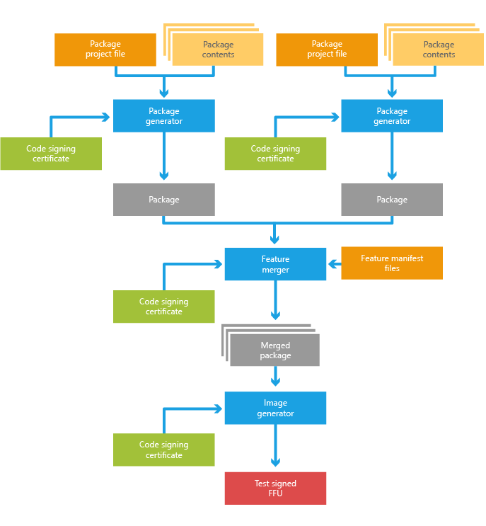

# Adding mobile packages


Packages are the logical building blocks of Windows 10 Mobile. They
contain all the files, libraries, registry settings, executables, and
data on the device. From device drivers to system files, every component
must be contained in a package. This modular architecture allows for
precise control of updates: a package is the smallest serviceable unit
on the device. Packages usually represent a specific feature or
functionality in the operating system. Individual packages can be
grouped together to form more manageable groups of components and used
to create images for flashing or updating a device.

## <span id="In_this_topic"></span><span id="in_this_topic"></span><span id="IN_THIS_TOPIC"></span>In this topic


-   [Packaging process during development](#packaging-process)

-   [Create a package project with no
    content](#creating_a_package_project)

-   [Add content to a package](#adding-content-to-a-package)

-   [Run the pkggen.exe tool](#run-pkg)

-   [View the contents of a package](#view-package)

-   [Add a language-specific content to a
    package](#adding_language_specific_content)

-   [Add a resolution-specific content to a
    package](#adding_resolution_specific_content)

-   [Add a driver component](#adding-driver-component)

-   [Package a driver](#package-driver)

-   [Add a service component](#service-component)

-   [Add customization settings](#customization)

-   [Add binary partitions](#adding-binary-partitions)

-   [Project scope macros](#project-scope-macros)

## <span id="Related_topics"></span><span id="related_topics"></span><span id="RELATED_TOPICS"></span>Related topics


The following list shows additional topics related to package creation:

-   [Primary elements and attributes of a package project
    file](primary-elements-and-attributes-of-a-package-project-file.md)

-   [Specifying components in a package project
    file](specifying-components-in-a-package-project-file.md)

-   [Specifying files and registry entries in a package project
    file](specifying-files-and-registry-entries-in-a-package-project-file.md)

-   [Command-line arguments for package
    generator](command-line-arguments-for-package-generator.md)

-   [Merging packages before
    imaging](merging-packages-before-imaging.md)

-   [Merging packages using
    FeatureMerger](merging-packages-using-featuremerger.md)

## <span id="packaging_process"></span><span id="PACKAGING_PROCESS"></span>Packaging process during development


It is important to follow the packaging model to ensure the operating
system behaves properly. If OEM packages are incorrectly defined, a
device that functions normally during development may stop working
correctly when a software update is applied.

Packages fall into three primary categories:

-   Microsoft prebuilt packages that are delivered with mobileos and
    contain the core operating system

-   SoC vendor prebuilt packages that are delivered by the vendor and
    contain the drivers and firmware that support the device's chipset

-   OEM packages that are built by partners to contain their
    device-specific drivers and customizations

The following diagram illustrates the packaging process during
development.



## <span id="creating_a_package_project"></span><span id="CREATING_A_PACKAGE_PROJECT"></span>Create a package project with no content


A package project XML file generally starts with no content. The
following is an example of an empty package project.

**Important**  

The package project XML file must use the "pkg.xml" extension.

 

``` syntax
<?xml version="1.0" encoding="utf-8"?>
<Package xmlns="urn:Microsoft.WindowsPhone/PackageSchema.v8.00"
   Owner="OEMName"
   OwnerType="OEM"     
   ReleaseType="Test"
   Platform="PlatformName"     
   Component="ComponentName"
   SubComponent="SubName">
</Package>
```

If you run the package generator (pkggen.exe) against this project file,
a package with no contents will be created.

## <span id="adding_content_to_a_package"></span><span id="ADDING_CONTENT_TO_A_PACKAGE"></span>Add content to a package


The contents of a package are organized as a list of XML elements in the
package project XML file. To add contents to a package, add a
**Components** element with the appropriate child elements as shown in
the following excerpt that demonstrates the addition of some files and
registry settings to a package.

``` syntax
<?xml version="1.0" encoding="utf-8"?>
<Package xmlns="urn:Microsoft.WindowsPhone/PackageSchema.v8.00"
   Owner="OEMName"
   OwnerType="OEM"     
   ReleaseType="Test"
   Platform="PlaformName"
   Component="ComponentName"
   SubComponent="SubName">
   <Components>
      <OSComponent>
         <Files>
            <File Source="$(_RELEASEDIR)\test_file1.dll"/>
            <File Source="$(_RELEASEDIR)\toBeRenamed.dat" 
               DestinationDir="$(runtime.system32)\test" Name="test.dat"/>
         </Files>
         <RegKeys>
            <RegKey KeyName="$(hklm.software)\OEMName\test">
               <RegValue Name="StringValue" Value="Test string" Type="REG_SZ"/>
               <RegValue Name="DWordValue" Value="12AB34CD" Type="REG_DWORD"/>
               <RegValue Name="BinaryValue" Value="12,AB,CD,EF" Type="REG_BINARY"/>
            </RegKey>
            <RegKey KeyName="$(hklm.software)\OEMName\EmptyKey"/>
         </RegKeys>
      </OSComponent>
   </Components>
</Package>
```

This example demonstrates how to specify the file source path and
override the default path and name on the device. It also demonstrates
how to specify different registry values. If you run the package
generator (pkggen.exe) against this project file, it will create a
package that contains the specified files and registry values. For more
info about how to run package generator, see [Command-line arguments for
package generator](command-line-arguments-for-package-generator.md).

You can also add other objects such as COM servers and drivers. For
additional schema and attribute information for each type of object, see
[Specifying components in a package project
file](specifying-components-in-a-package-project-file.md).

Relative DestinationDir references using a "." or ".." are not
supported. Use absolute directory references instead.

## <span id="run_pkg"></span><span id="RUN_PKG"></span>Run the pkggen.exe tool


The package generator tool (pkggen.exe) provided with the Windows Driver
Kit and is used to build a package and generate a .spkg file for
inclusion in the operating system image. This tool is installed by
default to %WPDKCONTENTROOT%\\Tools\\bin\\i386.

**To use the package generator tool**

1.  Configure your environment to specify a certificate for package
    signing using the guidance provided in [Set up the signing
    environment](https://msdn.microsoft.com/library/windows/hardware/dn756804.aspx) and
    [Sign binaries and
    packages](https://msdn.microsoft.com/library/windows/hardware/dn789217.aspx).

2.  Add %WPDKCONTENTROOT%\\Tools\\bin\\i386 to your Path environment
    variable.

3.  From an elevated command prompt, enter the following command for
    each of the pkg.xml files you want to build.

    ``` syntax
    PkgGen [package project file name] /config:"%WPDKCONTENTROOT%\Tools\bin\i386\pkggen.cfg.xml"
    ```

    **Note**  
    When a package is changed the /version field should always be
    incremented when running package generator.

     

For additional info about package generator options and capabilities,
see [Command-line arguments for package
generator](command-line-arguments-for-package-generator.md).

## <span id="view_package"></span><span id="VIEW_PACKAGE"></span>View the contents of a package


Packages use Windows cabinet file technology to store a set of files.

**To view the contents of a package**

1.  On a Windows PC, locate the generated package and add a ".cab" file
    extension to the package name.

2.  Double-click the renamed file to view the files that are stored in
    the .cab file.

3.  The package files are renamed in the .cab file. To view the original
    filenames, extract the man.dsm.xml file to the Desktop and open it.

4.  There are multiple file entries. For each file entry, the
    &lt;DevicePath&gt; element shows the full file name. The
    &lt;CabPath&gt; entry shows the file name that is used in the
    package.

    ``` syntax
    <FileEntry>
      <FileType>Regular</FileType>
      <DevicePath>\Windows\Packages\CustomMetadata\Contoso.PhoneTest.TestApp.meta.xml</DevicePath>
      <CabPath>4_Contoso.xml</CabPath> 
      <Attributes>Normal</Attributes>
    </FileEntry>
    ```

5.  After you are done viewing the files, remove the ".cab" file
    extension from the package file name.

## <span id="adding_language_specific_content"></span><span id="ADDING_LANGUAGE_SPECIFIC_CONTENT"></span>Add a language-specific content to a package


In the preceding example, all the files and registry values are language
neutral. You can use the package project XML file to add
language-related files and registry values to a package. Special flags
are used to notify the package generator of language-specific content.
The following XML example demonstrates how to designate
language-specific content.

``` syntax
<Components>
   <OSComponent>
      ...
      <Files Language="*">
         <File DestinationDir="$(runtime.default)\mui\$(langid)" 
            Source="$(_RELEASEDIR)\$(LANGID)\test.dll.mui"/>
      </Files>
      <Files Language="(zh-CN;zh-TW)">
         <File DestinationDir="$(runtime.default)\mui\$(langid)" 
            Source="$(_RELEASEDIR)\$(LANGID)\testZH.dll.mui"/>
      </Files>
      <RegKeys Language="(zh-CN;zh-TW)">
         <RegKey KeyName="$(hklm.software)\microsoft\testZH\$(LANGID)">
            <RegValue Name="ZHConfig_$(LANGID)" Value="$(LANGID)" Type="REG_SZ"/>
            <RegValue Name="ZHConfig_$(LANGID)_Test" Value="$(LANGID)" 
               Type="REG_EXPAND_SZ"/>
         </RegKey>
      </RegKeys>
      ...
   </OSComponent>
</Components>
```

By specifying the **Language** attribute of **File** or **RegKey**
elements, the package generator is notified that the enclosed contents
are language related and need to be expanded for all (or just the
specified) languages. Inside the element, you can use $(LANGID) to
reference the actual language.

**Note**  

While only **File** and **RegKey** elements have **Language**
attributes, most of the package objects can contain **File** and
**RegKey** child elements. For more info about these elements, see
[Specifying files and registry entries in a package project
file](specifying-files-and-registry-entries-in-a-package-project-file.md).

 

## <span id="adding_resolution_specific_content"></span><span id="ADDING_RESOLUTION_SPECIFIC_CONTENT"></span>Add a resolution-specific content to a package


Similar to including language-specific content, packages can also
include resources (files or registry settings) that are specific to a
resolution. This is done by creating a "resolution package." The way to
specify resolution-specific content is also similar to that of
language-specific content; the only difference is that you must use the
**Resolution** attribute instead of the **Language** attribute. The
following XML example demonstrates how to designate certain files and
registry keys for a specific resolution.

``` syntax
<Components>
   <OSComponent>
      ...
      <Files Resolution="*">
         <File Source="$(_RELEASEDIR)\$(RESID)\testA.jpg" Name="testA.$(resid).jpg"/> 
      </Files>
         <Files Resolution="(320X480;240x320)">
            <File Source="$(_RELEASEDIR)\$(RESID)\testB.jpg" 
               DestinationDir="$(runtime.system32)\$(resid)"/>
      </Files>
      <Files Resolution="(480x240)">
         <File Source="$(_RELEASEDIR)\$(RESID)\testC.jpg" 
            DestinationDir="$(runtime.system32)\$(resid)" Name="testC_$(resid).jpg"/>
      </Files>
      <RegKeys Resolution="*">
         <RegKey KeyName="$(hklm.software)\microsoft\ResRelatedSettings\$(RESID)">
            <RegValue Name="Config" Value="$(RESID)" Type="REG_SZ"/>
         </RegKey>
      </RegKeys>
         ...
   </OSComponent>
</Components>
```

## <span id="adding_driver_component"></span><span id="ADDING_DRIVER_COMPONENT"></span>Add a driver component


Driver injection is supported by using the **Driver** element in the
package project XML file. The following XML example demonstrates how to
specify the .inf and .sys file for a driver. For more info about the
elements and attributes available for drivers, including those for
security, see [Specifying components in a package project
file](specifying-files-and-registry-entries-in-a-package-project-file.md).

``` syntax
<Components>
   <Driver InfSource="$(_RELEASEDIR)\testDriver.inf">
      <Reference Source="$(_RELEASEDIR)\testDriver.sys"/>
      <Files>
         <File Source="$(_RELEASEDIR)\testDriver.sys"/>
      </Files>
   </Driver>
</Components>
```

## <span id="package_driver"></span><span id="PACKAGE_DRIVER"></span>Package a driver


The default file location for driver installation is
"$(runtime.drivers)". The staging of the driver object requires access
to the Mobile Core hive files. For a package that includes a driver, it
is necessary to also set the variable HIVE\_ROOT to the directory with
those hives, which should be %WPDKCONTENTROOT%\\CoreSystem. Under these
circumstances, the command for package generator would be the following:
`PkgGen SampleDriver.pkg.xml /config:"%WPDKCONTENTROOT%\Tools\bin\i386\pkggen.cfg.xml" /variables:"HIVE_ROOT=%WPDKCONTENTROOT%\CoreSystem"`

**Note**  

If the driver uses the **Include** INF directive to reference other
drivers that are part of the Mobile Core subset of the operating system,
use the **WIM\_ROOT** variable instead of the **HIVE\_ROOT** variable.
The default directory for the staging WIM image is the same as the
hives.

For Windows 10 Mobile, you must use both the **HIVE\_ROOT** and
**WIM\_ROOT** parameters. If you use only **WIM\_ROOT**, the package
might not be complete.

 

## <span id="service_component"></span><span id="SERVICE_COMPONENT"></span>Add a service component


The **Service** element in the package project XML file, its child
elements, and its attributes can be used to define and package a system
service. For more detailed info about the attributes and chid elements
of the **Service** element, see [Specifying components in a package
project file](specifying-files-and-registry-entries-in-a-package-project-file.md).

## <span id="customization"></span><span id="CUSTOMIZATION"></span>Add customization settings


Managed Centralized Settings Framework (MCSF) provides a standard way to
describe settings that are customizable within packages. A
**SettingsGroup** element represents a settings group in the
customization answer file.

## <span id="adding_binary_partitions"></span><span id="ADDING_BINARY_PARTITIONS"></span>Add binary partitions


The **BinaryPartition** element is a special element that represents a
binary dump of a partition on the device. A package project can only
specify one **BinaryPartition** element. Additionally, a BinaryPartition
element can't coexist with any other objects and requires that the
**BinaryPartition** attribute of the **Package** element be set to
**true**. The following example demonstrates this.

``` syntax
<?xml version="1.0" encoding="utf-8"?>
<Package xmlns="urn:Microsoft.WindowsPhone/PackageSchema.v8.00"
   Owner="OEMName"
   OwnerType="OEM"     
   ReleaseType="Test"          
   Component="ComponentName"
   SubComponent="SubName">
   Partition="DPP"
   BinaryPartition="true">
   <Components>
      <BinaryPartition ImageSource="$(_RELEASEDIR)\testDPP.bin"/>
   </Components>
</Package>
```

## <span id="project_scope_macros"></span><span id="PROJECT_SCOPE_MACROS"></span>Project scope macros


Package projects can utilize macros to simplify the XML creation
process. Some macros are already globally defined, in which case they
can't be changed or modified, but you can also define local macros for
use within your own package project XML file. This local macro
definition is embedded in the specific package project file through the
**Macros** element. The following example demonstrates creating a local
macro for use in a package project file.

``` syntax
<?xml version="1.0" encoding="utf-8"?>
<Package xmlns="urn:Microsoft.WindowsPhone/PackageSchema.v8.00"
   ...
   >
   <Macros>
      <Macro Id="testName" Value="testValue"/>
...
   </Macros>

   <Components>
      ...
   </Components>
</Package>
```

After defining the macro shown here, you could use $(testName) to
reference the value "testValue" in your project. For more info, see "The
Macros element and local project macros" in [Primary elements and
attributes of a package project
file](primary-elements-and-attributes-of-a-package-project-file.md).

 

 

[Send comments about this topic to
Microsoft](mailto:wsddocfb@microsoft.com?subject=Documentation%20feedback%20%5Bp_phPackaging\p_phPackaging%5D:%20Creating%20mobile%20packages%20%20RELEASE:%20(11/14/2017)&body=%0A%0APRIVACY%20STATEMENT%0A%0AWe%20use%20your%20feedback%20to%20improve%20the%20documentation.%20We%20don't%20use%20your%20email%20address%20for%20any%20other%20purpose,%20and%20we'll%20remove%20your%20email%20address%20from%20our%20system%20after%20the%20issue%20that%20you're%20reporting%20is%20fixed.%20While%20we're%20working%20to%20fix%20this%20issue,%20we%20might%20send%20you%20an%20email%20message%20to%20ask%20for%20more%20info.%20Later,%20we%20might%20also%20send%20you%20an%20email%20message%20to%20let%20you%20know%20that%20we've%20addressed%20your%20feedback.%0A%0AFor%20more%20info%20about%20Microsoft's%20privacy%20policy,%20see%20http://privacy.microsoft.com/default.aspx. "Send comments about this topic to Microsoft")


