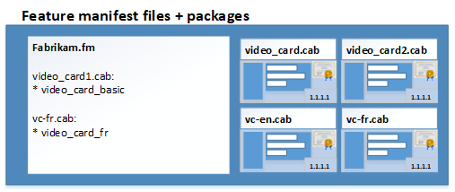

# Windows Core Operating System (WCOS) manufacturing guide

## Step-by-step guides
-   [Get the tools needed to customize WCOS](set-up-your-pc-to-customize-core.md)
-   [Lab 1a: Create a basic image](create-a-basic-image.md)
-   [Lab 1b: Add an app to your image](deploy-your-app-with-a-standard-board.md)
-   [Lab 1c: Add a file and a registry setting to an image](add-a-registry-setting-to-an-image.md)
-   [Lab 1d: Add networking and other provisioning package settings to an image](add-a-provisioning-package-to-an-image.md)
-   [Lab 1e: Add a driver to an image](add-a-driver-to-an-image.md)
-   [Lab 1f: Build a retail image](build-retail-image.md)
-   [Lab 2: Creating your own board support package](create-a-new-bsp.md)
-   [Lab 3: Update your apps](https://msdn.microsoft.com/windows/hardware/commercialize/service/iot/updating-iot-core-apps)

## Concepts

Windows Core is the base operating system which is common to wide range of devices, including HoloLens, Xbox, PCs, phones and Nano Servers. 

### How is Windows Core different from Windows 10?

* **Windows Core doesn't include generic device drivers**. It's designed to be lightweight and secure. Part of this design means not including a lot of the generic device drivers and features supported by Windows 10. 

To build a device, you'll need to add your own drivers. If you're using hardware from another manufacturer, that manufacturer will typically combine all of the drivers you'll need into a Board Support Package (BSP). If you're creating hardware for other OEMs to use, you'll need to build support packages for them, which we'll discuss in this guide.

* **Windows Core requires apps and drivers that run on the Universal Windows Platform (UWP) model**. Many manufacturers create UWP apps and [Universal Windows drivers](https://docs.microsoft.com/en-us/windows-hardware/drivers/develop/getting-started-with-universal-drivers) for existing Windows 10 PCs and devices.

Legacy Windows apps and drivers must be repackaged to meet the UWP standards before they can be added to the device. 

* **Windows Core uses the Windows packaging model to track and update everything that's on the device.** Packages let OEMs, ODMs, developers, and Microsoft work together to help deliver security and feature updates to your devices without stomping on each other's work.

### Windows packaging model

#### Packages
*  **Everything you add is packaged**. Every file, folder, setting and customization that you add to the device is included in a package. Each package includes a package project file (*.wm.xml) that lists the content and its locations.
*  **Packages are signed**. Every customization on your device is trackable to a package with a signature. Only you and partners that you trust can update the packages.
*  **Packages are versioned for easy web-based updates**. Need to change a setting or a file? Update the package and put it on an update server, and the devices can update themselves.

#### Feature manifests

* [Feature manifest files]((https://msdn.microsoft.com/library/windows/hardware/dn756745)) track the locations of all of your packages. 
  -  OEMs create feature manifests (OEMFM.xml) to track OEM customizations.
  -  Hardware manufactuers create feature manifests (BSPFM.xml) to track the drivers and settings used to support a motherboard. For example, OEM\_RPi2FM.xml includes all of the features used for the Raspberry Pi 2.
  -  Windows Core uses its own feature manifest and packages.

* Tag the packages with feature IDs so you can easily refer to them when making your own images.

#### ImgGen and image configuration files

Use image configuration file to merge your feature manifests with those from your partners to create an image that you can flash to your devices.

To design devices for different markets, use the feature ID tags from your feature manifests to decide which packages make it to your final images.

You can use as many feature manifests into an image as you want.

The image configuration file also include other information about the image, including:

-   A chip identifier, which is used to help set up the device partitions. The supported values for **soc** are defined in the corresponding bspfm.xml, under \<devicelayoutpackages>.

-   A **Device** identifier, which is used to select the device layout. The supported values for **device** are defined in the corresponding bspfm.xml, under \<oemdeviceplatformpackages>.

-   The ReleaseType (either **Production** or **Test**).

    **Retail builds**: We recommend creating retail images early on in your development process to verify that everything will work when you are ready to ship.

    These builds contain all of the security features enabled.

    To use this build type, all of your code must be signed using retail (not test) code signing certificates.

    For a sample, see %SRC\_DIR%\\Products\\SampleA\\RetailOEMInput.xml.

    **Test builds**: Use these to try out new versions of your apps and drivers created by you and your hardware manufacturer partners.

    These builds have some security features disabled, which allows you to use either test-signed or production-signed packages.

    These builds also include developer tools such as debug transport, SSH, and PowerShell, that you can use to help troubleshoot issues.

    For a sample, see %SRC\_DIR%\\Products\\SampleA\\TestOEMInput.xml.

The **Imggen** tool uses the image configuration file to create your final images.

These are the same tools used to create Windows 10 IoT Core and Mobile images. To learn more, see [OEMInput file contents](https://msdn.microsoft.com/library/windows/hardware/dn756778).

## OK, let's try it!

Start here: [Get the tools needed to customize Windows Core](set-up-your-pc-to-customize-core.md).

## Related topics

[Learn about Windows 10 IoT Core](https://developer.microsoft.com/windows/iot/iotcore)

[IoT Core Developer Resources](https://developer.microsoft.com/windows/iot)

[What's in the Windows ADK IoT Core Add-ons](iot-core-adk-addons.md)

[WCOS feature list](core-feature-list.md)

[IoT Core Add-ons command-line options](iot-core-adk-addons-command-line-options.md)

 

 

