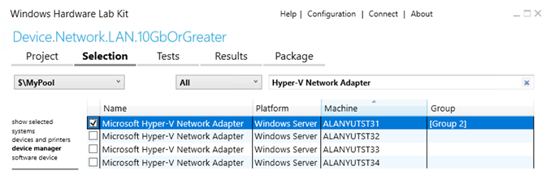
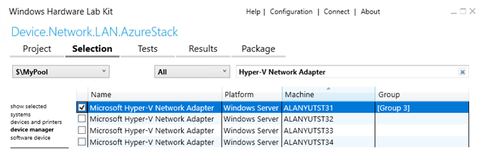
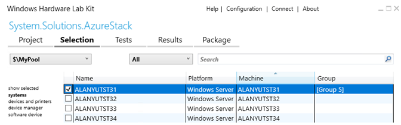

# Private Cloud Simulator for Windows Server 2019

## <span id="Introduction"></span><span id="introduction"></span><span id="INTRODUCTION"></span>Introduction

The current industry trend is for private cloud solutions to comprise tightly integrated software and hardware components in order to deliver a resilient private cloud with high performance. Issues in any of the components (software, hardware, drivers, firmware, and so forth) can compromise the solution and undermine the promises made regarding a Service Level Agreement (SLA) for the private cloud.

Some of these issues are surfaced only under a high-stress, cloud-scale deployment, and are potentially hard to find using traditional standalone, component-focused tests. The Private Cloud Simulator is a cloud validation test suite that enables you to validate your component in a cloud scenario and identify these types of issues.

### Target Audience

The target audience for this document are those working towards validating their hardware for Windows Server Logo, Microsoft Azure Stack (MAS) solutions and Windows Server Software Defined (WSSD) datacenter offerings (that offer SDDC Standard, SDDC Premium Additional Qualifiers on the Windows Server Catalog).

| Component Type                          | Windows Server Logo      | WSSD (SDDC Standard/Premium) | Azure Stack |
|-----------------------------------------|--------------------------|------------------------------|-------------|
| **Network Interface Cards**             | Yes                      | Yes                          | Yes         |
| **SAS HBA**                             | No                       | Yes                          | Yes         |
| **Hard Disk Drives (HDD): SAS, SATA**   | No                       | Yes                          | Yes         |
| **Solid State Drives (SSD): SAS, SATA** | No                       | Yes                          | Yes         |
| **NVMe devices**                        | No                       | Yes                          | Yes         |
| **SCSI Enclosures**                     | No                       | Yes                          | Yes         |
| **Solutions**                           | No                       | Yes                          | Yes         |

## <span id="Test_Overview"></span><span id="test_overview"></span><span id="TEST_OVERVIEW"></span>Test Overview

Private Cloud Simulator (PCS) simulates a live datacenter/private cloud by creating VM workloads, simulating data center operations (load balancing, software/hardware maintenance), and injecting compute/storage faults (unplanned hardware/software failure). PCS uses a Microsoft SQL Server database to record test and solution data during the run. It then presents a report that includes operation pass/fail rates and logs whihch provide the capability to correlate data for pass/fail determination and failure diagnosis (as applicable).

### Topology

PCS lab environment contains the following elements:

* An Active Directory domain controller/DNS/DHCP server for the test domain.
  * You can find information about Active Directory at <https://msdn.microsoft.com/library/bb727067.aspx>
  * [Active Directory Domain Services Functional Levels](https://technet.microsoft.com/en-us/library/understanding-active-directory-functional-levels.aspx) needs to be Windows Server 2012 or higher.
* A dedicated HLK controller machine. OS must be Windows Server 2016.
* A dedicated PCS controller machine. OS must be Windows Server 2019.
* A compute cluster, which hosts Hyper-V virtual machines. The minimun number of nodes depends on the type of [PCS jobs](#pcs_tests).

Supporting Documents:

* [Windows Server 2016 Storage Spaces Direct cluster](https://technet.microsoft.com/en-us/library/mt693395.aspx)
* [Failover-Clustering](https://technet.microsoft.com/en-us/library/hh831579.aspx)
* [Microsoft Azure Stack Logo Requirements](http://aka.ms/getreq) released via Microsoft Collaborate to Microsoft partners

Notes:

* All the above machines must be joined to the same test domain.
* All PCS tests need to be run as the same user in the 'Domain Admins' group for the test domain.
* Use the same user with Domain Admin credentials to install the HLK controller.

### HLK Controller System Requirements

Minimum system requirements are as shown in the table below.

| Resource                | Minimum requirement            |
|-------------------------|--------------------------------|
| CPU (or vCPU)           | 4 cores                        |
| Memory                  | 12 GB RAM                      |
| Available disk space    | 200 GB                         |
| Operating system        | Windows Server 2016 Datacenter |
| Active Directory domain | Join it to the test domain     |

#### HLK Controller Setup

* Follow the [Windows HLK Getting Started guide](https://msdn.microsoft.com/library/windows/hardware/dn915002) to [download](https://developer.microsoft.com/windows/hardware/windows-hardware-lab-kit) and install HLK controller software.
* Download the supplemental content package file **PCSFiles.vhd** for Windows Server 2019 from the [Windows Hardware Lab Kit] website(https://developer.microsoft.com/en-us/windows/hardware/windows-hardware-lab-kit).
* Copy the **PCSFiles.vhd** file to the **Tests\\amd64** test folder on the HLK Controller. Below is the default path for an HLK installation:

    `C:\Program Files (x86)\Windows Kits\10\Hardware Lab Kit\Tests\amd64`

#### Get IOMeter files

* IOMeter is a workload that must be installed on the HLK controller.
* Download the i386 Windows version of IOMeter release dated 2006.07.27 from the IOMeter website.
* Run the setup (or unzip the package) to unpack the files.
* Copy **IOMeter.exe**, **Dynamo.exe** to **Tests\\amd64\\pcs\\GuestScenarioManager\\IOMeter** folder on the HLK controller. Below is the default path for an HLK installation:

    `C:\Program Files (x86)\Windows Kits\10\Hardware Lab Kit\Tests\amd64\pcs\GuestScenarioManager\IOMeter`

### PCS Controller System Requirements

Minimum system requirements are as shown in the table below.

| Resource                     | Minimum requirement            |
|------------------------------|--------------------------------|
| CPU (or vCPU)                | 4 cores                        |
| Memory                       | 12 GB RAM                      |
| Free space on the boot drive | 200 GB                         |
| Operating system             | Windows Server 2019 Datacenter |
| Active Directory domain      | Join it to the test domain     |

#### PCS Controller Setup

* PCS controller MUST be a Generation v2 VM or a physical machine.
* **Secure Boot** and **BitLocker** MUST be disabled. This is required because PCS enables **TestSigning** boot configuration. If you are using Generation 2 Hyper-V VM as PCS controller, stop the VM to disable Secure Boot in the VM's settings.
* Install the HLK Client using the [Windows HLK Getting Started guide](https://msdn.microsoft.com/library/windows/hardware/dn915002) and open the requisite ports.
* Install .NET Framework 3.5 (This feature is not included by default in Windows Server 2019).
  * Generic Installation Instructions can be found at the following locations:
    * <https://msdn.microsoft.com/library/hh506443>
    * <https://msdn.microsoft.com/library/windows/desktop/hh848079>
  * For builds released via Microsoft Connect, see details below:
    * Mount the ISO supplied with the build and find the file at **MountedDriveLetter:\\sources\\sxs\\microsoft-windows-netfx3-ondemand-package.cab**
    * Copy the file to a local folder on the PCS controller
    * Install the package by executing this command line using admin privileges

      ```powershell
      Add-WindowsFeature Net-Framework-Features -source <Local Folder>
      ```

## <span id="PCS_Tests"></span><span id="pcs_tests"></span><span id="PCS_TESTS"></span>PCS Tests

This section discusses how to find an appropriate PCS test for your device/solution, configure the lab, and kickoff PCS execution.

* You need to use the same domain admin user account to setup lab and run tests.
* **Secure Boot State** must be OFF on all nodes and PCS controller.
* HLK update package MUST be download and installed on HLK controller/clients. [HLK update package](https://developer.microsoft.com/en-us/dashboard/collaborate/packages/5485) is available at Microsoft Collaborate site for download.

### PCS Test Selection

The PCS jobs are used to certify multiple categories of devices and solutions. The table below, maps them to the appropriate PCS job.

| Target             | Certification Program      | Job Name in HLK                                            |
|--------------------|----------------------------|------------------------------------------------------------|
| NIC                | Windows Server Logo        | PrivateCloudSimulator-Device.Network.LAN.10GbOrGreater     |
| NIC                | SDDC Standard              | PrivateCloudSimulator-Device.Network.LAN.10GbOrGreater     |
| NIC                | SDDC Premium               | PrivateCloudSimulator-Device.Network.LAN.AzureStack        |
| NIC                | AZURESTACK                 | PrivateCloudSimulator-Device.Network.LAN.AzureStack        |
| SAS HBA            | SDDC Standard              | PCS job is replaced by S2D [BVT](https://docs.microsoft.com/en-us/windows-hardware/test/hlk/testref/68fd59d3-afe9-4a68-8c9d-ed2c69f6a070) and [Stress](https://docs.microsoft.com/en-us/windows-hardware/test/hlk/testref/8f88f147-d747-4695-87cf-07990361d18f) tests  |
| SAS HBA            | SDDC Premium               | PCS job is replaced by S2D [BVT](https://docs.microsoft.com/en-us/windows-hardware/test/hlk/testref/68fd59d3-afe9-4a68-8c9d-ed2c69f6a070) and [Stress](https://docs.microsoft.com/en-us/windows-hardware/test/hlk/testref/8f88f147-d747-4695-87cf-07990361d18f) tests  |
| SAS HBA            | AZURESTACK                 | PCS job is replaced by S2D [BVT](https://docs.microsoft.com/en-us/windows-hardware/test/hlk/testref/68fd59d3-afe9-4a68-8c9d-ed2c69f6a070) and [Stress](https://docs.microsoft.com/en-us/windows-hardware/test/hlk/testref/8f88f147-d747-4695-87cf-07990361d18f) tests  |
| Disk(HDD/SSD/NVMe) | SDDC Standard              | PCS job is replaced by S2D [BVT](https://docs.microsoft.com/en-us/windows-hardware/test/hlk/testref/68fd59d3-afe9-4a68-8c9d-ed2c69f6a070) and [Stress](https://docs.microsoft.com/en-us/windows-hardware/test/hlk/testref/8f88f147-d747-4695-87cf-07990361d18f) tests  |
| Disk(HDD/SSD/NVMe) | SDDC Premium               | PCS job is replaced by S2D [BVT](https://docs.microsoft.com/en-us/windows-hardware/test/hlk/testref/68fd59d3-afe9-4a68-8c9d-ed2c69f6a070) and [Stress](https://docs.microsoft.com/en-us/windows-hardware/test/hlk/testref/8f88f147-d747-4695-87cf-07990361d18f) tests  |
| Disk(HDD/SSD/NVMe) | AZURESTACK                 | PCS job is replaced by S2D [BVT](https://docs.microsoft.com/en-us/windows-hardware/test/hlk/testref/68fd59d3-afe9-4a68-8c9d-ed2c69f6a070) and [Stress](https://docs.microsoft.com/en-us/windows-hardware/test/hlk/testref/8f88f147-d747-4695-87cf-07990361d18f) tests  |
| Solution           | SDDC Standard              | PrivateCloudSimulator-System.Solutions.StorageSpacesDirect (MIN) & (MAX) |
| Solution           | SDDC Premium               | PrivateCloudSimulator-System.Solutions.StorageSpacesDirect (MIN) & (MAX) |
| Solution           | AZURESTACK                 | PrivateCloudSimulator-System.Solutions.AzureStack (MIN) & (MAX) |

PCS jobs are summarized below:

* PrivateCloudSimulator - Device.Network.LAN.10GbOrGreater  
This test contains a set of actions, that specifically target the network adapter device along with VM and compute cluster actions.
* PrivateCloudSimulator - Device.Network.LAN.AzureStack  
This test contains an extended set of actions, that verify network adapter support for the new 'Software Defined Networking' feature in Windows Server, along with VM and compute cluster actions.
* PrivateCloudSimulator - System.Solutions.StorageSpacesDirect (MIN)/(MAX)  
This test contains an extended set of actions, that target the entire solution built on an hyper-converged storage spaces direct cluster. The (MIN) test should be run on a cluster with the minimum number of supported nodes for the solution. The (MAX) test should be run on a cluster with the maximum number of supported nodes for the solution.
* PrivateCloudSimulator - System.Solutions.AzureStack (MIN)/(MAX)  
This test contains an extended set of actions, that target the entire AzureStack solution. The (MIN) test should be run on a cluster with the minimum number of supported nodes for the solution. The (MAX) test should be run on a cluster with the maximum number of supported nodes for the solution.

### PCS Job Execution Flow

Each PCS job contains the following tasks.

* Initialize PCS Controller
  * In this stage, the PCS execution engine sets up a SQL server and IIS on the PCS controller machine
  * It also copies content (e.g. evaluation OS VHD files) to enable VM creation in the next stage
* Create VMs
    * This stage sees the PCS engine start creating VMs on each node of the cluster
    * VM creation stops when the target number of VMs/node has been reached.
    * This step is a part of PCS setup phase. Test run duration timer kicks in post this stage.
* Run PCS Actions
    * Now, PCS initiates various types of actions (VM, Cluster, Storage, Network) on each node of the cluster.
    * Actions run in parallel and co-ordinate among themselves to exercise the device (storage, network) and the solution through the private cloud/datacenter lifecycle
    * Actions run periodically and stop once the target execution time (defined by the profile/job) of the test has been reached.
    * Test execution time is defined per profile and can vary based on the profile you are running. Test execution timer kicks in after all the VMs are created.
    * The steps in each action and the corresponding result of each step is stored in the SQL server.
* Cleanup Run
    * In this stage, VMs created in stage (4) are cleaned up and the cluster is restored to a clean state (as possible).
    * It generates a report file (PcsReport.htm) and a ZIP file that contains test logs.
* Report result in HLK Studio
    * In this stage, the HLK studio reports the result of the PCS run.
    * The result can be packaged into an HLKX file for submission to Microsoft.

## <span id="Execute_PCS_Tests"></span><span id="execute_pcs_tests"></span><span id="EXECUTE_PCS_TESTS"></span>Execute PCS Tests

## <span id="PrivateCloudSimulator_-_Device.Network.LAN.10GbOrGreater"></span><span id="privatecloudsimulator_-_device.network.lan.10gborgreater"></span><span id="PRIVATECLOUDSIMULATOR_-_DEVICE.NETWORK.LAN.10GBORGREATER"></span>PrivateCloudSimulator - Device.Network.LAN.10GbOrGreater

#### System Requirements

| | |
|--------------------------------|--------------------------------|
| Component Being certified      | NIC                            |
| Setup Type                     | Hyper-converged setup with S2D storage. Note: An SDDC certified HBA is required. |
| Minimum Number of Server Nodes | 3 identical machines           |
| Server Spec                    | CPU: 16 physical cores (e.g. 2 sockets with 8 cores), MEMORY: 128 GB, 64GB free space on boot drive |
| Storage Overall                | 4 TB free space per node on HDD, 800 GB free space per node on SSD |
| Disk                   | If there are drives used as cache, there must be at least 2 per server. There must be at least 4 capacity (non-cache) drives per server. See [S2D hardware requirements](https://docs.microsoft.com/en-us/windows-server/storage/storage-spaces/storage-spaces-direct-hardware-requirements) for more information. |
| Network Card                   | NIC being certified       |
| Switch                         | Switch supporting all NIC features |

#### Setup

* Follow the [Windows HLK Getting Started guide](https://msdn.microsoft.com/library/windows/hardware/dn915002) to install HLK client software on all cluster nodes.
* Follow the [Windows Server 2016 Storage Spaces Direct cluster guide](https://technet.microsoft.com/library/mt693395.aspx) to deploy a cluster.
* All nodes must be connected to the same physical switches.
* 10GbE or better networking bitrate must be used. Create a virtual swith with the same name on each node.
* Virtual machines, created by PCS, connect to the virtual switch to send network traffic between them. These VMs get IP address via DHCP. Make sure your DHCP server assigns valid IP addresses to these VMs. If DHCP server is not available or fails, VMs would use Automatic Private IP Addressing (APIPA) to self-configure an IP address and subnet. Each VM must have a valid IP address to send network traffic between VMs.

#### Execute

* Open HLK Studio
* Follow the [Windows HLK Getting Started guide](https://msdn.microsoft.com/library/windows/hardware/dn915002) to create a machine pool
* Navigate to the **Project** tab and click **Create Project**
* Enter a project name and press Enter
* Navigate to the **Selection** tab
* Select the machine pool containing the network adapter device
* Select **device manager**
* Select the device. It should be ok to select any relevant NIC device (does not matter which member of the virtual switch team) on any of the compute nodes that is targeted for certification.

  

* Right-click on the selected device and select **Add/Modify Features**
* In the features dialog, select **Device.Network.LAN.10GbOrGreater** and then click **OK**. For most NIC cards (with speeds 10GbE or higher) this feature should have been selected automatically.
* Navigate to the **Tests** tab
* Select **PrivateCloudSimulator - Device.Network.LAN.10GbOrGreater**
* Click **Run Selected**
* In the Schedule dialog,
  * Enter values for the required test parameters
    * DomainName: Test user's domain name
    * UserName: Test user's user name
    * Password: Test user's password
    * ComputeCluster: Name of compute cluster
    * StoragePath: Default value is "". It uses all the available CSVs from compute cluster. You can use different paths by entering comma separated paths. Example: **"C:\\ClusterStorage\\Volume1,C:\\ClusterStorage\\Volume2"**
    * VmSwitchName: Name of virtual switch on all nodes
    * FreeDriveLetter: Default value is **R**. During setup, PcsFiles.vhd file is mounted to this drive letter on PCS controller. Make sure this drive letter is available.
    * IsCreateCluster: Use default value
    * IsRemoveCluster: Use default value
    * IsConfigureHyperV: Use default value
  * Map machines to roles
    * PrimaryNode: This is the node with the selected device
    * Test Controller: Select PCS test controller machine
    * OtherNodes: Select other cluster nodes
* Click **OK** to schedule the test
* Please refer to [View PCS report in real-time through SQL Server Reporting Services](#realtime) to view the real-time results for the test run.

#### Duration

* PCS actions (listed below) run for about 24 hours.
* The complete run may take an additional 24-36 hours (including time for setup and cleanup).

#### PCS Actions

The table below lists the actions that are included in this test.

| Action Name                 | Description |
|-----------------------------|--------------------------------|
| VmCloneAction               | Creates a new VM. |
| VmLiveMigrationAction       | Live-migrates the VM to another cluster node.|
| VmSnapshotAction            | Takes a snapshot of the VM. |
| VmStateChangeAction         | Changes the VM state (for example, to Paused). |
| VmStorageMigrationAction    | Migrates VM storage (the VHD(s)) between cluster nodes. |
| VmGuestRestartAction        | Restarts the VM. |
| VmStartWorkloadAction       | Starts a user-simulated workload. |
| VmGuestFullPowerCycleAction | Power-cycles the VM. |

## <span id="PrivateCloudSimulator_-_Device.Network.LAN.AzureStack"></span><span id="privatecloudsimulator_-_device.network.lan.azurestack"></span><span id="PRIVATECLOUDSIMULATOR_-_DEVICE.NETWORK.LAN.AZURESTACK"></span>PrivateCloudSimulator - Device.Network.LAN.AzureStack

#### System Requirements

| | |
|--------------------------------|--------------------------------|
| Component Being certified      | NIC (with RDMA) |
| Setup Type                     | Hyper-converged setup with S2D storage. Note: An SDDC certified HBA is required. |
| Minimum Number of Server Nodes | 3 identical machines           |
| Server Spec                    | CPU: 16 physical cores (e.g. 2 sockets with 8 cores), MEMORY: 128 GB, 64GB free space on boot drive |
| Storage Overall                | 4 TB free space per node on HDD, 800 GB free space per node on SSD |
| Disk                   | If there are drives used as cache, there must be at least 2 per server. There must be at least 4 capacity (non-cache) drives per server. See [S2D hardware requirements](https://docs.microsoft.com/en-us/windows-server/storage/storage-spaces/storage-spaces-direct-hardware-requirements) for more information. |
| Network Card                   | NIC being certified       |
| Switch                         | Switch supporting all NIC features |

#### Setup

* Hyper-V host that contains PCS Controller VM must be Windows Server 2016 or later.
* Follow the [Windows HLK Getting Started guide](https://msdn.microsoft.com/library/windows/hardware/dn915002) to install HLK client software on all cluster nodes
* Follow the [Windows Server 2016 Storage Spaces Direct cluster guide](https://technet.microsoft.com/library/mt693395.aspx) to deploy a cluster
* For instructions to set up networking for Storage Spaces Direct, see [Windows Server 2016 Converged NIC and Guest RDMA Deployment Guide](https://github.com/Microsoft/SDN/blob/master/Diagnostics/S2D%20WS2016_ConvergedNIC_Configuration.docx).
* PCS Controller VM should be built as a generation 2 VM and have 2 network interfaces, one for the management network and the other for SDN (PA address space) topology. The interface for SDN topology will be assigned an IP address from the IP address space passed in as the **AddressPrefixes** parameter.

  

* All the nodes must be able to communicate with the PCS Controller VM at all times through a management interface. For this purpose, each server should have one additional NIC for management interface, which does not need to meet strict bitrate requirements.
* 10GbE or better networking bitrate is required for the NICs under test. Each server should have two identical 10gb or greater NICs.
* If RDMA capable NICs are used, the physical switch must meet the associated RDMA requirements.
* Make sure that every node contains a teaming enabled virtual switch with the same name.

  ```powershell
  New-VMSwitch -Name SdnSwitch -NetAdapterName "Name 1,Name 2" -AllowManagementOS -EnableEmbeddedTeaming
  ```

* Configure Nested Virtualization: Nested virtualization for the PCS Controller VM must be enabled. While the PCS VM is in the OFF state, run the following command on the Hyper-V host.

   ```powershell
   Set-VMProcessor -VMName <VMName> -ExposeVirtualizationExtensions $true
   ```

* Make sure that RDMA is setup on all nodes and reflects when queried through Get-SMBClientNetworkInterface & Get-SMBServerNetworkInterface.
* Live Migration settings (Failover Cluster Manager-&gt;Networks-&gt;Live Migration Settings) must be set appropriately to use storage network for live migrations.
* This test creates virtual machines and send traffic between them using the virtual switch created. The vNic (virtual nic) of the PCS virtual machines are assigned IP address from the IP address space passed in as the **AddressPrefixes** parameter.

#### Execute

* Open HLK Studio
* Navigate to the **Project** tab and click **Create Project**
* Enter a project name and press Enter
* Navigate to the **Selection** tab
* Select the machine pool containing the network adapter device
* Select **device manager**
* Select the device. It should be OK to select any relevant NIC device (does not matter which member of the virtual switch team) on any of the compute nodes that is targeted for certification.

  

* Right-click on the selected device and select **Add/Modify Features**
* In the features dialog, select **Device.Network.LAN.AzureStack** and click **OK**.
* Navigate to the **Tests** tab
* Select **PrivateCloudSimulator - Device.Network.LAN.AzureStack**
* Click **Run Selected**
* In the Schedule dialog,
  * Enter values for the required test parameters
    * DomainName: Test user's fully qualified domain name (FQDN).
    * UserName: Test user's user name
    * Password: Test user's password
    * ComputeCluster: compute cluster name
    * StoragePath: Default value is ''. It uses all the available CSVs from compute cluster. You can use different paths by entering comma separated paths. Volume Names shouldn’t contain empty spaces. Example: **'C:\ClusterStorage\Volume1,C:\ClusterStorage\Volume2'** (single quotes are needed)
    * VmSwitchName: Name of virtual switch to be used for SDN. Example: SdnSwitch
    * FreeDriveLetter: Default value is **R**. During setup, PcsFiles.vhd file is mounted to this drive tter on PCS controller. Make sure this drive letter is available.
    * AdapterNames: Comma seperated list of adapter names that are part of the vmSwitch. Use the format **"'Name 1', 'Name 2'"** (double quotes and single quotes are needed) for multiple adapters. Names must be derived from Get-NetAdapter cmdlet.
    * VLan: Vlan ID set on vmSwitch. Only required if your physical switch is configured for Vlan. Enter '0' to indicate that there is no Vlan tagging.
    * RDMAEnabled: Enter $True if NIC supports RDMA
    * SetEnabled: Enter $True if NIC supports Switch Embedded Teaming
    * HnvEnabled: Enter $True if NIC supports Hyper-V Network Virtualization
    * TaskOffloadEnabled: Enter $True if NIC supports Encapsulate Task Offload
    * TestControllerNetAdapterName: Adapter name on PCS Controller that can be assigned a static IP in the **AddressPrefixes** range to communicate with SDN Network Controller virtual machines. Example: **'Ethernet 2'** (single quotes are needed if there are spaces in the name)    
    * VHDSourcePath: a VHDX file for Windows Server 2019 DataCenter. This VHDX file will be used to create Network Controller VMs. Default value is **c:\pcs\BaseVHDX\17763.1.amd64fre.rs5_release.180914-1434_server_serverdatacentereval_en-us.vhdx**. DON’T change the default value unless you have to use your own VHDX file. Cloned vhdx files have the same disk signatures. To avoid disk signature collision, this VHDX file cannot be the same as the one used by PCS controller.
    * KBPackagePath: Comma seperated list of Windows Update Packages that should be applied to the VHDX file that specified in parameter VHDSourcePath. Default value is '' (single quotes are needed). It means no KB would be injected into VHDX file. In the example below, two KBs would be applied to VHDX file. These KBs should match the ones installed on cluster nodes.
      * Two update packages KBExample1 and KBExample2 are downloaded from Windows Update site and copy them to c:\KB\KBExample1.msu and c:\kb\KBExample1.msu on the PCS controller machine.
      * Enter **'c:\KB\KBExample1.msu,c:\kb\KBExample2.msu'** (single quote is required, KBExample1 is installed before KBExample2.)
    * AddressPrefixes: The IP address range to be used by Tenant VMs and Hosts. These addresses will be used for SDN datacenter management.
    * VipPrefixes: Two IP address ranges that are used by SLB for VIP load balancing scenarios. Use the format "'192.160.2.0/23','192.160.3.0/23'" (double quotes and single quotes are needed)
    * ClientAddressPrefix: The IP address range used by Client VMs.
  * Map machines to roles
    * PrimaryNode: This is the node with the selected device, automatically selected by HLK.
    * Test Controller: Select PCS test controller machine
    * OtherNodes: Select other cluster nodes
* Click **OK** to schedule the test
* Please refer to [View PCS report in real-time through SQL Server Reporting Services](#realtime) to view the real-time results for the test run.

#### Cleanup

Use the **C:\\Pcs\\ReRunPcsCleanup.cmd** script on the PCS-Controller for cleaning up state of the setup if the test abruptly ends. It is very important that stale VMs & SDN infrastructure is cleaned up before starting a new run.

Please make sure the following items are cleaned up before starting a new run:

* Clustered VM roles (FailoverClusterManager-&gt;Cluster-&gt;Roles)

  ```powershell
  Get-ClusterGroup -Cluster $clusterName
  ```

* All the VMs created by PCS

  ```powershell
  Get-ClusterNode -Cluster $clusterName | % { Get-VM -ComputerName $_.Name }
  ```

* vNics created by PCS/SDN

  ```powershell
  Get-ClusterNode -Cluster $clusterName | % { Get-VMNetworkAdapter -ComputerName $_.Name -ManagementOS | Select-Object ComputerName,Name,SwitchName }
  ```

  

* Storage/CSV-volumes on the cluster do not have any entries pertaining to PCS (C:\\ClusterStorage\\Volume1\\PCS)

#### Duration

* PCS actions (listed below) run for about 24 hours.
* The complete run may take an additional 36-48 hours (including time for setup and cleanup).

#### PCS Actions

The table below lists the actions that are included in this test.

| Action Name                 | Description |
|-----------------------------|--------------------------------|
| NetRunEastWestCrossSubnetTrafficAction | Run traffic between two Tenant Vms in same VNetwork, but different Vsubnets |
| NetRunEastWestSameSubnetTrafficAction  | Run traffic between two Tenant Vms in same Vsubnet |
| NetLoadBalancerEastWestInterTenantTrafficAction | Run traffic between load balanced tenants and another Vm in a different App Tier. Simulates load balanced traffic amongst frontent application (website) Vms. |
| NetLoadBalancerEastWestIntraTenantTrafficAction | Run traffic between load balanced tenants and a Vm in the same App Teir. Simulates load balanced traffic from backend application (DB) to frontent application (website). |
| NetLoadBalancerInboundTrafficAction    | Run traffic from outside the Tenant network to a load balanced Vms (website). |
| NetLoadBalancerNorthSouthTrafficAction | Run traffic from inside the Tenant network to a load balanced Vms. |
| NetLoadBalancerOutboundTrafficAction | Run traffic from load balancedVms inside the Tenant network to a Vm outside. |
| NetAddInboundVipToLoadBalancerAction | Creates Virtual Ips for Tenant VMs dynamically, mainly for other traffic actions to use. |
| VmCloneAction | Creates Virtual Ips for Tenant VMs dynamically, mainly for other traffic actions to use. |
| VmLiveMigrationAction       | Live-migrates the VM to another cluster node.|
| VmStateChangeAction         | Changes the VM state (for example, to Paused). |
| VmStorageMigrationAction    | Migrates VM storage (the VHD(s)) between cluster nodes. |
| VmGuestRestartAction        | Restarts the VM. |
| VmGuestFullPowerCycleAction | Power-cycles the VM. |

### <span id="PrivateCloudSimulator_-_System.Solutions.StorageSpacesDirect"></span><span id="privatecloudsimulator_-_system.solutions.storagespacesdirect"></span><span id="PRIVATECLOUDSIMULATOR_-_SYSTEM.SOLUTIONS.STORAGESPACESDIRECT"></span>PrivateCloudSimulator - System.Solutions.StorageSpacesDirect

#### Setup

* Setup your solution with the cluster deployment toolset supplied for WSSD program.
* Minimum Configuration
  * This config contains the minimum of cluster nodes, slowest supported processor, least memory and lowest storage capacity supported by the solution family.
  * Please use the **PrivateCloudSimulator - System.Solutions.StorageSpacesDirect (MIN)** job to validate this setup
* Maximum Configuration
  * This config contains the maximum of cluster nodes and the maximum storage supported by the solution family.
  * Processor and memory should be equal or higher than the lowest supported value for the solution, but need not be the maximum possible supported value. The processor and memory values should be representative of the most common skus for the solution.
  * Please use the **PrivateCloudSimulator - System.Solutions.StorageSpacesDirect (MAX)** job to validate this setup

#### Execute

* Open HLK Studio
* Follow the [Windows HLK Getting Started guide](https://msdn.microsoft.com/library/windows/hardware/dn915002) to create a machine pool
* Navigate to the **Project** tab and click **Create Project**
* Enter a project name and press Enter
* Navigate to the **Selection** tab
* Select the machine pool containing the system under test and PCS controller machine.
* Select **systems** on the left panel and then select the PCS test controller (NOTE: NOT the machine that needs to be certified).

  

* Right-click on the selected PCS controller machine and select **Add/Modify Features**
* In the features dialog, select **System.Solution.StorageSpacesDirect** and click OK
* Navigate to the **Tests** tab
* Select **PrivateCloudSimulator - System.Solutions.StorageSpacesDirect (MAX)** or **PrivateCloudSimulator - System.Solutions.StorageSpacesDirect (MIN)** (based on the solution size you are testing)
* Click **Run Selected**
* In the Schedule dialog,
  * Enter values for the required test parameters
    * DomainName: Test user's fully qualified domain name (FQDN).
    * UserName: Test user's user name
    * Password: Test user's password
    * ComputeCluster: compute cluster name
    * StoragePath: Default value is "". It uses all the available CSVs from compute cluster. You can use different paths by entering comma seperated paths. Example: **"C:\ClusterStorage\Volume1,C:\ClusterStorage\Volume2"** (double quote is needed)
    * VmSwitchName: Enter the name of the virtual switch. This name must be the same on all nodes
    * FreeDriveLetter: Default value is **R**. During setup, PcsFiles.vhd file is mounted to this drive letter on PCS controller. Make sure this drive letter is available.
  * Map machines to roles
    * Test Controller: Select PCS test controller machine
* Click **OK** to schedule the test.
* Please refer to [View PCS report in real-time through SQL Server Reporting Services](#realtime) to view the real-time results for the test run.

#### Duration

* PCS Actions (listed below) will run for 96 hours.
* The complete run may take an additional 24-36 hours (including time for setup and cleanup).

#### PCS Actions

The profile defines the actions to execute to validate the disk drives for Microsoft AzureStack. The table below lists the actions that are included in this profile.

| Action Name                 | Description |
|-----------------------------|--------------------------------|
| VmCloneAction | Creates a new VM. |
| VmLiveMigrationAction | Live-migrates the VM to another cluster node. |
| VmSnapshotAction | Takes a snapshot of the VM. |
| VmStateChangeAction | Changes the VM state (for example, to Paused). |
| VmStorageMigrationAction | Migrates VM storage (the VHD(s)) between cluster nodes. |
| VmGuestRestartAction | Restarts the VM. |
| VmStartWorkloadAction | Starts a user-simulated workload. |
| VmGuestFullPowerCycleAction | Power-cycles the VM. |
| ComputeNodeEvacuation | Drains all resources from one cluster node. |
| ClusterCSVMoveAction | Move the CSV disks to the best available node. |
| StorageNodePoolMove | Moves a storage pool (created in Storage Spaces) to a different owner node in the storage cluster. |
| StorageNodeRestart | Restarts a node in the storage cluster. |
| StorageNodeBugcheck | Bug checks one node of the storage cluster. |
| StorageNodeUpdateStorageProviderCacheAction | Calls update-storageprovidercache command in PowerShell. |

### <span id="PrivateCloudSimulator_-_System.Solutions.AzureStack"></span><span id="privatecloudsimulator_-_system.solutions.azurestack"></span><span id="PRIVATECLOUDSIMULATOR_-_SYSTEM.SOLUTIONS.AZURESTACK"></span>PrivateCloudSimulator - System.Solutions.AzureStack

#### Setup

* Setup your solution with the cluster deployment toolset supplied for AzureStack program.
* Minimum Configuration
  * This config contains the minimum of cluster nodes, slowest processor, least memory and lowest storage capacity supported by the solution family.
  * Please use the **PrivateCloudSimulator - System.Solutions.AzureStack (MIN)** job to validate this setup
* Maximum Configuration
  * This config contains the maximum of cluster nodes and the maximum storage supported by the solution family.
  * Processor and memory should be equal or higher than the lowest supported value for the solution, but need not be the maximum possible supported value. The processor and memory values should be representative of the most common skus for the solution.
  * Please use the **PrivateCloudSimulator - System.Solutions. AzureStack (MAX)** job to validate this setup

#### Execute

* Open HLK Studio
* Follow the [Windows HLK Getting Started guide](https://msdn.microsoft.com/library/windows/hardware/dn915002) to create a machine pool
* Navigate to the **Project** tab and click **Create Project**
* Enter a project name and press Enter
* Navigate to the **Selection** tab
* Select the machine pool containing the system under test
* Select **systems** on the left panel and then select the PCS test controller (NOTE: Not the machine that needs to be certified).

  

* Right-click on the selected device and select **Add/Modify Features**
* In the features dialog, select **System.Solution.AzureStack** and click OK
* Navigate to the **Tests** tab
* Select **PrivateCloudSimulator - System.Solutions.AzureStack**
* Click **Run Selected**
* In the Schedule dialog,
  * Enter values for the required test parameters
    * DomainName: Test user's fully qualified domain name (FQDN).
    * UserName: Test user's user name
    * Password: Test user's password
    * ComputeCluster: compute cluster name
    * StoragePath: Default value is "". It uses all the available CSVs from compute cluster. You can use different paths by entering comma seperated paths. Example: **"C:\ClusterStorage\Volume1,C:\ClusterStorage\Volume2"** (double quote is needed)
    * VmSwitchName: Enter the name of the virtual switch. This name must be the same on all nodes
    * FreeDriveLetter: Default value is **R**. During setup, PcsFiles.vhd file is mounted to this drive letter on PCS controller. Make sure this drive letter is available.
  * Map machines to roles
    * Test Controller: Select PCS test controller machine
* Click **OK** to schedule the test.
* Please refer to [View PCS report in real-time through SQL Server Reporting Services](#realtime) to view the real-time results for the test run.

#### Duration

* PCS Actions (listed below) will run for 96 hours.
* The complete run may take an additional 24-36 hours (including time for setup and cleanup)

#### Actions

The profile defines the actions to execute to validate the storage Enclosure for Microsoft AzureStack. The table below lists the actions that are included in this profile.

| Action Name                 | Description |
|-----------------------------|--------------------------------|
| VmCloneAction | Creates a new VM. |
| VmLiveMigrationAction | Live-migrates the VM to another cluster node. |
| VmSnapshotAction | Takes a snapshot of the VM. |
| VmStateChangeAction | Changes the VM state (for example, to Paused). |
| VmStorageMigrationAction | Migrates VM storage (the VHD(s)) between cluster nodes. |
| VmGuestRestartAction | Restarts the VM. |
| VmStartWorkloadAction | Starts a user-simulated workload. |
| VmGuestFullPowerCycleAction | Power-cycles the VM. |
| ClusterCSVMoveAction | Move the CSV disks to the best available node. |
| StorageNodePoolMove | Moves a storage pool (created in Storage Spaces) to a different owner node in the storage cluster. |
| StorageNodeRestart | Restarts a node in the storage cluster. |
| StorageNodeBugcheck | Bug checks one node of the storage cluster. |
| StorageNodeUpdateStorageProviderCacheAction | Calls update-storageprovidercache command in PowerShell. |

## <span id="realtime"></span><span id="REALTIME"></span>View PCS report in real-time through SQL Server Reporting Services

While PCS operations are running, reports are saved in a SQL database on the PCS Controller. Each report lists all operations that were performed, their pass percentages, and all resources that were acquired and released during the test. A new database is created for each test run to enable you to review data from previous test runs at any time.

To view the report, follow these steps:

* By default, Internet Explorer Enhanced Security Configuration is enabled on Windows Server. You need to disable it to view the report.

    Open Server Manager =&gt; Local Server =&gt; Click **IE Enhanced Security Configuration** to turn it off for administrators and users.

* Open IE from PCS controller and visit http://PcsControllerMachineName/Reports

  

* Click **PCS Reports** =&gt; **PCSRuns**.
* Each PCS run is identified by a unique **Pass Run ID**.

  

* Click a **Pass Run ID** (for example, click f44b3f88-3dbf-476e-9294-9d479ca0a369) to open a report from the PCS run. The data in these reports is live. While a test runs, you can monitor the progress of a test run in real-time.
  * An overview of all resources (nodes, cluster, and VMs) that participated in the test run.
  * All actions that were performed on each resource. The Pass and Fail columns report the number of actions that passed and failed.

  

* In the **Overall Operation Information** table, you can click links in the **Action**/**Pass**/**Fail** column to open detail pages, which give you more information about the action's results. For example, if you clicked the failure number 9 by the **VMLiveMigrationAction** entry, you would see the summary shown in the following illustration.

  

* The first entry above provides the following information:

  * **Failure ID:** When we encounter a failure in PCS, we generalize the Failure Message and generate a unique Hash for it. In above example the Failure ID is **97c12afd-23a8-3982-e304-a5dc6793950d**
  * **Failure Hash:** Generalized failure message. In the example above, the failure hash is

    Virtual Machine &lt;VIRTUAL MACHINE&gt; live migration failed at progress &lt;PERCENTAGE&gt; (migration state: Migrating)  
    Error: Virtual machine migration operation for '&lt;VIRTUAL MACHINE&gt;' failed at migration destination '&lt;COMPUTE NODE&gt;'. (Virtual machine ID &lt;GUID&gt;)  
    Failed to receive data for a Virtual Machine migration: This operation returned because the timeout period expired. (0x800705B4).

  * **Count Current Run:** The count of actions of a particular type that failed with this particular error message during this run. In the above example, **VMLiveMigrationAction** was run 3 times.
  * **Count All Runs:** A count of actions that failed because of this particular failure across all PCS runs. For the **VMLiveMigrationAction**, this count was 3.
  * **PCS Runs Affected:** Tells how many runs have been affected by this failure. For **VMLiveMigrationAction**, only 1 PCS run was affected.

* To look further into the error - you can click a failure ID on that screen to drill down to a global history of the failure type across all PCS runs. For example, click **97c12afd-23a8-3982-e304-a5dc6793950d** to display the following. The page lists all failed operations, grouped by failure type, which has the effect of highlighting key features that you might need to investigate.

  

* If you click the Action ID, you can drill down farther to see an Action Log Report. Errors are shown in red; Warnings are shown in yellow.

  

## <span id="Troubleshoot_a_PCS_run_from_the_HLK_Controller"></span><span id="troubleshoot_a_pcs_run_from_the_hlk_controller"></span><span id="TROUBLESHOOT_A_PCS_RUN_FROM_THE_HLK_CONTROLLER"></span>Troubleshoot a PCS run from the HLK Controller

There are multiple stages in PCS Execution Flow. Below is an example when viewing a result from HLK Manager =&gt; Explorers =&gt; Job Monitor =&gt; select Machine Pool =&gt; select the job in Job Execution Status.


If PCS failed at **Setup**, **Execute**, or **Cleanup** stage, you can browse job logs by right click the job name (or a child task name) =&gt; click Browse Job Logs. The log file names are PCS-E2Elaunch\_Setup.log, PCSE2Elaunch\_Execute.log, and PCS-E2Elaunch\_Cleanup.log. Log files should contain information about failures. Try to search for unexpected exception near the end of log files.

## <span id="Troubleshoot_a_PCS_run_from_the_PCS_Controller"></span><span id="troubleshoot_a_pcs_run_from_the_pcs_controller"></span><span id="TROUBLESHOOT_A_PCS_RUN_FROM_THE_PCS_CONTROLLER"></span>Troubleshoot a PCS run from the PCS Controller

When a PCS job fails at Setup/Execute/Cleanup stage, you can rerun the stage directly from PCS controller. This method is useful to for troubleshooting problems in these stages.

* Open elevated command prompt
* ReRun **ReRunPcsSetup.cmd**, **ReRunPcsExecute.cmd**, or **ReRunPcsCleanup.cmd** script

## <span id="Logs_and_Diagnose"></span><span id="logs_and_diagnose"></span><span id="LOGS_AND_DIAGNOSE"></span>Logs and Diagnose

PCS has three main stages: Setup, Execute, and Cleanup. A PCS job uses PCS-E2Elaunch.ps1 script to launch these three stages. Their log file names are called PCS-E2ELaunch\_Setup.log, PCS-E2ELaunch\_Execute.log and PCSE2ELaunch\_Cleanup.log.

When a PCS run has completed, PCS analyzes logs during **Cleanup** stage. A run succeeded when the following criteria are met, with the analyzed report saved as PCSReport.htm.

* All PCS actions has at least 90% pass rate
* No unexpected crash of any cluster node, except the ones initiated by PCS for testing purpose

The following files are generated on PCS Controller during **Cleanup** stage.

* PcsReport.htm: summary about the run.
* ClusterName-PRE.mht.html: cluster validation test report that is run before **Execute** stage
* ClusterName-POST.mht.html: cluster validation test report that is run after **Execute** stage
* PcsLog-DateTime.zip: contains logs and is copied to the HLK Controller when test finished.
  * MHTML folder: contains PCS SQL logs
  * SDDCDiagnosticInfo folder: contains cluster logs and event logs

The issues seen or resulting from a PCS certification run has been observed to not be related to PCS itself many times. Below contains a basic guide to help narrow down some of the issues.

* Run cluster validation test and check report for errors.
* On the failover cluster manager, check whether all the nodes, vDisk, and Pool are in healthy condition. If they are not, it is fine to invest time on checking the logs/debugging before calling upon MSFT.
* Open Hyper-V manager and make sure the VMs and vSwitches get enumerated (also possible by running Get-VM or Get-VMSwitch).
* Make sure you are able create a vSwitch outside of PCS tests on one/all of the compute nodes.
* Make sure you can create a VM on one/all of the nodes and can attach a vmNetworkAdapter it to a vSwitch.
* Look for dump files generated due to bugchecks by running "dir /s \*.dmp" from the %systemdrive% on the compute nodes.
* Possible usage of [LiveKD](https://technet.microsoft.com/en-us/sysinternals/livekd.aspx) to look at kernel modules/threads that are stuck, if you do not have kernel debugger attached.
* Check if compute nodes' license is active, as Eval version license get reset every 180 days.

### Generate a ZIP file that contains PCS logs

You can run the following script from PCS controller to generate a ZIP file that contains required logs. This method is useful when job is cacelled or while test is running.

```powershell
C:\pcs\PCS-E2ELaunch.ps1 -DomainName <string> -UserName <string> -Password <string> -ComputeCluster <string> [-StorageCluster <string>] -CollectLog [-CollectLogLevel <int>]
```

**Parameters**

* DomainName: Test user's fully qualified domain name (FQDN).
* UserName: Test user's user name
* Password: Test user's password
* ComputeCluster: Name of compute cluster name
* StorageCluster: optional, Name of storage cluster name. Don't specify this parameter if Computer and Storage clusters are the same.
* CollectLog: Required
* CollectLogLevel: optional, default is 1. Enter 3 to collect verbose logs.

### Generate PcsReport.htm file manually

While PCS is running, you can run the following cmdlets on PCS controller to generate a HTML report that lists unexpected bugchecks from all nodes.

```powershell
Import-Module C:\PCS\PrivateCloudSimulator-Manager.psm1
Get-PCSReport
```

### Enable or Disable a PCS action
Each PCS job has its own xml files that define its actions. These XML files can be found on HLK Controller. Below is an example for **PrivateCloudSimulator - System.Solution.AzureStack** job

C:\\Program Files (x86)\\Windows Kits\\10\\Hardware Lab Kit\\Tests\\amd64\\PCS\\**System.Solutions.AzureStack**\\PrivateCloudSimulator\_Create.xml

```xml
<ConfigurableType Type="Microsoft.PrivateCloudSimulator.VM.Actions.HyperV.VmCloneAction, Microsoft.PrivateCloudSimulator.VM.Actions.HyperV">
  <ConfigurableTypeField FieldName="Interval" ValueType="System.TimeSpan" Value="00:01:00" />
  <ConfigurableTypeField FieldName="StartupNumber" ValueType="System.Int32" Value="2" />
  <ConfigurableTypeField FieldName="InjectVMRTInGuest" ValueType="System.Boolean" Value="true" />
  <ConfigurableTypeField FieldName="BaseVHDPath" ValueType="System.String" Value="%BASEVHD%" />
</ConfigurableType>
```

* Test Action name is VmCloneAction.
* The **Interval** field sets the frequency with which the action runs. Use the format *hh:mm:ss*. For example, the value 02:00:00 repeats the action every 2 hours.
* The **StartUpNumber** field defines the number of instances of that action to initiate on each node of the compute cluster. To disable an action, set this field to zero.
* Don't modify other fields.
* Each job could contain up to 3 xml files: PrivateCloudSimulator.xml, PrivateCloudSimulator\_Create.xml, PrivateCloudSimulator\_Storage.xml

```xml
<ConfigurableType Type="Microsoft.PrivateCloudSimulator.VM.Actions.HyperV.VmCloneBase, Microsoft.PrivateCloudSimulator.VM.Actions.HyperV">
  <ConfigurableTypeField FieldName="VmClusteringPercentage" ValueType="System.Int32" Value="100" />
  <ConfigurableTypeField FieldName="UseDiffDisks" ValueType="System.Boolean" Value="false" />
</ConfigurableType>
```

* PCS by default uses the provided guest OS VHD to create VMs that have fixed disks by default. To create VMs that have differencing disks instead, set the **UseDiffDisks** value to **true**.

### Customize Action Logs

A PCS run has a RunId. A PCS action has an action ID. When a PCS action fails, PCS removes the variant (i.e. VM name) from the failure message and generates a unique hash value for it. Similar failures have same unique hash value. PCS then groups them together in SQL report site.

PCS uses .NET Trace Listeners to collect test results. These listeners are defined in Microsoft.PrivateCloudSimulator.exe.config.

* SQLOnline: This listener logs the results into SQL database.
* AnalyticalLogGather: This listener collects extra information when an action is failed.

When a particular action fails or a particular hash value is seen, you can configure AnalyticalLogGather listener to collect event logs, cluster logs, or call a script. This is defined in ActionFailureReactionPolicy.xml.

In ActionFailureReactionPolicy.xml, PCS supports two types of triggers and three types of reactions. Using this XML, you can define rules like "when trigger X is seen, take reactions Y and Z". Most actions would have NodeScope set to ReservedOnly and MaxLevel set to 3 (Critical, Error, and Warning events).

**Trigger:**

| Type         | Data           |
|--------------|----------------|
| ActionFail   | ActionFullName |
| KnownFailure | FailureHash    |

**Reaction:**

| Type                 | Data                                                                 |
|----------------------|----------------------------------------------------------------------|
| ETWCollection        | Channel, NodeScope, StorageLocation, MaxLevel                        |
| ClusterLogCollection | UseLocalTime, NodeScope, StorageLocation, MaxTimeDuration (optional) |
| CustomPS             | ScriptFullPath, NodeScope, Argument                                  |

Valid NodeScope values are the following:

* AllNodes
* ComputeOnly
* StorageOnly
* EdgeOnly
* NCOnly
* ReservedOnly

Valid MaxLevel values are the following:

* 0 (logs at all levels)
* 1 (Critical)
* 2 (Error)
* 3 (Warning)
* 4 (Information)
* 5 (Verbose)

**Examples:**

```xml
<Trigger>
  <Type>ActionFail</Type>
  <Data Name="ActionFullName" Value="Microsoft.HyperV.Test.Stress.PrivateCloud.ComputeNode.Action.StorageNodeRestartAction">
  </Data>
  <ReactionMatchList>
    <!-- Details of Reaction are Defined Below and are referenced using the ID attribute-->
    <MatchingReaction ID ="1"></MatchingReaction>
    <MatchingReaction ID ="2"></MatchingReaction>
  </ReactionMatchList>
</Trigger>49
<Reaction ID="1">
  <Type>ETWCollection</Type>
  <Data Name="Channel" Value="Microsoft-Windows-Hyper-V-VMMS-Analytic"></Data>
  <Data Name="NodeScope" Value="ReservedOnly"></Data>
  <Data Name="StorageLocation" Value="C:\PCS\PCSEventData\%NODE%\%ActionId%\EventLogs"></Data>
  <Data Name="MaxLevel" Value="3"></Data>
</Reaction>
```

Action log files are saved to 'FORENSICLOGLOCATION' folder on PCS controller. By default, it is C:\\PCS\\PCSEventData.

For each failed action, the following information is collected from the reserved node(s). This log location can be seen in the action's SQL report page.

* %MachineName%\\%RunId%\\ClusterLogs\\%ActionId%
* %MachineName%\\%RunId%\\EventLogs\\%ActionId%
* %MachineName%\\%RunId%\\CustomResponse\\%ActionId%

## <span id="FAQ"></span><span id="faq"></span>FAQ

### Do we need to install the HLK Client on cluster nodes?

You need to install HLK Client on cluster nodes and on the PCS controller as well.

### Boot disk of cluster node has very little free space due to a large pagefile

By default, Windows automatically manages paging file size and its location. Default location is C:\\pagefile.sys and file size could grow while test runs.

You can specify pagefile location and size by modifying the PagingFiles value. Below is an expample that set the initial and maximum pagefile sizes to 50GB (51200MB).

```syntax
reg add "HKLM\SYSTEM\CurrentControlSet\Control\Session Manager\Memory Management" /v PagingFiles /t REG_MULTI_SZ /d "C:\pagefile.sys 51200 51200" /f
```

### Windows does not save memory dump file after a crash

Make sure you initial pagefile size is greater than 50GB. A dump file wont get created if pagefile size is too small. Please see the link below for more information.

<https://support.microsoft.com/en-us/help/130536/windows-does-not-save-memory-dump-file-after-a-crash>

### What is the PCS support alias?

Please send email to [pvsha@microsoft.com](mailto://pvsha@microsoft.com) for any queries related to PCS or WSSD, AzureStack hardware certification.

## <span id="Appendix__Software_Defined_Datacenter__SDDC__Additional_Qualifiers__AQs_"></span><span id="appendix__software_defined_datacenter__sddc__additional_qualifiers__aqs_"></span><span id="APPENDIX__SOFTWARE_DEFINED_DATACENTER__SDDC__ADDITIONAL_QUALIFIERS__AQS_"></span>Appendix: Software Defined Datacenter (SDDC) Additional Qualifiers (AQs)

All server systems and components used in Windows Server 2019 WSSD offers must be certified for the Windows Server 2019 logo and meet the Windows Server 2019 Software-Defined Data Center (SDDC) additional qualifiers (AQs). The required HLK Feature names are listed in the table below.

### COMPONENT TYPE: NIC

| Required HLK Features                        | SDDC Standard AQ | SDDC Premium and AzureStack AQ |
|----------------------------------------------|------------------|--------------------------------|
| Device.Network.LAN.10GbOrGreater             | X                | X |
| Device.Network.LAN.VMQ                       | X                | X |
| Device.Network.LAN.RSS                       | X                | X |
| Device.Network.LAN.LargeSendOffload          | X                | X |
| Device.Network.LAN.ChecksumOffload           | X                | X |
| Device.Network.LAN.Base                      | X                | X |
| Device.Network.LAN.VXLAN                     |                  | X |
| Device.Network.LAN.VMMQ                      |                  | X |
| Device.Network.LAN.MTUSize                   | Required if using Encap offloads | X |
| Device.Network.LAN.KRDMA                     |                  | X |
| Device.Network.LAN.GRE                       |                  | X |
| Device.Network.LAN.DCB                       | Required if using Encap offloads | X |
| Device.Network.LAN.AzureStack                |                  | X |

### COMPONENT TYPE: SAS HBA

| Required HLK Features                        | SDDC Standard AQ | SDDC Premium and AzureStack AQ |
|----------------------------------------------|------------------|--------------------------------|
| Device.Storage.Controller                    | X                | X |
| Device.Storage.Controller.Flush              | X                | X |
| Device.Storage.Controller.PassThroughSupport | X                | X |
| Device.Storage.Controller.Sas                | X                | X |
| Device.Storage.Controller.AzureStack         | X                | X |

### COMPONENT TYPE: NVMe Storage Devices

| Required HLK Features                        | SDDC Standard AQ | SDDC Premium and AzureStack AQ |
|----------------------------------------------|------------------|--------------------------------|
| Device.Storage.ControllerDrive.NVMe          | X                | X |
| Device.Storage.Hd.AzureStack                 | X                | X |

### COMPONENT TYPE: HDD (SAS)

| Required HLK Features                        | SDDC Standard AQ | SDDC Premium and AzureStack AQ |
|----------------------------------------------|------------------|--------------------------------|
| Device.Storage.Hd                            | X                | X |
| Device.Storage.Hd.DataVerification           | X                | X |
| Device.Storage.Hd.Flush                      | X                | X |
| Device.Storage.Hd.PortAssociation            | X                | X |
| Device.Storage.Hd.Sas                        | X                | X |
| Device.Storage.Hd.Scsi.ReliabilityCounters   | X                | X |
| Device.Storage.Hd.AzureStack                 | X                | X |
| Device.Storage.Hd.FirmwareUpgrade            | X                | X |

### COMPONENT TYPE: HDD (SATA)

| Required HLK Features                        | SDDC Standard AQ | SDDC Premium and AzureStack AQ |
|----------------------------------------------|------------------|--------------------------------|
| Device.Storage.Hd.Sata                       | X                | X |
| Device.Storage.Hd                            | X                | X |
| Device.Storage.Hd.DataVerification           | X                | X |
| Device.Storage.Hd.Flush                      | X                | X |
| Device.Storage.Hd.PortAssociation            | X                | X |
| Device.Storage.Hd.AzureStack                 | X                | X |
| Device.Storage.Hd.FirmwareUpgrade            | X                | X |

### COMPONENT TYPE: SSD (SAS)

| Required HLK Features                        | SDDC Standard AQ | SDDC Premium and AzureStack AQ |
|----------------------------------------------|------------------|--------------------------------|
| Device.Storage.Hd                            | X                | X |
| Device.Storage.Hd.DataVerification           | X                | X |
| Device.Storage.Hd.PortAssociation            | X                | X |
| Device.Storage.Hd.Sas                        | X                | X |
| Device.Storage.Hd.AzureStack                 | X                | X |
| Device.Storage.Hd.FirmwareUpgrade            | X                | X |

### COMPONENT TYPE: Server

| Required HLK Features                        | SDDC Standard AQ | SDDC Premium and AzureStack AQ |
|----------------------------------------------|------------------|--------------------------------|
| System.Fundamentals.Firmware                 | X                | X |
| System.Server.Virtualization                 | X                | X |
| System.Server.AzureStack.Security            | X                | X |
| System.Server.Assurance                      |                  | X |
| System.Server.AzureStack.BMC                 |                  | X |
