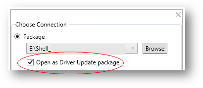
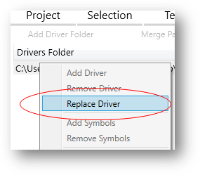

# Create a driver only update package

HLK Studio supports driver-only updates using the **Connect** option. This is commonly referred to as the Driver Update Acceptable (DUA) process.

1. Sign into the [Windows Hardware Dev Center Dashboard](https://docs.microsoft.com/windows-hardware/drivers/dashboard/index), and find the [hardware submission](https://docs.microsoft.com/windows-hardware/drivers/dashboard/manage-your-hardware-submissions) that you want to update. Note that DUA is only available for submissions that include a driver file. 

2. Under **Packages and signing properties**, select **Download DUA shell** and download the file. 
    1. If you don't have the current driver package, you can access the driver's INF files by downloading the signed driver files.

3. Launch HLK Studio
    > [!TIP]
    > Do not open the DUA shell package by double clicking the .hlkx file. You must open the package from within HLK studio.

4. Select **Package**, and then select **Browse** to open the downloaded DUA shell package.

5. Select **Open as Driver Update package**

    

6. Select **Ok**.

7. Select the **package** tab, and right-click the appropriate driver folder. Then select **Replace Driver**

    

8. Find and select the folder where your driver updates are located.
    > [!IMPORTANT]
    > The following filetypes are not allowed for DUA submissions:
    > * .exe
    > * .dll
    > * .sys
    >
    > Typical acceptable filetypes include:
    > * .inf
    > * .txt
    > * .pdf
    > * .prd

9. Select **Create Package**
    > [!NOTE]
    > Submissions to the Hardware Dev Center require that you sign your package with an [EV code signing certificate](https://docs.microsoft.com/windows-hardware/drivers/dashboard/get-a-code-signing-certificate). 

10. Within the Hardware Dev Center Dashboard, [create a new hardware submission](https://docs.microsoft.com/windows-hardware/drivers/dashboard/create-a-new-hardware-submission
), and upload your .hlkx file.
