# HMD Exerciser Kit Hardware

## HMD Exerciser

The HMD Exerciser contains all the PC/HMD connectivity and the connector
for the HMD Board. It consists of several components as seen below.

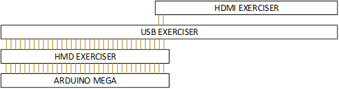 *HMD Exerciser hardware arrangement*

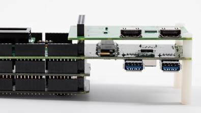 *HMD Exerciser hardware arrangement (actual HW)*

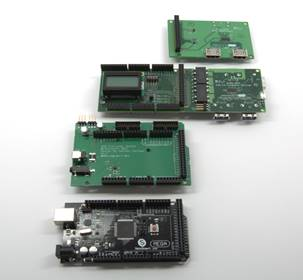 *Component boards arranged in order of stacking (actual HW)*

## HMD Exerciser Components

The HMD Exerciser is made up of an Arduino compatible microcontroller
and several stacked boards called **shields**. The individual
*shields* are detailed below in order from bottom to top.

### Arduino Mega 2560 R3

The [Arduino Mega 2560
R3](http://go.microsoft.com/fwlink/p/?LinkId=733526) is the
microcontroller for the HMD Exerciser Main Board and provides an
interface for the other boards. Note that any Arduino Mega 2560 R3
compatible board can be used with HMD Exerciser.

If not included with the HMD Exerciser, a compatible power adapter is
also required.

    

### HMD Shield

The HMD Shield provides connectivity for the HMD Board along with audio
input from the HMD and control for up to two servos.

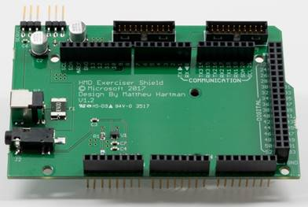  

This board provides the following functionality:

-   Control and power for two servos
-   Audio monitoring
-   Interface connector for the HMD Board

### USB Type A SuperSpeed Shield

The USB Type A SuperSpeed shield controls routing of USB from port J1 to
any other port. The shield also monitors amperage and voltage drawn from
the SUT and displays it on the LCD.

The shield has one USB Type B port (labeled **J1**) to which the SUT is
connected. The shield also has four other USB ports (labeled **J2**,
**J3**, **J4**, and **J6**) to attach devices that act as peripherals to
the SUT.

In the HMD Exerciser Kit setup this shield is used primarily for USB 3.0
Multiplexing. If one HMD is attached, this shield connects and
disconnects the device over USB. If two HMDs are attached, the shield
switches the connection between the two devices, or disconnects both.

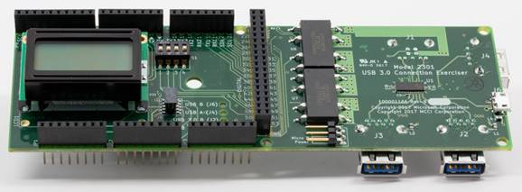  

### HDMI Shield

The HDMI Shield controls the HDMI connection between the HMD and the
SUT.

This shield has three HDMI ports (labeled **J1**, **J2**, and **J3**).
**J1** should be connected to the SUT while any HMDs are connected to
the remaining ports. The connections can be routed so either **J2** or
**J3** connect to **J1**, or HDMI can be disconnected from the SUT
altogether.

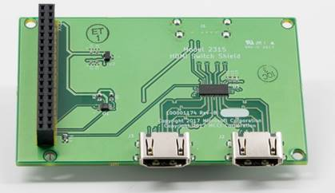  

## HMD Tester Board Components

### HMD Tester Board

The HMD Tester Board is separate from the HMD Exerciser. It should be
secured in the HMD by using a 3D printed mount or another fixture. A custom
cable, referred to as the Board-to-Shield cable, connects the HMD Tester
Board to the HMD Exerciser.

The HMD Tester Board can

-   Simulate user presence by using IR Sensor and a LED.
-   Detect brightness and color of the HMD displays independently using two TCS34725 color sensors.

When the HMD Tester Board is mounted in the HMD, the IR sensor and the LED should align with the HMD's presence sensor, and the RGB sensors should be in front of the HMD's displays.

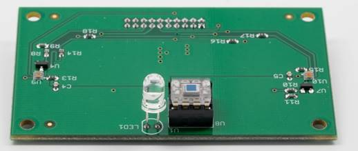 *HMD Tester Board (display panel side view)*

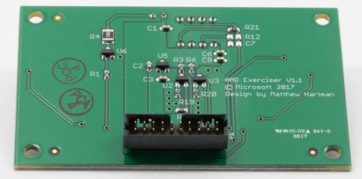 *HMD Tester Board (external side view)*

### HMD Tester Board Mount

The HMD Board attaches to the HMD using a mount specific to that
headset. A template 3D print model for the Acer HMD is available.
Microsoft does not provide templates for other models.

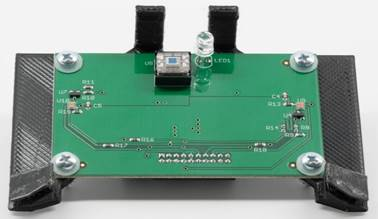 *HMD Board Mount (top view)* 

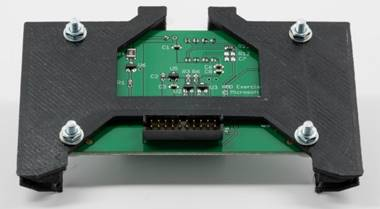 *HMD Board Mount (bottom view)]*

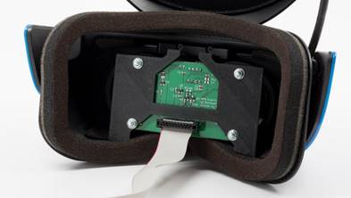 *HMD Tester Board as mounted in the HMD*

## HMD Exerciser Kit Cables and Accessories

### HMD Tester Board-to-Shield Cable

The Board-to-Shield cable connects the HMD Board to the HMD Shield on the HMD
Exerciser. It consists of a length of 28 AWG flat ribbon cable (PN
AWG28-20/G-1/300-R) and two connectors (PN 0875682093).

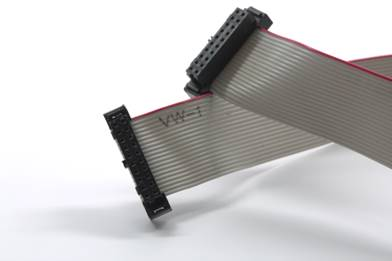  

### HMD Audio Cable

This cable is a symmetric 3.5mm audio cable that connects from the HMD's
audio jack (if available) to the HMD Shield's 3.5mm jack. It can also be
connected to the SUT.

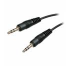  

If the test setup uses two HMDs, it must use a "Y" cable and two HMD
audio cables.

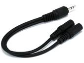  

### USB 2.0 A-to-B cable

This cable connects the SUT to the HMD Exerciser Main Board for
communication and firmware updates.

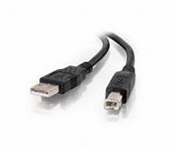  

### USB 3.0 A-to-B cable

This cable connects the SUT to the HMD Exerciser's USB Connection
Exerciser Shield port **J1**

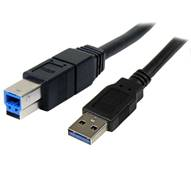  

### HDMI cable

This cable connects the SUT to the HMD Exerciser's HDMI Shield port
**J1**. This cable should meet or exceed HDMI 2.0 spec.

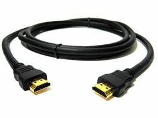  