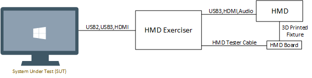
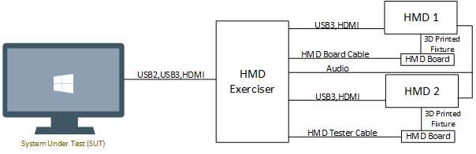
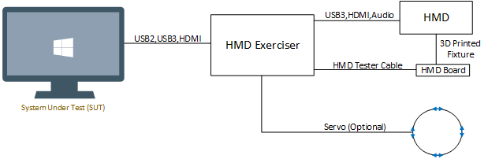

# Testing with the HMD Exerciser Kit

## Example Test Environments

The following diagrams show some of the possible test setups. These topologies could be used to test a single HMD, two HMDs, or an HMD with servo controlled motion.

 *High-level connectivity diagram with one HMD*
  
 *High-level connectivity diagram with two HMDs*
  
 *High-level connectivity diagram with one HMD and servo*

## Hardware Requirements

In addition to the HMD Exerciser Kit, the test environment must include
the following hardware components:

### System Under Test (SUT)

-   The SUT must meet the [minimum requirements to support Windows Mixed
    Reality](https://developer.microsoft.com/en-us/windows/mixed-reality/windows_mixed_reality_minimum_pc_hardware_compatibility_guidelines)
-   The SUT must have the version of Windows installed with which to
    test interoperability (Windows 10 Fall Creator Update or newer)
-   The SUT must have the following ports available:
    -   1 USB 3.0 port for connection to the HMD
    -   1 USB 2.0/3.0 port for connection to the HMD Exerciser
    -   1 HDMI port for connection to the HMD

### HMD

The HMD Exerciser Kit is compatible with all HMDs that support Windows
Mixed Reality.

## Example Test Setup

Test setup should resemble the image below:

  

## Hardware Setup Instructions

1. Ensure that the HMD Exerciser Main Board's shields are all present and are firmly attached.

2. Connect HDMI cable from HDMI port J1 to the System Under Test.

3. Connect USB 3.0 cable from USB port J1 to a USB 3.0 port on the System Under Test.

4. Connect USB 2.0 cable from the Arduino USB port to the System Under Test.

5. Connect the power supply for the HMD Exerciser to the lower barrel jack on the HMD Exerciser Main Board.

6. Connect the HMD Board cable to the P1 port on the HMD Shield.

7. Connect the other side of the HMD Board cable to the HMD Board.

8. Ensure the HMD Board is firmly attached to the appropriate mount.

9. Clip the HMD Board into the HMD. Ensure it is centered on the displays. If present, adjust the mechanical IPD dial as needed.

10. Attach the audio cable between the audio jack on the HMD Exerciser Main Board to the HMD headphone jack (if present).

11. Connect the HMD's USB and HDMI connection to the HMD Exerciser Main Board, noting which port they are plugged into.

12. Ensure the HMD Exerciser Main Board is recognized by **Device Manager** on the proxy controller.
    - Right-click the Start button in the task bar and select **Device Manager**.
    - Expand the Ports (COM & LPT) node and note the COM port that is used by the microcontroller. In this example, it is connected to COM4.

          

13. Run **ConnExUtil /SetPort \<USB Port\>** where **\<USB Port\>** is the port where the HMD is connected to the HMD Exerciser USB Shield. This will be **J2** or **J3**.

14. Run **ConnExUtil /SetHDMIPort \<HDMI Port\>** where **\<HDMI Port\>** is the port where the HMD is connected to the HMD Exerciser's HDMI Shield. This will be **J2** or **J3**.

15. Ensure that your HMD enumerates in Device Manager.

## Additional resources

### Confirming USB current and power

The onboard LCD on the HMD Exerciser's USB Shield displays power (volts, amps, and direction). Confirm that it matches expectations from power sources plugged in and actively enabled. Power draw from port **J2** or **J3** will show as negative.

  

### Confirming device addition on desktops

1. Identify the USB host controller to which the device is connected.

2. Ensure that the new device appears under the correct node in **Device Manager**.

3. For USB 3.0 hubs connected to a USB 3.0 port, **Device Manager** shows two hub devices: one enumerated at SuperSpeed and another at high speed.

### Confirm device removal on desktops

1. Identify the device in **Device Manager**.

2. Perform the test step to remove the device from the system.

3. Confirm that the device is no longer present in Device Manager.

4. For a USB 3.0 hub, check that both devices (SuperSpeed and companion hubs) are removed. Failure to remove a device in this case may be a device failure and should be investigated by all components involved to triage the appropriate root cause.

### Using ETW to log issues

To enable ETW for USB 2.0 ports, see [ETW in the Windows 7 USB core stack](http://go.microsoft.com/fwlink/p/?LinkId=623316).

To enable USB 3.0 logging, run the following commands (or see [How to capture a USB event trace with
Logman](https://msdn.microsoft.com/en-us/library/windows/hardware/jj151573(v=vs.85).aspx)):

	logman start usbtrace -ets -o usbtrace.etl -nb 128 640 -bs 128
	logman update usbtrace -ets -p Microsoft-Windows-USB-UCX Default
	logman update usbtrace -ets -p Microsoft-Windows-USB-USBHUB3 Default

After these are logs are captured, run the test scenario.  
Stop the trace by using this command:

	logman stop usbtrace -ets