# Annotations

Annotation is a user-defined column in WPA tables. WPA provides **Dynamic Annotation** which allows for users to annotate tables based on AQS queries. Multiple annotation columns can be added and configured independently. Annotations and queries can be persisted in WPA profiles as a part of the presets. **Legacy Annotation** is another way of adding annotations in WPA. It supports annotating on a per-row basis. There can be only one legacy annotation for each row and it will not be persisted in the presets.

## Dynamic Annotation UI
### Configure Annotations From View Editor
In **Analysis View**, open **View Editor**. Select existing annotation columns or drag a new one from **Available Columns**. In **Column Details** view, add new or edit/remove existing annotation-query pairs. 

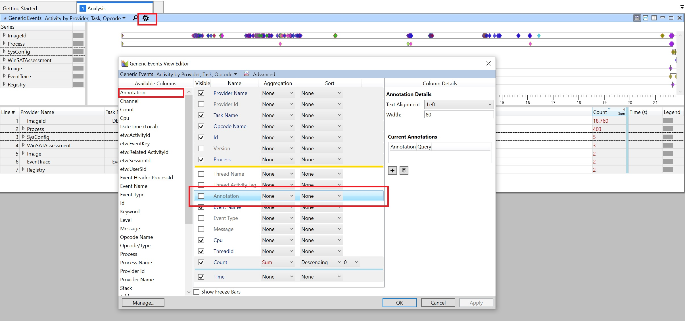 
   
#### Add Annotation
Enter an annotation and a query. E.g. Annotate &quot;edge&quot; on all processes that contains &quot;edge&quot;. Then Click &quot;Add&quot; to update the annotation and query to <strong>Column Details</strong>

You can edit the order and the visibilty of columns in the **View Editor**. Remember to check "visible" for the annotation columns that you want to see in the **Analysis View**. Then click on "OK" to apply your annotations. 
   
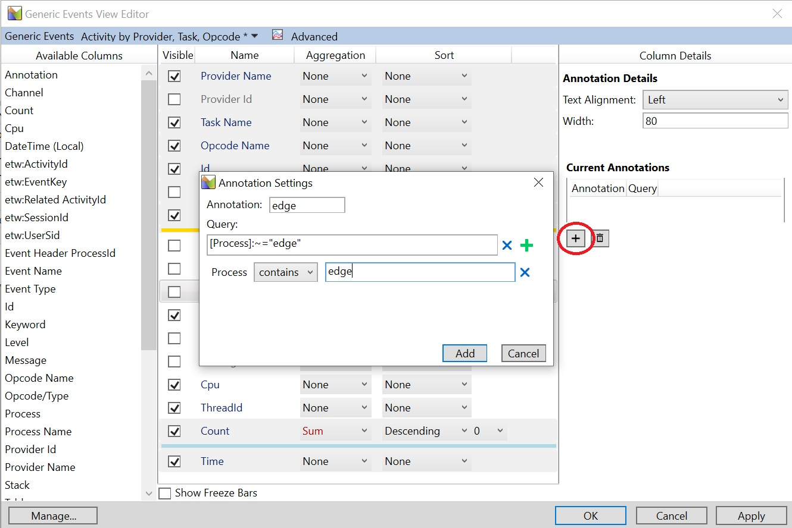 
   
Annotation is updated to <strong>Current Annotations</strong>.
   
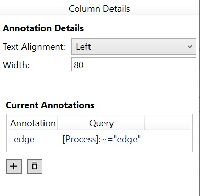 
Annotation is applied to table based on the query result. 
   
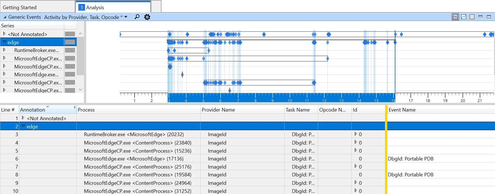
   
#### Edit/Remove Annotation
Double click on an annotation-query row and the <strong>Annotation Settings</strong> will pop up and allow you to edit the annotaion-query pair. To remove an annotation-query pair, just select it and click the &quot;trash&quot; button.

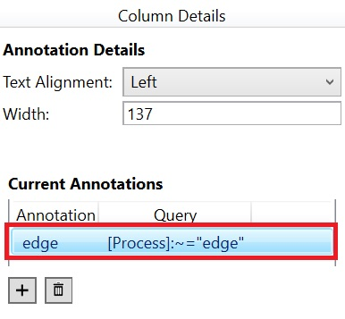 &emsp;&emsp;&emsp; 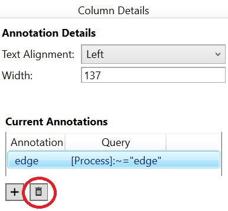 
   
#### Multiple Annotations in One Column
Multiple annotations can be added to the same **Annotation Column**. The annotations that fall into the same cell are separated by a comma.

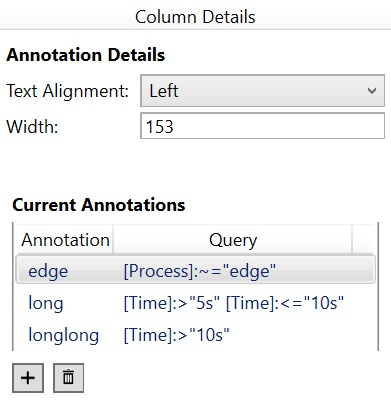
 
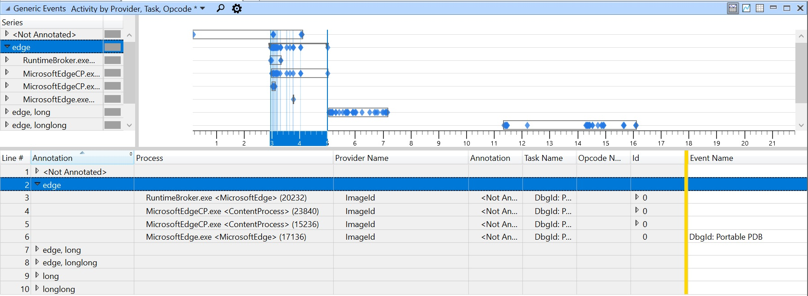
 
#### Multiple Annotation Columns
<strong>Dynamic Annotation</strong> supports adding multiple <strong>Annotation Column</strong>s. Simply drag a new <strong>Annotation Column</strong> in <strong>View Editor</strong> and it can be configured independently of the existing ones. 
 
### Configure Annotations From Right Click
In addition to View Editor, you can configure annotations by performing a right click on the table. 
Select one or more rows in the table and right click, select &quot;Annotate Selection&quot;. The pop-up window is going to show all the visible <strong>Annotation Column</strong>s (numbered based on their ordering in the table) and you may configure from there just like in <strong>View Editor</strong> 
 
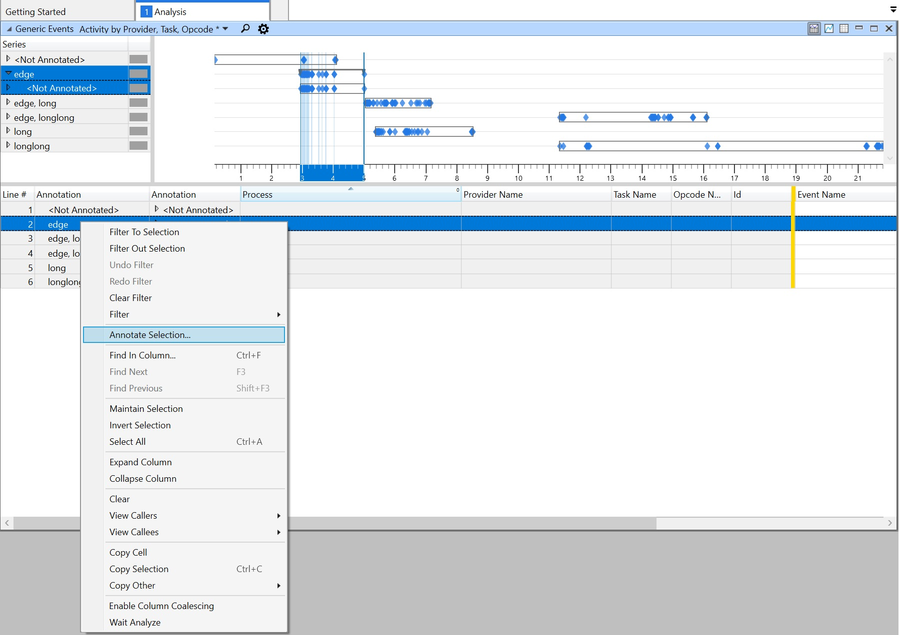

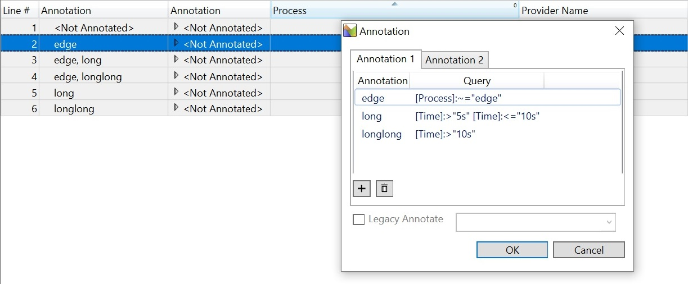

## Legacy Annotation
Following the above section, enable "Legacy Annotate" at the bottom of the pop-up window and enter an annotation. Click "OK" to apply annotation. Note that this single annotation is applied only to the currently selected rows in the table and is shared across all **Annotation Colum**s. If it overlaps with dynamic annotations on certain rows, the legacy annotation will always be added to the beginning of all annotations. The legacy annotation is not stored as part of the presets, but it can be exported as part of WPA Package.

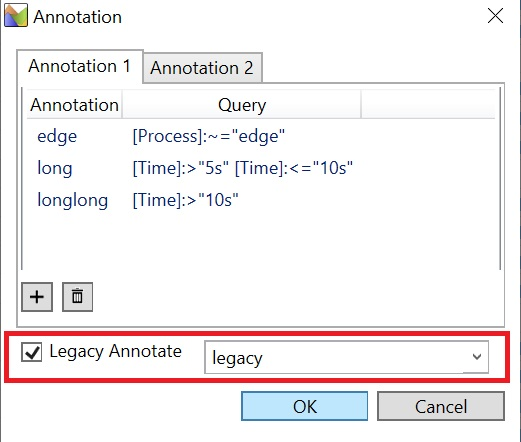

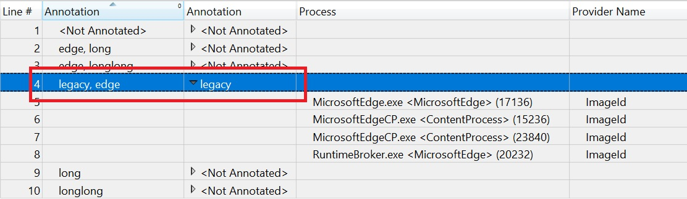
