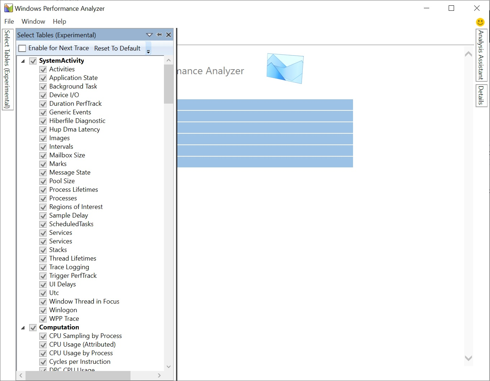
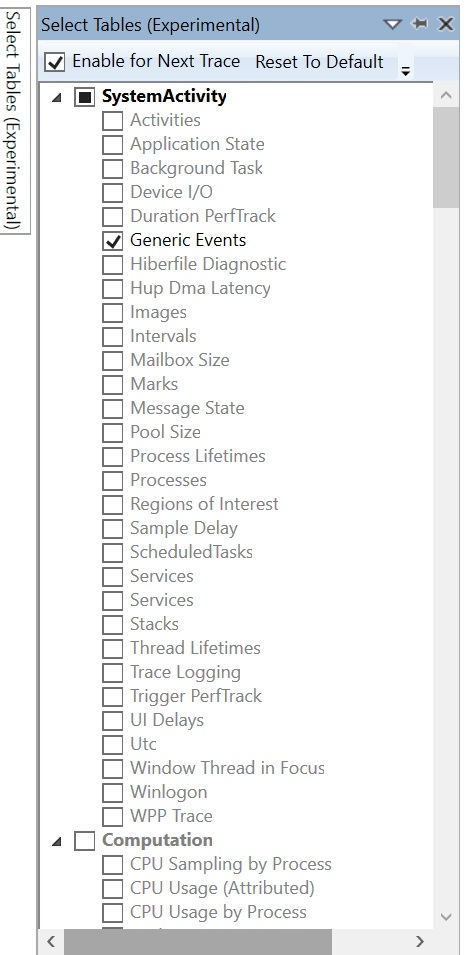
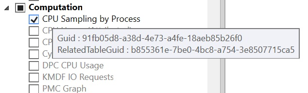

# Select Tables Window

**Select Tables** window shows all the available tables in WPA anf allows for users to decide which tables to enable in their analysis.

## Using the **Select Tables** Window
1. Open **Window** -> **Select Tables**
2. Check "Enable for Next Trace" to enable table selection for the next trace you open. If uncheck, all tables are enabled by default. 

   

3. Select tables to enable. E.g. Generic Events

   

4. Open the trace and the **Graph Explorer** will load graphs for only the selected tables. In the following example, only "Generic Events" is loaded.

   

## Related Tables
Some tables have related tables whose GUIDs can be found by placing mouse over table names. These tables cannot be loaded without having their related tables enabled. So in the **Select Table** window, if a table is selected, its related table automatically gets selected too. Nevertheless, disabling a table won't unselect its related table.

   
